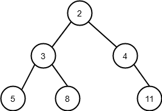

## Key Terminology

### Statement
- A statement is a command that the program executes.
- Examples include printing text or assigning a value to a variable.
- Statements can be simple or complex, sometimes containing other statements within structures like conditional statements.

### Block
- A block is a group of statements that execute together, often under a specific condition.
- In Python, blocks are defined by indentation.
- The block of a conditional statement executes only if the condition is true.

### Expression
- An expression is a piece of code that evaluates to a value with a specific data type.
- Examples include arithmetic operations or string concatenation.
- Expressions can be simple or complex and are often assigned to variables for use in the program.

### Function
- A function performs a defined task and can take arguments (data) for processing.
- Functions are executed when called and can return values.
- Examples include built-in functions like `print()` for output and `input()` for user input.
- The returned value from a function can be assigned to a variable for later use.

### Statement
- Part of the program that executes something.
- Can refer to a single command or a group of commands.
- Examples: `print("Hi!")`, `number = 2`, `if name == "Anna": print("Hi!")`.

### Block
- Group of consecutive statements at the same level in the program's structure.
- Usually within conditional statements.
- Indicated by consistent indentation in Python.
- Example:
  - ```Python
    if age > 17:
        print("You are of age!")
        age = age + 1
        print("You are now one year older...")```

### Expression
Piece of code that results in a value of a specific data type.
Can be simple or complex, formed by combining simpler expressions.
Examples: `2 + 4 + 3`, `"abc" + "de"`, `11 / 2, 2 * 5 > 9`.

### Function
Executes specific functionality, possibly taking arguments.
Called in the code to perform its task.
Examples: `print("this is an argument")`, `input("Please type in your name: ")`.

### Data type
Characteristic of any value in the program.
Examples: `name = "Anna" (string)`, `result = 100` (integer).
Determined by using the `type()` function.

### Syntax
Rules governing how code should be written in a programming language.
Includes punctuation, indentation, and structure.
Example in Python: Colon at the end of the `if` statement's first line, consistent indentation for blocks.

### Debugging
Process of finding and fixing errors (bugs) in the program.
Bugs can cause errors during execution or produce incorrect results.
Techniques include adding print statements, analyzing code behavior, and verifying assumptions.
Essential skill for programmers; often requires running the program multiple times to isolate and fix issues.

### Expressions
Expressions in programming are snippets of code that produce a value when evaluated. They can be simple or complex, composed of variables, constants, operators, and function calls. Here's a breakdown of key points:
1. **Evaluation**: When a program runs, expressions are evaluated to produce a result. This result can be of various data types such as numbers, strings, or Boolean values.
2. **Data Types**: Each expression has a data type that defines the kind of value it yields. For instance, an expression might result in an integer, a string, or a Boolean value.
3. **Components**: Expressions can be composed of multiple smaller expressions combined with operators. These operators include arithmetic operators (+, -, *, /), comparison operators (==, !=, <, >), logical operators (and, or, not), and more.
4. **Example**: 
   1. 2 + 3 is an expression that evaluates to 5.
   2. x > 5 is an expression that evaluates to either True or False, depending on the value of x.
5. **Usage**: Expressions are used extensively in programming to calculate values, make decisions, and control the flow of the program.

| Expression     | Value     | Type                  | Python data type |
| -------------- | --------- | --------------------- | ---------------- |
| `2 + 4 + 3`    | `9`       | integer               | `int`            |
| `"abc" + "de"` | `"abcde"` | string                | `str`            |
| `11 / 2`       | `5.5`     | floating point number | `float`          |
| `2 * 5 > 9`    | `True`    | Boolean value         | `bool`           |

### Functions
Functions are blocks of code that perform a specific task or computation. They encapsulate a set of instructions that can be executed multiple times with different inputs. Here's what you need to know about functions:
1. **Purpose**: Functions provide a way to organize code into manageable and reusable units. They help in avoiding redundancy and promoting modular programming.
2. **Structure**: Functions consist of a name, parameters (optional), and a body. Parameters act as placeholders for values that are passed to the function when it's called.
3. **Calling**: Functions are executed by calling their names along with any required arguments. When called, a function performs its defined task and may return a value as a result.
4. **Example**:
   1.   ```python
        def add(a, b):
            return a + b
        result = add(3, 5)  # Calling the add function with arguments 3 and 5
        ```
5. **Return Value**: Functions can return a value using the return statement. This value can then be used in other parts of the program.
6. **Built-in Functions**: Programming languages provide built-in functions for common tasks like printing output (print()), getting user input (input()), and performing mathematical operations.
7. **Custom Functions**: Programmers can define their own functions tailored to specific requirements, enhancing code readability and reusability.

In summary, expressions compute values, while functions encapsulate reusable blocks of code that perform specific tasks. Both are fundamental concepts in programming and play crucial roles in writing efficient and maintainable code.

## Functions

### Function Arguments
Functions often take one or more *arguments*, which may affect what the function does. For example, the built-in Python functions `print` and `input` take as argument(s) the text that is to be displayed:

```python
print("Hi!")                           # argument is the string "Hi!"
name = input("What is your name? ")    # argument is the string "What is your name? "
print(name)                            # argument is the value of the variable name
```

It was mentioned before that the terms *argument* and *parameter* are often used to refer to the same thing. The distinction is that while *argument* is used with the data passed to the function when the function is called, inside the function the *arguments* are assigned to variables called *parameters*. So, approximately, when the function is called, we call the passed bits of data arguments, but when we are defining the function, we call them parameters.

This may seem like a futile semantic distintion, and to make things even muddier, not all sources follow this definition.

Let's define some functions that take arguments. In the function definition, the parameters are defined within the parentheses after the function name:
```python
def hello(target):
    print("Hello", target)
```

Calling this function twice, like so
```python
hello("Emily")
hello("world!")
```

prints out two different greetings:
```
Hello Emily
Hello world!
```

Let's take a closer look at the function definition:
```python
def hello(target):
    print("Hello", target)
```

On the first line, in the function header, we defined that this function takes an argument, and assigns it to a parameter named `target`. In the body of the function the `print` command uses the value stored in `target`.

When the function is called, the parameter `target` has the value given as an argument in the function call. For example, the following function call
```python
name = "Alan"
hello(name)
```

causes the parameter `target` to be set to the value `"Alan"`.

The names of functions and their parameters follow the same principles as the names of variables. They should be descriptive, and contain primarily lowercase letters and underscore characters.

**Note**: that the names of the parameters within the function definition have no relation to any variables outside it. We might just as well call the following function like this:

```python
def sum(x, y):
    result = x + y
    print(f"The sum of the arguments {x} and {y} is {result}")

x = 100
y = 30
sum(1, 2)
sum(x + y, 10)
```

This should print out
```
The sum of the arguments 1 and 2 is 3
The sum of the arguments 130 and 10 is 140
```

In the first function call the parameters are assigned the values x = 1 and y = 2. In the second function call they are assigned the values x = 130 and y = 10, regardless of the similarly named variables used in the function call.

### **Warning**: using global variables within functions
As we have seen, it is possible to assign new variables within function definitions. The function can also see variables assigned outside it, in the main function. Such variables are called global variables.

Using global variables from within functions is usually a bad idea. Among other issues, doing so may cause bugs which are difficult to trace.

Below is an example of a function which uses a global variable "by mistake":
```python
# this is a global variable
name = "Betty"

def hello(given_name):
    # using the global variable instead of the parameter by mistake
    print("Hello", name)

hello("Steve")
hello("Betty")
```

output:
```
Hello Betty
Hello Betty
```

No matter how many different arguments we call the function with, it will always print out the value `"Betty"` stored in the global variable.

### The parameters and arguments of a function
A function can take one or more arguments. When the function is called, the arguments are assigned to variables, which are defined in the function definition. These variables are called *parameters*, and they are listed inside the parentheses after the function name.

In the following code the function `greet` has one parameter defined, while the function `sum` has two.

```python
def greet(name):
    print("Hello there,", name)

def sum(a, b):
    print("The sum of the arguments is", a + b)

greet("Emily")
sum(2, 3)
```

Sample output:
```
Hello there, Emily
The sum of the arguments is 5
```

### Formal vs actual, parameter vs argument
The terminology around data passed to functions can feel confusing. To make matters worse, some sources refer to what we have called parameters and arguments as formal and actual parameters. Other sources call them formal and actual arguments. The Python documentation specifies only the terms argument and parameter, so that is what we will use as well.

What actually happens when the function call `greet("Emily")` is executed?

In the function definition `greet(name)` the parameter `name` behaves for all intents and purposes just like a normal variable. We can use it within the function just like how variables can be used inside the main function.

In the function call `greet("Emily")` the argument `"Emily"` is just like any other string and can be assigned to a variable.

So, when the function call is executed, the value of the argument, `"Emily"`, is assigned to the parameter variable `name`. For the duration of this execution of the function, `name = "Emily"`. When the function is called with a different argument, the value of `name` will be different.

This terminology may all seem a bit superfluous, but computer science as a discipline does aim to be as exact a science as possible. Using well defined terminology helps.

### Function calls within function calls
You can call a function from within another function. This is similar to calling a `print` function within a custom defined function. Custom defined functions are functionally no different. In the following example the function `greet_many_times` calls the function `greet` as many times as specified by the argument `times`:

```python
def greet(name):
    print("Hello there,", name)

def greet_many_times(name, times):
    while times > 0:
        greet(name)
        times -= 1

greet_many_times("Emily", 3)
```
Sample Output:
```
Hello there, Emily
Hello there, Emily
Hello there, Emily
```

### The return value of a function
Functions can also return values. For instance, the built-in Python function `input` returns an input string typed in by the user. The value returned by a function can be stored in a variable:

```python
word = input("Please type in a word: ")
```
When you want an integer value from the user, the input from the user has to be converted into an integer. The function we've used for this purpose is `int`, and it also returns a value:
```python
number = int(input("Please type in an integer: "))
```
The function `int` takes the string returned by `input` as its argument, and returns an integer type value, if an integer can be parsed from the string.

### The `return` statement
The functions you define yourself can also return values. To do this you need the `return` statement. For example, the following function `my_sum` returns the sum of its parameters:

```python
def my_sum(a, b):
    return a + b

result = my_sum(2, 3)

print("Sum:", result)
```

Sample output:
```
Sum: 5
```

Here's another example of a return value. This function asks for the user's name and returns the string the user types in:

```python
def ask_for_name():
    name = input("What is your name? ")
    return name

name = ask_for_name()
print("Hello there,", name)
```

Sample output:
```
What is your name? Anna
Hello there, Anna
```

The `return` statement ends the execution of the function immediately. The following is a nifty way to create a comparison function:

```python
def smallest(a,b):
    if a < b:
        return a
    return b

print(smallest(3, 7))
print(smallest(5, 2))
```

The idea here is that if `a` is smaller than `b`, the function returns `a` and exits immediately. If not, the execution continues to the next line, where the value `b` is returned. A function can never execute two separate `return` statements with a single function call.

Sample output:
```
3
2
```

You can make use of the `return` statement even if the function doesn't return a value. Its purpose then is to end the execution of the function:
```python
def greet(name):
    if name == "":
        print("???")
        return
    print("Hello there,", name)

greet("Emily")
greet("")
greet("Mark")
```
If the argument (which gets stored in the variable `name`) is an empty string, the function prints out `???` and exits.

Sample output:
```
Hello there, Emily
???
Hello there, Mark
```

#### Using return values from functions
We already know that the return values of functions can be stored in variables:

```python
def my_sum(a, b):
    return a + b

result = my_sum(4, 6)
print("The sum is", result)
```
Sample output:
```
The sum is 10
```

The return value of a function is a value just like any other. It is not necessary to store it in a variable in order to give it as an argument to the `print` command:

```python
print("The sum is", my_sum(4, 6))
```

The return value of a function can become the argument of another function:
```python
def my_sum(a, b):
    return a+b

def difference(a, b):
    return a-b

result = difference(my_sum(5, 2), my_sum(2, 3))
print("The result is", result)
```

Sample output:
```
The result is 2
```

In this case the inner function calls `my_sum(5, 2)` and `my_sum(2, 3)` are executed first. The values they return (7 and 5) are used as the arguments of the outer function call.

The outer function call `difference(7, 5)` returns the value 2, which is stored in the variable `result` and printed out.

In summary, values returned by functions work exactly like any other value in Python. They can be printed out, stored in variables, used in expressions and used as arguments in other function calls.

#### The difference between return and print
Sometimes the difference between a function *returning* a value and a *print statement* within a function can be confusing. Let's have a look at two different ways of implementing a function for working out which of two values is greater:

```python
def max1(a, b):
    if a > b:
        return a
    else:
        return b

def max2(a, b):
    if a > b:
        print(a)
    else:
        print(b)

result = max1(3, 5)
print(result)

max2(7, 2)
```

Sample output:
```
5
7
```

Both versions seem to be working just fine, as the maximum values are printed correctly. There is a fundamental difference between the two, however. The first of the two functions, `max1`, does not print out anything on its own, but instead it returns the value which is greater. If we execute the following line
```python
max1(3, 5)
```
nothing seems to happen. The return value of the function has to be *used* in some way in the code which called the function. For instance, it can be stored in a variable and printed out:
```python
result = max1(3, 5)
print(result)
```
The second version, `max2`, uses the `print` command *within the function* to print out the greater value. If we want to see the value, it is enough to call the function
```python
max2(7, 5)
```
and the greater value is printed out. The downside of this handy function is that the value worked out by the function is not available for use in the program which called it. That is why functions which return values are often the better option.

##### **Summary**
In Python, `return` and pr`int serve different purposes when used within a defined function.
1) `return`

   - `return` is a keyword in Python used to exit a function and return a value to the caller.
   - When a function encounters a `return` statement, it immediately exits and passes back the specified value to the caller.
   - A function can have multiple return statements, but only one of them will be executed, and it will terminate the function execution.

Example:
```python
def add(a, b):
    return a + b

result = add(3, 5)
print(result)  # Output will be 8
```
2) `print`
   - `print` is a built-in function in Python used to display information on the console.
   - It doesn't return any value to the caller; instead, it outputs the specified values to the console.
   - `print` statements can be used within a function to display intermediate results or debugging information, but they don't affect the return value of the function itself.
  
Example:
```python
def greet(name):
    print("Hello,", name)

greet("Alice")  # Output will be "Hello, Alice"
```

In summary, `return` is used to provide a value back to the caller of a function, while `print` is used to display information on the console. They serve different purposes and can be used together within a function to provide both a return value and display information as needed.

In the following example:
```python
def max1(a, b):
    if a > b:
        return a
    else:
        return b

def max2(a, b):
    if a > b:
        print(a)
    else:
        print(b)

result = max1(3, 5)
print(result)

max2(7, 2)

result2 = max2(7, 2)
print(result2)
```

Sample output:
```
5
7
7
None
```

both functions `max1` and `max2` are being used to find the maximum of two numbers. However, they differ in how they handle the result:

- `max1`: This function uses `return` to return the maximum value back to the caller. When you assign the result of `max1(3, 5)` to `result`, you're actually storing the returned value (which is `5`) in the variable `result`. This allows you to later use the value of `result` in your program.
- `max2`: This function uses `print` to directly output the maximum value to the console instead of returning it. When you assign the result of `max2(7, 2)` to `result2`, you're storing `None` in the variable `result2`. This is because the `max2` function doesn't return anything explicitly, it just prints the result to the console. In Python, when a function doesn't have a `return` statement, it implicitly returns `None`.

So, the difference is that `max1` returns the maximum value which can be stored in a variable and used later, whereas `max2` prints the maximum value directly to the console and doesn't provide a value that can be stored and used in subsequent operations.

In our example, if we try to print `result2`, you'll get `None` because `max2` function doesn't return anything explicitly.

### The type of the argument and return
A quick recap of the data types we've come across so far:
| Type                  | Python data type | Example          |
| --------------------- | ---------------- | ---------------- |
| integer               | `int`            | `23`             |
| floating point number | `float`          | `-0.45`          |
| string                | `str`            | `"Peter Python"` |
| Boolean value         | `bool`           | `True`           |

When you call a function, it will only work correctly if the arguments you give it are of the right type. Let's have a look at an example:

```python
def print_many_times(message, times):
    while times > 0:
        print(message)
        times -= 1
```
The function works as expected if we call it like this:
```python
print_many_times("Hello there", 5)
```
Sample output:
```
Hello there
Hello there
Hello there
Hello there
Hello there
```

However, if we give the function an argument of the wrong type, it will not work:
```python
print_many_times("Hello there", "Emily")
```
Sample output:
```
TypeError: '>' not supported between instances of 'str' and 'int'
```

The problem here is that the second parameter `times` is compared to an integer, `0`, on line 2 of the function definition. The argument given was `"Emily"`, which is a string, not an integer. Strings and integers cannot be compared so simply, so an error ensues.

To avoid issues like this you can include *type hints* in your function definitions. The type hint specifies the type of the argument intended for the function:

```python
def print_many_times(message : str, times : int):
    while times > 0:
        print(message)
        times -= 1
```

This tells anyone using the function that the argument stored in `message` is supposed to be a string, and the argument stored in `times` is supposed to be an integer.

Similarly, the return value of a function can be hinted at in the function definition:

```python
def ask_for_name() -> str:
    name = input("Mikä on nimesi? ")
    return name
```
This tells the user of the function that the function is supposed to return a string.

**NB**: Type hinting is literally just hinting about the type of the argument or the return value. It is not a guarantee of type, and definitely not a safeguard against type errors. If a function receives an argument or returns a value of the wrong type, the function is still executed, but it might not work correctly.

We can add further *type hints* for clarifying data type of items within list objects by stating the data/object type within [] brackets like the example below.

```python
def no_shouting(my_list: list[str]) -> list:
    result = []
    for i in my_list:
        if i.isupper() != True:
            result.append(i)           
    return result
```

### Passing data from one function to another
When a program contains multiple functions, the question arises: how do you pass data from one function to another?

The following example asks the user for some integer values. The program then prints out these values and performs an "analysis" on them. The program is divided into three separate functions:

```python
def input_from_user(how_many: int):
    print(f"Please type in {how_many} numbers:")
    numbers = []

    for i in range(how_many):
        number = int(input(f"Number {i+1}: "))
        numbers.append(number)

    return numbers

def print_result(numbers: list):
    print("The numbers are: ")
    for number in numbers:
        print(number)

def analyze(numbers: list):
    mean = sum(numbers) / len(numbers)
    return f"There are altogether {len(numbers)} numbers, the mean is {mean}, the smallest is {min(numbers)} and the greatest is {max(numbers)}"

# the "main function" using these functions
inputs = input_from_user(5)
print_result(inputs)
analysis_result = analyze(inputs)
print(analysis_result)
```

When the program is executed, it could go like this:
Sample output:
```
Please type in 5 numbers:
Number 1: 10
Number 2: 34
Number 3: -32
Number 4: 99
Number 5: -53
The numbers are:
10
34
-32
99
-53
There are altogether 5 numbers, the mean is 11.6, the smallest is -53 and the greatest is 99
```

The idea here is that the main function "saves" all data processed by the program. In this case all that is needed is the input from the user in the variable `inputs`.

If the input is needed in a function, it is passed as an argument. This happens with the functions `print_result` and `analyze`. If the function produces data that is needed elsewhere in the program, the function returns it with the `return` command, and it is stored in a variable in the main function. This happens with the functions `input_from_user` and `analyze`.

You could use the global variable `inputs` from the main function directly in the helper functions. We have already covered why that is a bad idea, but [here is another explanation](https://softwareengineering.stackexchange.com/questions/148108/why-is-global-state-so-evil). If functions are able to change a global variable, unexpected things may start happening in the program, especially when the number of functions grows large.

Passing data into and out of functions is best handled by arguments and return values.

You could also separate the implicit main function in the example above into its own function. Then the variable `inputs` would no longer be a global variable, but instead a local variable within the `main` function:

```python
# your main function goes here
def main():
    inputs = input_from_user(5)
    print_result(inputs)
    analysis_result = analyze(inputs)

    print(analysis_result)

# run the main function
main()
```

### Warning: using global variables within functions

We know it is possible to assign new variables within function definitions, but the function can also see variables assigned outside it, in the main function. Such variables are called _global_ variables.

Using global variables from within functions is usually a bad idea. Among other issues, doing so may cause bugs which are difficult to trace.

Below is an example of a function which uses a global variable "by mistake":

```python
def print_reversed(names: list):
    # using the global variable instead of the parameter by accident
    i = len(name_list) - 1
    while i >= 0:
        print(name_list[i])
        i -= 1

# here the global variable is assigned
name_list = ["Steve", "Jean", "Katherine", "Paul"]
print_reversed(name_list)
print()
print_reversed(["Huey", "Dewey", "Louie"])
```
Sample output:
```
Paul
Katherine
Jean
Steve

Paul
Katherine
Jean
Steve
```

Even though both function calls have the right kind of argument, the function always prints out what is stored in the global variable `name_list`.

To make matters even more muddled, remember that all code for testing your functions should be placed within the `if __name__ == "__main__":` block for the automatic tests. The previous example should be modified:

```python
def print_reversed(names: list):
    # using the global variable instead of the parameter by accident
    i = len(name_list) - 1
    while i>=0:
        print(name_list[i])
        i -= 1

# All the code for testing the function should be within this block
if __name__ == "__main__":
    # here the global variable is assigned
    name_list = ["Steve", "Jean", "Katherine", "Paul"]
    print_reversed(name_list)
    print()
    print_reversed(["Huey", "Dewey", "Louie"])
```

Notice the global variable is assigned within the `if` block now.

The automatic tests in the TMC system are executed without running any of the code in the `if` block. So, in this latter example the function wouldn't even theoretically work, since it refers to the variable `name_list`, which doesn't exist at all when the tests are executed.

#### Reminder: using global variables within functions

We know it is possible to assign new variables within function definitions, but the function can also see variables assigned outside it, in the main function. Such variables are called _global_ variables.

Using global variables from within functions is usually a bad idea. Among other issues, doing so may cause bugs which are difficult to trace.

Below is an example of a function which uses a global variable "by mistake":

```python
def print_reversed(names: list):
    # using the global variable instead of the parameter by accident
    i = len(name_list) - 1
    while i >= 0:
        print(name_list[i])
        i -= 1

# here the global variable is assigned
name_list = ["Steve", "Jean", "Katherine", "Paul"]
print_reversed(name_list)
print()
print_reversed(["Huey", "Dewey", "Louie"])
```

Sample output:
```
Paul
Katherine
Jean
Steve

Paul
Katherine
Jean
Steve
```

Even though both function calls have the right kind of argument, the function always prints out what is stored in the global variable `name_list`.

To make matters even more muddled, remember that all code for testing your functions should be placed within the `if __name__ == "__main__":` block for the automatic tests. The previous example should be modified:

```python
def print_reversed(names: list):
    # using the global variable instead of the parameter by accident
    i = len(name_list) - 1
    while i>=0:
        print(name_list[i])
        i -= 1

# All the code for testing the function should be within this block
if __name__ == "__main__":
    # here the global variable is assigned
    name_list = ["Steve", "Jean", "Katherine", "Paul"]
    print_reversed(name_list)
    print()
    print_reversed(["Huey", "Dewey", "Louie"])
```

Notice the global variable is assigned within the `if` block now.

The automatic tests in the TMC system are executed without running any of the code in the `if` block. So, in this latter example the function wouldn't even theoretically work, since it refers to the variable `name_list`, which doesn't exist at all when the tests are executed.

### Warning: overwriting a parameter and returning too early

There are a couple of novel sources of bugs we should look at before jumping into the exercises in this part. Let's have a look at a function which tells us whether an integer is found within a list. Both are defined as parameters of the function:

```python
def number_in_list(numbers: list, number: int):
    for number in numbers:
        if number == number:
            return True
        else:
            return False
```

This function seems to always return `True`. The reason is that the `for` loop overwrites the value stored in the parameter `number`. Thus the condition in the `if` statement is always true.

Renaming the parameter solves the problem:

```python
def number_in_list(numbers: list, searched_number: int):
    for number in numbers:
        if number == searched_number:
            return True
        else:
            return False
```

Now the condition in the `if` statement looks better. But there is a new problem, since the function still doesn't seem to work correctly. Trying out the following manifests a bug:

```python
found = number_in_list([1, 2, 3, 4], 3)
print(found)  # prints out False
```

The issue here is that the function returns too early, without checking all the numbers in the list. In fact, the function takes only the first item in the list, and returns `True` or `False` depending on its value. We cannot know whether a number is _not present_ in the list until we have checked all the items in the list. The `return False` command should be placed outside the `for` loop:

```python
def number_in_list(numbers: list, searched_number: int):
    for number in numbers:
        if number == searched_number:
            return True

    return False
```

Let's have a look at another faulty function:

```python
def unique_numbers(numbers: list):
    # a helper variable to store all the numbers we've already checked
    numbers = []
    for number in numbers:
        # have we seen this number already?
        if number in numbers:
            return False
        numbers.append(number)

    return True

unique = unique_numbers([1, 2, 2])
print(unique)  # prints out True
```

This function is supposed to check whether all numbers in a list are distinct from each other, but it always returns `True`.

Here the function again overwrites the value stored in its parameter by mistake. The function tries to use the variable `numbers` to store all the numbers already checked, but this overwrites the original argument list. Renaming the helper variable is an easy fix:

```python
def unique_numbers(numbers: list):
    # a helper variable to store all the numbers we've already checked
    numbers_checked = []
    for number in numbers:
        # have we seen this number already?
        if number in numbers_checked:
            return False
        numbers_checked.append(number)

    return True

unique = unique_numbers([1, 2, 2])
print(unique)  # prints out False
```

Problems like this, and many others, can be located and fixed with the help of the debugger or the [visualisation tool](http://www.pythontutor.com/visualize.html#mode=edit). Learning to use these efficiently cannot be emphasised enough.

### Developing a larger programming project

Rule No. 1 in tackling any programming project is not trying to solve everything at once. The program should be built out of smaller sections, such as helper functions. You should verify the operation of each part before moving on to the next. If you try to handle too much at once, most likely only chaos ensues.

To do this you will need a way of testing your functions outside the main function. You can achieve this by defining a main function explicitly, and calling this function from outside any other function in the program. A single function call is then easy to comment out for testing. The first steps in building the following programming project could look like this:

```python
def main():
    points = []
    # your program code goes here

main()
```

Now the helper functions can be tested without running the main function:

```python
# helper function for determining the grade based on the amount of points
def grade(points):
    # more code

def main():
    all_points = []
    # your program code goes here

# comment out the main function
#main()

# test the helper function
student_points = 35
result = grade(student_points)
print(result)
```
### Side effects of functions

If a function takes a reference to a list as an argument, it will be able to modify that list. If direct modifications were not intended by the programmer, accidentally modifying the list received as a parameter could cause problems elsewhere in the program.

Let's take a look at a function which is supposed to find the second smallest item in a list:

```python
def second_smallest(my_list: list) -> int:
    # in an ordered list, the second smallest item is at index 1
    my_list.sort()
    return my_list[1]

numbers = [1, 4, 2, 5, 3, 6, 4, 7]
print(second_smallest(numbers))
print(numbers)
```
Sample output:
```
2
[1, 2, 3, 4, 4, 5, 6, 7]
```

The function does find the second smallest item reliably, but it additionally sorts the list in place, changing the order of the items. If the order is significant elsewhere in the program, calling the function could cause errors. Unintentional modifications to an object accessed through a reference is called a _side effect_ of a function.

We can avoid the side effect by making a small change to the function:

```python
def second_smallest(my_list: list) -> int:
    list_copy = sorted(my_list)
    return list_copy[1]

numbers = [1, 4, 2, 5, 3, 6, 4, 7]
print(second_smallest(numbers))
print(numbers)
```

Sample output:
```
2
[1, 4, 2, 5, 3, 6, 4, 7]
```

The function `sorted` returns a new, sorted copy of the list, so looking for the second smallest item no longer messes with the order of the original list.

It is generally considered a good programming practice to avoid causing side effects with functions. Side effects can make it more difficult to verify that the program functions as intended in all situations.

Functions free of side effects are also called _pure functions_. Especially when adhering to a functional programming style, this is a common ideal to follow. We will explore this topic further in _Advanced Course in Programming_, which is the course following this one.


## Control Flow - Conditional Statement & Loops

### Conditional Structures & Iterations
Conditional structures and repetition, or iterations, are central technique in programming. Together these form the fundamental control structures any programmer must master. They are called control structures because essentially they allow you to control which lines of code get executed when. While conditional structures allow you to choose between sections of code, iteration structures allow you to repeat sections of code. They are often called loops because they allow the program to "loop back" to some line that was already executed before. The process of executing one repetition of a loop is also referred to as an iteration of the loop.

#### if-else construction


#### if-elif-else construction
  

#### Conditional while loop

The execution goes back and forth, checking if the condition is true and executing the code within the block, over and over again. If the condition at any point is false, execution of the program continues from the line after the while block.

In this structure the condition is always checked before the block within the loop is executed.

### Initialisation, condition and update
To create a loop you'll often need to include three distinct steps: initialisation, condition, and updating the iteration variables.

*Initialisation* refers to setting the initial value(s) of the variable(s) used within the condition of the loop. These are often called the **iteration** or **iterator variables**. This is performed before the loop is first entered. The *condition* defines for how long the loop is to be executed. It is set out at the very beginning of the loop. Finally, within each repetition of the loop the variables involved in the condition are *updated*, so that each iteration brings the loop one step closer to its conclusion. The following image illustrates these steps:


If any one of these three components is missing, the loop will likely not function correctly.

Any Boolean expression or combination thereof is a valid condition in a loop such that you may use `and`, `or`, `not`, and `()` to build complex conditions.

### Break & Continue Command
The `break` command can be used to stop the execution of a loop immediately. A typical example of where it is used is a situation where the program asks the user for input, and the execution ends only when a specific input is received.

The same functionality can be achieved without the `break` command, using a suitable condition. The two programs below both ask the user to type in numbers, and calculate the sum of the numbers until the user types in -1.

```python
# 1st version using the break command

sum = 0

while True:
    number = int(input("Please type in a number, -1 to exit: "))
    if number == -1:
        break
    sum += number

print (f"The sum is {sum}")
```

```python
# 2nd version without the break command

sum = 0
number = 0

while number != -1:
    number = int(input("Please type in a number, -1 to exit: "))
    if number != -1:
        sum += number

print (f"The sum is {sum}")
```
Both programs print out the same thing with the same inputs.

The two programs are functionally practically identical. However, the first method is often easier, as the condition `number == -1` appears only once, and the variable `number` doesn't have to be initialised outside the loop.

The `break` command and a suitable condition can also be used together in a while loop. For example, the following loop is repeated as long as the sum of the numbers is at most 100, but it also stops if the user types in the number -1.

```python
sum = 0

while sum <= 100:
    number = int(input("Please type in a number, -1 to exit: "))
    if number == -1:
        break
    sum += number

print (f"The sum is {sum}")
```

As always in programming, there are many ways to reach the same functionality. The following program is functionally identical to the above:

```python
sum = 0

while True:
    number = int(input("Please type in a number, -1 to exit: "))
    if number == -1:
        break
    sum += number
    if sum > 100:
        break

print (f"The sum is {sum}")
```

Another way to change the way a loop is executed is the `continue` command. It causes the execution of the loop to **jump straight to the beginning of the loop**, where the condition of the loop is. Then the execution continues normally with checking the condition:


For example, the following program sums up numbers from input, but it only includes the numbers which are smaller than 10. If the number is 10 or greater, the execution jumps to the beginning of the loop and the number is not added to the sum.

For example, the following program sums up numbers from input, but it only includes the numbers which are smaller than 10. If the number is 10 or greater, the execution jumps to the beginning of the loop and the number is not added to the sum.

```python
sum = 0

while True:
    number = int(input("Please type in a number, -1 to exit: "))
    if number == -1:
        break
    if number >= 10:
        continue
    sum += number

print (f"The sum is {sum}")
```
### Nested Loops
Just like if statements, loops can also be placed inside other loops. For example, the following program uses a loop to ask the user to input numbers. It then uses another loop inside the first one to print a countdown from the given number down to 1:

```python
while True:
    number = int(input("Please type in a number: "))
    if number == -1:
        break
    while number > 0:
        print(number)
        number -= 1
```

When there are nested loops, `break` and `continue` commands only affect the innermost loop which they are a part of. The previous example could also be written like this:

```python
while True:
    number = int(input("Please type in a number: "))
    if number == -1:
        break
    while True:
        if number <= 0:
            break
        print(number)
        number -= 1
```
Here the latter `break` command only stops the innermost loop, which is used to print the numbers. The outer loop continues to ask for new numbers until the user inputs -1.

### Definite iteration
You can use a `while` loop to go through the items in a list, just like we used while loops to go through strings. The following program prints out the items in the list, each on a separate line:

```python
my_list = [3, 2, 4, 5, 2]

index = 0
while index < len(my_list):
    print(my_list[index])
    index += 1
```
Sample output:
```
3
2
4
5
2
```

This obviously works, but it is a rather complicated way of going through a list, as you have to use a helper variable `index` to remember which item in the list you're at. Fortunately, Python offers a more intuitive way of traversing through lists, strings and other similar structures.

### The for loop
When you want to go through some ready collection of items, the Python `for` loop will do this for you. For instance, the loop can go through all items in a list from first to last.

When using a `while` loop the program doesn't "know" beforehand how many iterations the loop will perform. It will repeat until the condition becomes false, or the loop is otherwise broken out of. That is why it falls under _indefinite iteration_. With a for loop the number of iterations is determined when the loop is set up, and so it falls under _definite iteration_.

The idea is that the `for` loop takes the items in the collection one by one and performs the same actions on each. The programmer does not have to worry about which item is being handled when. The syntax of the for loop is as follows:

```python
for <variable> in <collection>:
    <block>
```

The `for` loop takes an item in the collection, assigns it to the variable, processes the block of code, and moves on to the next item. When all items in the collection have been processed, execution of the program continues from the line after the loop.


The following program prints out all the items in a list using a `for` loop:

```python
my_list = [3, 2, 4, 5, 2]

for item in my_list:
    print(item)
```
Sample output:
```

3
2
4
5
2
```

Compared to the example at the beginning of this section, the structure is much easier to understand. A `for` loop makes straightforward traversal through a collection of items very simple.

The same principle applies to characters in a string:

```python
name = input("Please type in your name: ")

for character in name:
    print(character)
```
Sample output:
```
Please type in your name: **Grace**
G
r
a
c
e
```

### The function `range`

Often you know how many times you want to repeat a certain bit of code. You might, for example, wish to go through all the numbers between 1 and 100. The `range` function plugged into a `for` loop will do this for you.

There are a few different ways to call the range function. The simplest way is to give the function just one argument, which signifies the end-point of the range. The end-point itself is excluded, just like with string slices. In other words, the function call `range(n)` provides a loop with a range from 0 to `n-1`:

```python
for i in range(5):
    print(i)
```
Sample output:
```
0
1
2
3
4
```

With two arguments, the function will return a range between the two numbers. The function `range(a,b)` provides a range starting from `a` and ending at `b-1`:

```python
for i in range(3, 7):
    print(i)
```
Sample output:
```
3
4
5
6
```

Finally, with a third argument you can also specify the size of the _step_ the range takes between each value. The function call `range(a, b, c)` provides a range starting from `a`, ending at `b-1`, and changing by `c` with every step:

```python
for i in range(1, 9, 2):
    print(i)
```
Sample output:
```
1
3
5
7
```

A step can also be negative. Then the range will be in reversed orded. Notice the first two arguments are also flipped here:

```python
for i in range(6, 2, -1):
    print(i)
```
Sample output:
```
6
5
4
3
```

### From a range to a list

The function `range` returns a range object, which in many ways behaves like a list, but isn't actually one. If you try printing out the value the function returns, you will only see a description of a range object:

```python
numbers = range(2, 7)
print(numbers)
```
Sample output:
```
range(2, 7)
```

The function `list` will convert a range into a list. The list will contain all the values that are in the range. The Advanced Course in Programming course, which follows this one, will shed more light on this subject.

```python
numbers = list(range(2, 7))
print(numbers)
```
Sample output:
```

[2, 3, 4, 5, 6]
```

### Finding the best or the worst item in a list

A very common programming task is finding the best or worst item in a list, according to some criteria. A simple solution is using a helper variable to "remember" which of the items processed so far was the most suitable. This temporary best choice is then compared to each item in turn, and at the end of the iteration the variable contains the best of the bunch.

A rough draft which doesn't quite compile yet:

```python
best = initial_value # The initial value depends on the situation
for item in my_list:
    if item is better than best:
        best = item

# We now have the best one figured out!
```

The details of the final program code depend on the type of the items in the list, and also on the criteria for choosing the best (or worst) item. Sometimes you may need more than one helper variable.

## Methods
Methods work quite similarly to the functions. What distinguishes them from functions is that methods are always attached to the *object* they are called on. The *object* is the entity named before the method in the method call. For example, in the string method call `find` applied as `my_string.find("abc")` the object is the string (my_string) where the method looks for the substring (abc) it has as an argument.

## Running Python Script as a Main Program Vs Imported Module 
The below code:
```python
if __name__ == "__main__":
```
is a common Python idiom used to determine if a Python script is being run as the main program or if it has been imported as a module into another script. This line is crucial for scripts that can be run standalone or be imported by other scripts without executing the main part of the code immediately.

Here's a breakdown of what it means:

- `__name__` is a special variable in Python that represents the name of the current module. When a module is run directly (not imported), Python sets this variable to `"__main__"`.
- if `__name__ == "__main__":` checks if the script is being run directly. If this condition is true, it means that the script is not being imported and is the main program being executed. Therefore, the code block under this if-statement will run.

This mechanism allows a Python file to act both as a reusable module and as a standalone script. Code inside this block is typically used to run tests, execute a main function, or perform tasks that should only occur when the script is executed directly, not when it's imported into another script.

## Lists

A Python *list* is a collection of values which is accessed via a single variable name. The contents of the list are written within square brackets. The values contained in the list are called items, or sometimes elements.

The following command creates a new, empty list
```python
my_list = []
```
whereas this command creates a list with five items in it:
```python
my_list = [7, 2, 2, 5, 2]
```
### Accessing items in a list
The items in a list are indexed in exactly the same way as characters in a string. Indexing starts from zero, and the last index is the length of the list minus 1:


A single list item can be accessed just like a single character in a string is accessed, with square brackets:
```python
my_list = [7, 2, 2, 5, 2]

print(my_list[0])
print(my_list[1])
print(my_list[3])

print("The sum of the first two items:", my_list[0] + my_list[1])
```
Sample output:
```
7
2
5
The sum of the first two items: 9
```

The entire contents of the list can also be printed out:
```python
my_list = [7, 2, 2, 5, 2]
print(my_list)
```
Sample output:
```
[7, 2, 2, 5, 2]
```

Unlike strings, lists are **mutable**, which means their contents can change. You can assign a new value to an item within a list, just like you can assign a new value to a variable:
```python
my_list = [7, 2, 2, 5, 2]
print(my_list)
my_list[1] = 3
print(my_list)
```
Sample output:
```
[7, 2, 2, 5, 2]
[7, 3, 2, 5, 2]
```

The function len gives you the number of items in a list:
```python
my_list = [7, 2, 2, 5, 2]
print(len(my_list))
```
Sample output:
```
5
```
### Adding items to a list
The `append` method adds items to the end of a list. It works like this:
```python
numbers = []
numbers.append(5)
numbers.append(10)
numbers.append(3)
print(numbers)
```
Sample output
```
[5, 10, 3]
```
The following example makes use of two separate lists:
```python
numbers = []
shoe_sizes = []

numbers.append(5)
numbers.append(10)
numbers.append(3)

shoe_sizes.append(37)
shoe_sizes.append(44)
shoe_sizes.append(40)
shoe_sizes.append(28)

print("Numbers:")
print(numbers)

print("Shoe sizes:")
print(shoe_sizes)
```

The item is appended to the list on which the **method** is called:

Sample output:
```
Numbers:
[5, 10, 3]
Shoe sizes:
[37, 44, 40, 28]
```

### Adding to a specific location
If you want to specify a location in the list where an item should be added, you can use the `insert` method. The method adds an item at the specified index. All the items already in the list with an index equal to or higher than the specified index are moved one index further, "to the right":


So, for instance this program
```python
numbers = [1, 2, 3, 4, 5, 6]
numbers.insert(0, 10)
print(numbers)
numbers.insert(2, 20)
print(numbers)
```
prints out this:
```
[10, 1, 2, 3, 4, 5, 6]
[10, 1, 20, 2, 3, 4, 5, 6]
```

### Removing items from a list
There are two different approaches to removing an item from a list:

- If the index of the item is known, you can use the method `pop`.
- If the contents of the item are known, you can use the method `remove`.

So, the method `pop` takes the index of the item you want to remove as its argument. The following program removes items at indexes 2 and 3 from the list. Notice how the indexes of the remaining items change when one is removed.

```python
my_list = [1, 2, 3, 4, 5, 6]

my_list.pop(2)
print(my_list)
my_list.pop(3)
print(my_list)
```
Sample output:
```
[1, 2, 4, 5, 6]
[1, 2, 4, 6]
```

It's useful to remember that the method `pop` also returns the removed item:

```python
my_list = [4, 2, 7, 2, 5]

number = my_list.pop(2)
print(number)
print(my_list)
```
Sample output:
```
7
[4, 2, 2, 5]
```

The method `remove`, on the other hand, takes the value of the item to be removed as its argument. For example, this program

```python
my_list = [1, 2, 3, 4, 5, 6]

my_list.remove(2)
print(my_list)
my_list.remove(5)
print(my_list)
```
prints out this:
```
[1, 3, 4, 5, 6]
[1, 3, 4, 6]
```

The `method` removes the *first* occurrence of the value in the list, much like the string function `find` returns the *first* occurrence of a substring:

```python
my_list = [1, 2, 1, 2]

my_list.remove(1)
print(my_list)
my_list.remove(1)
print(my_list)
```
Sample output:
```
[2, 1, 2]
[2, 2]
```

If the specified item is not in the list, the `remove` function causes an error. Just like with strings, we can check for the presence of an item with the `in` operator:
```python
my_list = [1, 3, 4]

if 1 in my_list:
    print("The list contains item 1")

if 2 in my_list:
    print("The list contains item 2")
```
Sample output:
```
The list contains item 1
```

### Sorting lists
The items in a list can be sorted from smallest to greatest with the method `sort`.

```python
my_list = [2,5,1,2,4]
my_list.sort()
print(my_list)
```
Sample output:
```
[1, 2, 2, 4, 5]
```

Notice how the method modifies the list itself. Sometimes we don't want to change the original list, so we use the function `sorted` instead. It returns a sorted list:

```python
my_list = [2,5,1,2,4]
print(sorted(my_list)))
```
Sample output:
```
[1, 2, 2, 4, 5]
```

Remember the difference between the two: `sort` changes the order of the original list in place, whereas `sorted` creates a new, ordered copy of the list. With sorted we can preserve the original order of the list:

```python
original = [2, 5, 1, 2, 4]
in_order = sorted(original)
print(original)
print(in_order)
```
Sample output:
```
[2, 5, 1, 2, 4]
[1, 2, 2, 4, 5]
```

### List maximum, minimum and sum
The functions `max` and `min`, short for maximum and minimum, return the greatest and smallest item in a list, respectively. The function `sum` returns the sum of all items in a list.

```python
my_list = [5, 2, 3, 1, 4]

greatest = max(my_list)
smallest = min(my_list)
list_sum = sum(my_list)

print("Smallest:", smallest)
print("Greatest:", greatest)
print("Sum:", list_sum)
```
Sample output:
```
Smallest: 1
Greatest: 5
Sum: 15
```

### List Method Vs Functions
There are two different ways of processing lists in Python, which can get confusing. Examples of a list *methods* include: `append` and `sort`. They are used with the dot `.` operator on the list variable:

```python
my_list = []

# method calls
my_list.append(3)
my_list.append(1)
my_list.append(7)
my_list.append(2)

# another method call
my_list.sort()
```

Some *functions* are happy to take a list as an argument. Above we saw the functions max, min, len and sorted do just that:

```python
my_list = [3, 2, 7, 1]

# function calls take the list as an argument
greatest = max(my_list))
smallest = min(my_list))
length = len(my_list))

print("Smallest:", smallest)
print("Greatest:", greatest)
print("Length of the list:", length)

# another function call 
# the list itself is an argument, the function returns a sorted copy
in_order = sorted(my_list))
print(in_order)
```
Sample output:
```
Smallest: 1
Greatest: 7
Length of the list: 4
[1, 2, 3, 7]
```

### A list as an argument or a return value

Just like the built-in functions, defined functions can also take a list as an argument and produce a list as a return value. The following function works out the central value in an ordered list, also called the _median_ value:

```python
def median(my_list: list):
    ordered = sorted(my_list))
    list_centre = len(ordered) // 2
    return ordered[list_centre]
```

The function creates an ordered version of the list given as an argument and returns the item in the very middle. Notice the integer division operator `//` used here. The index of a list should always be an integer.

The function works like this:

```python
shoe_sizes = [45, 44, 36, 39, 40]
print("The median of the shoe sizes is", median(shoe_sizes))

ages = [1, 56, 34, 22, 5, 77, 5]
print("The median of the ages is", median(ages))
```
Sample output:
```
The median of the shoe sizes is 40
The median of the ages is 22
```

A function can also return a list. The following function asks the user to type in integers and returns the input as a list:

```python
def input_numbers():
    numbers = []
    while True:
        user_input = input("Please type in an integer, leave empty to exit: ")
        if len(user_input) == 0:
            break
        numbers.append(int(user_input))
    return numbers
```

The function makes use of a helper variable `numbers`, which is a list. All the numbers typed in by the user are added to the list. When the loop is exited from, the function returns the list with the statement `return numbers`.

Calling the function like this

```python 
numbers = input_numbers()

print("The greatest number is", max(numbers))
print("The median of the numbers is", median(numbers))
```

could print this, for example:

```
Please type in an integer, leave empty to exit: 5
Please type in an integer, leave empty to exit: -22
Please type in an integer, leave empty to exit: 4
Please type in an integer, leave empty to exit: 35
Please type in an integer, leave empty to exit: 1
Please type in an integer, leave empty to exit:
The greatest number is 35
The median of the numbers is 4
```

This small example demonstrates one of the most important uses of functions: they can help you divide your code into smaller, easily understandable and logical wholes.

Of course the same functionality could be achieved without writing any of our own functions:

```python
numbers = []
while True:
    user_input = input("Please type in an integer, leave empty to exit: ")
    if len(user_input) == 0:
        break
    numbers.append(int(user_input))

ordered = sorted(numbers)
list_centre = len(ordered) // 2
median = ordered[list_centre]

print("The greatest number is", max(numbers))
print("The median of the numbers is", median)
```

In this version, following the programming logic is more difficult, as it is no longer clear which commands are a part of which functionality. The code fulfils the same purposes - reading in input, calculating the median value, and so on - but the structure is less clear.

Organising your code into separate functions will improve you program's readability, but also make it easier to handle logical wholes. This in turn helps you verify that the program works as intended, as each function can be tested separately.

Another important use for functions is making code _reusable_. If you need to achieve some functionality twice is your program, it is a good idea to create your own function and name it appropriately:

```python
print("Shoe sizes:")
shoe_sizes = input_numbers()

print("Weights:")
weights = input_numbers()

print("Heights:")
heights = input_numbers()
```

### Lists with different types of data

In the previous part we mainly handled lists with integer items, but any types of values can be stored in lists. A list of strings could look like this:

```python
names = ["Marlyn", "Ruth", "Paul"]
print(names)
names.append("David")
print(names)

print("Number of names on the list:", len(names))
print("Names in alphabetical order:")
names.sort()
for name in names:
  print(name)
```

Sample output:
```
['Marlyn', 'Ruth', 'Paul']
['Marlyn', 'Ruth', 'Paul', 'David']
Number of names on the list: 4
Names in alphabetical order:
David
Marlyn
Paul
Ruth
```

Floating point numbers are also valid list items:

```python
measurements = [-2.5, 1.1, 7.5, 14.6, 21.0, 19.2]

for measure in measurements:
    print(measure)

mean = sum(measurements) / len(measurements)

print("The mean is:", mean)
```

Sample output:
```
-2.5
1.1
7.5
14.6
21.0
19.2
The mean is: 10.15
```

### Lists within lists

The items in a list can be lists themselves:

```python
my_list = [[5, 2, 3], [4, 1], [2, 2, 5, 1]]
print(my_list)
print(my_list[1])
print(my_list[1][0])
```
Sample output:
```
[[5, 2, 3], [4, 1], [2, 2, 5, 1]]
[4, 1]
4
```

Why would lists within lists be useful?

Remember that lists can contain items of different types. You could store information about a person in a list. For instance, you could include their name as the first item, their age as the second item, and their height in meters as the third item:

```python
["Anne", 12, 1.45]
```

A database of persons could then be a list, whose items would be lists containing information about a single person:

```python
persons = [["Betty", 10, 1.37], ["Peter", 7, 1.25], ["Emily", 32, 1.64], ["Alan", 39, 1.78]]

for person in persons:
  name = person[0]
  age = person[1]
  height = person[2]
  print(f"{name}: age {age} years, height {height} meters")
```

Sample output:
```
Betty: age 10 years, height 1.37 meters
Peter: age 7 years, height 1.25 meters
Emily: age 32 years, height 1.64 meters
Alan: age 39 years, height 1.78 meters
```

The `for` loop goes through the items in the outer list one by one. That is, each list containing information about a single person is, in turn, assigned to the variable `person`.

Lists arent always the best way to present data, such as information about a person. We will soon come across Python _dictionaries_, which are often better suited to such situations.

### Matrices

A two-dimensional array, or a _matrix_, is also a natural application of a list within a list.

For example, the following matrix


could be presented as a two-dimensional list in Python like so:

```python
my_matrix = [[1, 2, 3], [3, 2, 1], [4, 5, 6]]
```

Since a matrix is a list containing lists, the individual elements within the matrix can be accessed using consecutive square brackets. The first index refers to the row, and the second to the column. Indexing starts from zero, so for example `my_matrix[0][1]` refers to the second item on the first row.

```python
my_matrix = [[1, 2, 3], [3, 2, 1], [4, 5, 6]]

print(my_matrix[0][1])
my_matrix[1][0] = 10
print(my_matrix)
```

Sample output:
```
2
[[1, 2, 3], [10, 2, 1], [4, 5, 6]]
```

Like any other list, the rows of the matrix can be traversed wth a `for` loop. The following code prints out each row of the matrix on a separate line:

```python
my_matrix = [[1, 2, 3], [4, 5, 6], [7, 8, 9]]

for row in my_matrix:
    print(row)
```

Sample output:
```
[1, 2, 3]
[4, 5, 6]
[7, 8, 9]
```

Likewise, nested loops can be used to access the individual elements. The following code prints out each element in the matrix on a separate line with the help of two `for` loops:

```python
my_matrix = [[1, 2, 3], [4, 5, 6], [7, 8, 9]]

for row in my_matrix:
    print("a new row")
    for element in row:
        print(element)
```

Sample output:
```
a new row
1
2
3
a new row
4
5
6
a new row
7
8
9
```

### Visualising code containing lists within lists

Programs containing lists within lists can feel hard to grasp at first. The [visualisation tool](http://www.pythontutor.com/visualize.html) from Python Tutor is a great help in understanding how they work. The following is a visualisation of the example above:


The image above reveals that a 3 by 3 matrix technically consists of four lists. The first list represents the entire matrix. The three remaining lists are items in the first list, and represent the rows.

As multidimensional lists can be traversed with nested loops, it would be natural to think of the lists themselves as nested, but the image above shows us this isn't actually so. Instead, the list representing the whole matrix "points" to each individual list representing a row in the matrix. This is called a _reference_, and in the [following section](/part-5/2-references) the idea will be explored more thoroughly.

In the image above the execution has progressed to the second row of the matrix, and this list is what the variable `row` currently refers to. The variable `element` contains the element the execution is currently at. The value stored in `element` is the middle item in the list, i.e. 5.

### Accessing items in a matrix

Accessing a single row within a matrix is simple - just choose the desired row. The following function calculates the sum of the elements on a chosen row:

```python
def sum_of_row(my_matrix, row_no: int):
    # choose the desired row from within the matrix
    row = my_matrix[row_no]
    row_sum = 0
    for item in row:
        row_sum += item

    return row_sum

m = [[4, 2, 3, 2], [9, 1, 12, 11], [7, 8, 9, 5], [2, 9, 15, 1]]

my_sum = sum_of_row(m, 1)
print(my_sum) # prints out 33 (which equals 9 + 1 + 12 + 11)
```

Working with columns within a matrix is slightly more complicated, as the matrix is stored by rows: 

```python
def sum_of_column(my_matrix, column_no: int):
    # go through each row and select the item at the chosen position
    column_sum = 0
    for row in my_matrix:
        column_sum += row[column_no]

    return column_sum

m = [[4, 2, 3, 2], [9, 1, 12, 11], [7, 8, 9, 5], [2, 9, 15, 1]]

my_sum = sum_of_column(m, 2)
print(my_sum) # prints out 39 (which equals 3 + 12 + 9 + 15)
```

The column handled here consists of the elements at index 2 on _each row_.

[The visualisation tool](http://www.pythontutor.com/visualize.html) is definitely recommended for understanding how these functions work.

Changing the value of a single element within the matrix is simple: choose a row within the matrix, and then a column within the row:

```python
def change_value(my_matrix, row_no: int, column_no: int, new_value: int):
    # choose the desired row
    row = my_matrix[row_no]
    # select the correct item within the row
    row[column_no] = new_value

m = [[4, 2, 3, 2], [9, 1, 12, 11], [7, 8, 9, 5], [2, 9, 15, 1]]

print(m)
change_value(m, 2, 3, 1000)
print(m)
```

Sample output:
```
[[4, 2, 3, 2], [9, 1, 12, 11], [7, 8, 9, 5], [2, 9, 15, 1]]
[[4, 2, 3, 2], [9, 1, 12, 11], [7, 8, 9, 1000], [2, 9, 15, 1]]
```

Notice how above we used the indexes of the row and column to access a chosen element. If we want to change the contents of the matrix, we have to access the elements by their indexes. This means that we can't use a simple `for item in list` loop to traverse the matrix if we want to change the contents of the matrix.

Instead, we will have to keep track of the indexes of the elements, for example with a `while` loop, or a `for` loop using the `range` function. The following code increases the value of each element in the matrix by one:

```python
m = [[1,2,3], [4,5,6], [7,8,9]]

for i in range(len(m)): # using the number of rows in the matrix
    for j in range(len(m[i])): # using the number of items on each row 
        m[i][j] += 1

print(m)
```

Sample output:
```
[[2, 3, 4], [5, 6, 7], [8, 9, 10]]
```

The outer loop goes through indexes from zero to the length of the matrix, that is, the number of rows in the matrix. The inner loop goes through indexes from zero to the length of each row within the matrix.

### A two-dimensional array as a data structure in a game

A matrix can be a very useful data structure in many different games. For example, the grid of a sudoku game in the image below


can be represented in matrix form like so:

```python
sudoku = [
  [9, 0, 0, 0, 8, 0, 3, 0, 0],
  [0, 0, 0, 2, 5, 0, 7, 0, 0],
  [0, 2, 0, 3, 0, 0, 0, 0, 4],
  [0, 9, 4, 0, 0, 0, 0, 0, 0],
  [0, 0, 0, 7, 3, 0, 5, 6, 0],
  [7, 0, 5, 0, 6, 0, 4, 0, 0],
  [0, 0, 7, 8, 0, 3, 9, 0, 0],
  [0, 0, 1, 0, 0, 0, 0, 0, 3],
  [3, 0, 0, 0, 0, 0, 0, 0, 2]
]
```

Here the value zero represents an empty square, as zero is not an acceptable value in a finished sudoku puzzle.

Here is a simple function for printing out the above sudoku grid:

```python
def print_grid(sudoku):
    for row in sudoku:
        for square in row:
            if square > 0:
                print(f" {square}", end="")
            else:
                print(" _", end="")
        print()

print_grid(sudoku)
```

The printout should look like this::

```x

 9 _ _ _ 8 _ 3 _ _
 _ _ _ 2 5 _ 7 _ _
 _ 2 _ 3 _ _ _ _ 4
 _ 9 4 _ _ _ _ _ _
 _ _ _ 7 3 _ 5 6 _
 7 _ 5 _ 6 _ 4 _ _
 _ _ 7 8 _ 3 9 _ _
 _ _ 1 _ _ _ _ _ 3
 3 _ _ _ _ _ _ _ 2

```

Any common game with a gameboard layout can be modelled in a similar fashion. Among others, chess, Minesweeper, Battleship or Mastermind are all based on a two-dimensional grid. For sudoku, it is natural to use numbers to represent the game state, but for other games, different methods may be better.

## Strings & Lists

You are already familiar with the `[]` syntax for accessing a part of a string:

```python
my_string = "exemplary"
print(my_string[3:7])
```
Sample output:
```
mpla
```

The same syntax works with lists. Lists can be sliced just like strings:

```python
my_list = [3,4,2,4,6,1,2,4,2]
print(my_list[3:7])
```
Sample output:
```
[4, 6, 1, 2]
```

### Strings and lists slicing

In fact, the `[]` syntax works very similarly to the `range` function, which means we can also give it a step:

```python
my_string = "exemplary"
print(my_string[0:7:2])
my_list = [1,2,3,4,5,6,7,8]
print(my_list[6:2:-1])
```
Sample output:
```
eepa
[7, 6, 5, 4]
```

If we omit either of the indexes, the operator defaults to including everything. Among other things, this allows us to write a very short program to reverse a string:

```python
my_string = input("Please type in a string: ")
print(my_string[::-1])
```
Sample output:
```
Please type in a string: **exemplary**
yralpmexe
```

### Strings are immutable

Strings and lists have a lot in common, especially in the way they behave with different operators. The main difference is that strings are _immutable_. That means they cannot be changed.

```python
my_string = "exemplary"
my_string[0] = "a"
```

Strings cannot be changed, so the execution of this program causes an error:

Sample output:
```
TypeError: 'str' object does not support item assignment
```

A similar error follows if you try to sort a string with the `sort` method.

Strings themselves are immutable, but the variables holding them are not. A string can be replaced by another string.

The following two examples are thus fundamentally different:

```python
my_list = [1,2,3]
my_list[0] = 10
```


```python
my_string = "Hey"
my_string = my_string + "!"
```


The first example changes the contents of the referenced list. The second example replaces the reference to the original string with a reference to another string. The original string is still somewhere in computer memory, but there is no reference to it, and it cannot be used in the program any longer.

We will return to this subject in the next part, where references to lists are explored in more detail.

### More methods for lists and strings

The method `count` counts the number of times the specified item or substring occurs in the target. The method works similarly with both strings and lists:

```python
my_string = "How much wood would a woodchuck chuck if a woodchuck could chuck wood"
print(my_string.count("ch"))

my_list = [1,2,3,1,4,5,1,6]
print(my_list.count(1))
```
Sample output:
```
5
3
```

The method will not count overlapping occurrences. For example, in the string `aaaa` the method counts only two occurrences of the substring `aa`, even though there would actually be three if overlapping occurrences were allowed.

The method `replace` creates a new string, where a specified substring is replaced with another string:

```python
my_string = "Hi there"
new_string = my_string.replace("Hi", "Hey")
print(new_string)
```
Sample output:
```
Hey there
```

The method will replace all occurrences of the substring:

```python
sentence = "sheila sells seashells on the seashore"
print(sentence.replace("she", "SHE"))
```
Sample output:
```
SHEila sells seaSHElls on the seashore
```

When using the `replace` method, a typical mistake is forgetting that strings are immutable:

```python
my_string = "Python is fun"

# Replaces the substring but doesn't store the result...
my_string.replace("Python", "Java")
print(my_string)
```
Sample output:
```
Python is fun
```

If the old string is no longer needed, the new string can be assigned to the same variable:

```python
my_string = "Python is fun"

# Replaces the substring and stores the result in the same variable
my_string = my_string.replace("Python", "Java")
print(my_string)
```
Sample output:
```
Java is fun
```

## Print statement formatting

So far we have learnt three methods for formulating the argument given to the `print` command.

The first is the `+` operator for strings. It allows simple concatenation of string segments:

```python
name = "Mark"
age = 37
print("Hi " + name + " your age is " + str(age) + " years" )
```

This method will not work if any of the segments are not strings. In the example above, the variable `age` has been converted into a string with the `str` function, since it is an integer and cannot be concatenated as is.

The second method is considering each segment of the argument as a separate argument, and splitting them up with commas:

```python
print("Hi", name, "your age is", age, "years" )
```

This code produces the exact same result as the previous version. The `print` command normally adds a space character between each argument. The advantage here is that the segments can be of different types, so there is no need to convert anything into a string.

If you want to remove the automatically added spaces, you can add a special named argument `sep`:

```python
print("Hi", name, "your age is", age, "years", sep="")
```
This prints out
```
HiMarkyour age is37years
```

The argument `sep=""` is a _keyword argument_, and its name is short for _separator_. It specifies that the other arguments should now be separated by an empty string. You can set the separator to any string you like. For example, if you wanted each argument on a separate line, you could set the separator to `"\n"`, which is the newline character:

```python
print("Hi", name, "your age is", age, "years", sep="\n")
```
Sample output:
```
Hi
Mark
your age is
37
years
```

By default, the print command always ends in a newline character, but you can change this as well. The keyword argument `end` specifies what is put at the end of a line. Setting `end` to an empty string means that there is no newline character at the end of the printout:

```python
print("Hi ", end="")
print("there!")
```
Sample output:
```
Hi there!
```

### f-strings

The third method to prepare strings is f-strings. The previous example with the name and the age would look like this formulated with f-strings:

```python
name = "Erkki"
age = 39
print(f"Hi {name} your age is {age} years")
```

Thus far we have only used very simple f-strings, but they can be very versatile in formatting string type content. One very common use case is setting the number of decimals that are printed out with a floating point number. By default the number is quite high:

```python
number = 1/3
print(f"The number is {number}")
```
Sample output:
```
The number is 0.333333333333333
```

The specific format we want the number to be displayed in can be set within the curly brackets of the variable expression. Let's add a colon character and a _format specifier_ after the variable name:

```python
number = 1/3
print(f"The number is {number:.2f}")
```
Sample output:
```
The number is 0.33
```

The format specifier `.2f` states that we want to display 2 decimals. The letter _f_ at the end means that we want the variable to be displayed as a `float`, i.e. a floating point number.

Here's another example, where we specify the amount of whitespace reserved for the variable in the printout. Both times the variable `name` is included in the resulting string, it has a space of 15 characters reserved. First the names are justified to the left, and then they are justified to the right:

```python
names =  [ "Steve", "Jean", "Katherine", "Paul" ]
for name in names:
  print(f"{name:15} centre {name:>15}")
```
Sample output:
```
Steve           centre           Steve
Jean            centre            Jean
Katherine       centre       Katherine
Paul            centre            Paul
```

The uses of f-strings are not restricted to `print` commands. They can be assigned to variables and combined with other strings:

```python
name = "Larry"
age = 48
city = "Palo Alto"
greeting = f"Hi {name}, you are {age} years of age"
print(greeting + f", and you live in {city}")
```
Sample output:
```
Hi Larry, you are 48 years of age, and you live in Palo Alto
```

You can think of an f-string as a sort of function, which creates a normal string based on the "arguments" within the curly brackets.

## Immutable Vs Mutable Data Types


## References

Thus far we have thought of a variable as a sort of a "box" which contains the value of the variable. Technically this is not true in Python. What is stored in a variable is not the value per se, but a _reference_ to the _object_ which is the actual value of the variable. The object can be e.g. a number, a string or a list.

In practice, this means that the value of the variable _is not stored_ in the variable itself. Instead, there is information about the location in computer memory where the value can be found.

A reference is often represented by an arrow from the variable to the actual value in memory:


So, a reference tells us where the value can be found. The function `id` can be used to find out the exact location the variable points to:

```python
a = [1, 2, 3]
print(id(a))
b = "This is a reference, too"
print(id(b))
```

Sample output:
```
4538357072
4537788912
```

The reference, or the ID of the variable, is an integer, which can be thought of as the address in computer memory where the value of the variable is stored. If you execute the above code on your own computer, the result will likely be different, as your variables will point to different locations - the references will be different.

The Python Tutor visualisation tool also shows references as arrows from the variable to the actual content, as we saw in the previous section. The tool "cheats" a bit when it comes to strings, however. It displays strings as if they are stored in the variables themselves:


In reality, Python strings are handled very much like lists, with references to locations in memory.

Many of the built-in types in Python, such as `str`, are _immutable_. This means the value of the object, or any part of it, cannot change. The value can be replaced with a new value:


Some of Python types are _mutable_. For example, the contents of a list can change without needing to create a whole new list:


It may surprise you that also the basic data types `int`, `float` and `bool` are immutable in Python. Let's have a look at the following bit of code:

```python
number = 1
number = 2
number += 10
```

It seems that the commands above are just changing the value stored in the variable, but in fact each command creates a whole new number in the computer's memory.

The printout from the following program illuminates the situation:

```python
number = 1
print(id(number))
number += 10
print(id(number))
a = 1
print(id(a))
```

Sample output:
```
4535856912
4535856944
4535856912
```

At first, the variable `number` points to the memory location 4535856912. When `number` is assigned a new value, it points to the location 4535856944. Now, when the variable `a` is assigned the value 1, `a` points to the very same location where `number` was pointing, when it was also assigned the value 1.

It seems Python has stored the value 1 in the memory location 4535856912. Whenever a variable is assigned the value 1, it _refers_ to that location in computer memory.

It is good to keep in mind that _almost everything is a reference_ in Python, but all this is rarely relevant to everyday programming tasks. So let's get back to more practical matters.

### Multiple references to the same list

What actually happens when you assign a list variable to a new variable - is the list copied over?

```python
a = [1, 2, 3]
b = a
b[0] = 10
```

The assignment `b = a` copies the value stored in variable `a` to the variable `b`. However, the value stored in `a` is not the list _itself_, but a _reference_ to the list.

So, the assignment `b = a` copies the reference. As a result there are now two references to the same memory location containing the list.


The list can be accessed through either of the two references:

```python
list1 = [1, 2, 3, 4]
list2 = list1

list1[0] = 10
list2[1] = 20

print(list1)
print(list2)
```

Sample output:
```
[10, 20, 3, 4]
[10, 20, 3, 4]
```

If there is more than one reference to the same list, any one of the references can be used to access the list. On the other hand, a change made through any one of the references affects also the other references, as their target is the same.

The visualisation tool is again very useful in figuring out what is happening:


### Copying a list

If you want to create an actual separate copy of a list, you can create a new list and add each item from the original list in turn:


```python
my_list = [1, 2, 3, 3, 5]

new_list = []
for item in my_list:
    new_list.append(item)

new_list[0] = 10
new_list.append(6)
print("the original:", my_list)
print("the copy:", new_list)
```
Sample output:
```
my_list [1, 2, 3, 3, 5]
new_list [10, 2, 3, 3, 5, 6]
```

A snapshot of the copying process in the visualisation tool:


The variable `new_list` points to a different list than the variable `my_list`.

An easier way to copy a list is the bracket operator `[]`, which we used for slices previously. The notation `[:]` selects all items in the collection. As a side effect, it creates a copy of the list:

```python
my_list = [1,2,3,4]
new_list = my_list[:]

my_list[0] = 10
new_list[1] = 20

print(my_list)
print(new_list)
```
Sample output:
```
[10, 2, 3, 4]
[1, 20, 3, 4]
```

### Using lists as parameters in functions

When you pass a list as an argument to a function, you are passing a reference to that list. This means that the function can modify the list directly.

The following function takes a list as an argument and adds a new item to the end of the list:

```python
def add_item(my_list: list):
    new_item = 10
    my_list.append(new_item)

a_list = [1,2,3]
print(a_list)
add_item(a_list)
print(a_list)
```
Sample output:
```
[1, 2, 3]
[1, 2, 3, 10]
```

Notice the function `add_item` does not have a return value. It only changes the list it takes as an argument.

The visualisation tool may help you understand what is happening here:


_Global frame_ refers to the variables defined in the main function, whereas the *add_item* frame with a blue background represents the parameters and variables within that function. As you can see from the visualisation, the `add_item` function refers to the very same list as the main function. The changes made within the `add_item` function also affect the main function.

Another way to implement this functionality would be to create a new list within the function, and return that:

```python
def add_item(my_list: list) -> list:
    new_item = 10
    my_list_copy = my_list[:]
    my_list_copy.append(new_item)
    return my_list_copy

numbers = [1, 2, 3]
numbers2 = add_item(numbers)

print("original list:", numbers)
print("new list:", numbers2)
```
Sample output:
```
original list: [1, 2, 3]
new list: [1, 2, 3, 10]
```

If you aren't absolutely sure you understand what is happening in the code above, please go through it in the visualisation tool.

### Editing a list given as an argument

The following is an attempt at a function which should augment each item in a list by ten:

```python
def augment_all(my_list: list):
    new_list = []
    for item in my_list:
        new_list.append(item + 10)
    my_list = new_list

numbers = [1, 2, 3]
print("in the beginning:", numbers)
augment_all(numbers)
print("after the function is executed:", numbers)
```
Sample output:
```
in the beginning: [1, 2, 3]
after the function is executed: [1, 2, 3]
```

For some reason the function doesn't work, so what is going on?

The function takes a _reference_ to a list as an argument. This is stored in the variable `my_list`. The assignment `my_list = new_list` assigns a new value to that same variable. The variable `my_list` now points to the new list created inside the function, and the reference to the original list is no longer available within the function. This assignment has no effect outside the function, however.

Furthermore, the variable `new_list`, which contains the new, augmented values, is not accessible from outside the function. It is "lost" as the execution of the function finishes, and focus returns to the main function. The variable `numbers` in the main function always points to the original list.

The visualisation tool is your friend here, too. Please go through the stages carefully, and see how the original list is not affected by the execution of the function at all:


One way to fix this is to copy all the items from the new list to the old list, one by one:

```python
def augment_all(my_list: list):
    new_list = []
    for item in my_list:
        new_list.append(item + 10)

    # copy items from the new list into the old list
    for i in range(len(my_list)):
        my_list[i] = new_list[i]
```

Python also has a nifty shorthand for assigning multiple items in a collection at once:

```python
>>> my_list = [1, 2, 3, 4]
>>> my_list[1:3] = [10, 20]
>>> my_list
[1, 10, 20, 4]
```

In the example above a slice of the list is assigned values from another collection.

As we know, a slice can include the entire collection:

```python
>>> my_list = [1, 2, 3, 4]
>>> my_list[:] = [100, 99, 98, 97]
>>> my_list
[100, 99, 98, 97]
```

The entire contents of the old list are replaced. Inspired by this, a working version of the augmenting function could look like this:

```python
def augment_all(my_list: list):
    new_list = []
    for item in my_list:
        new_list.append(item + 10)

    my_list[:] = new_list
```

Actually, there is no need to create a new list within the function at all. We can just assign the new values directly into the original list:

```python
def augment_all(my_list: list):
    for i in range(len(my_list)):
        my_list[i] += 10
```

### Side effects of functions

If a function takes a reference to a list as an argument, it will be able to modify that list. If direct modifications were not intended by the programmer, accidentally modifying the list received as a parameter could cause problems elsewhere in the program.

Let's take a look at a function which is supposed to find the second smallest item in a list:

```python
def second_smallest(my_list: list) -> int:
    # in an ordered list, the second smallest item is at index 1
    my_list.sort()
    return my_list[1]

numbers = [1, 4, 2, 5, 3, 6, 4, 7]
print(second_smallest(numbers))
print(numbers)
```
Sample output:
```
2
[1, 2, 3, 4, 4, 5, 6, 7]
```

The function does find the second smallest item reliably, but it additionally sorts the list in place, changing the order of the items. If the order is significant elsewhere in the program, calling the function could cause errors. Unintentional modifications to an object accessed through a reference is called a _side effect_ of a function.

We can avoid the side effect by making a small change to the function:

```python
def second_smallest(my_list: list) -> int:
    list_copy = sorted(my_list)
    return list_copy[1]

numbers = [1, 4, 2, 5, 3, 6, 4, 7]
print(second_smallest(numbers))
print(numbers)
```

Sample output:
```
2
[1, 4, 2, 5, 3, 6, 4, 7]
```

The function `sorted` returns a new, sorted copy of the list, so looking for the second smallest item no longer messes with the order of the original list.

It is generally considered a good programming practice to avoid causing side effects with functions. Side effects can make it more difficult to verify that the program functions as intended in all situations.

Functions free of side effects are also called _pure functions_. Especially when adhering to a functional programming style, this is a common ideal to follow. We will explore this topic further in _Advanced Course in Programming_, which is the course following this one.

## Dictionary

Lists can be handy in many situations, but they are limited by the fact that the items are accessed through indexes; 0, 1, 2, and so forth. If you want to find some item in a list, you will either have to know its index, or, at worst, traverse through the entire list.

Another central data structure in Python is the _dictionary_. In a dictionary, the items are indexed by _keys_. Each key maps to a _value_. The values stored in the dictionary can be accessed and changed using the key.

### Using a dictionary

The following example shows you how the dictionary data structure works. Here is a simple dictionary from Finnish to English:

```python
my_dictionary = {}

my_dictionary["apina"] = "monkey"
my_dictionary["banaani"] = "banana"
my_dictionary["cembalo"] = "harpsichord"

print(len(my_dictionary))
print(my_dictionary)
print(my_dictionary["apina"])
```
Sample output
```
3
{'apina': 'monkey', 'banaani': 'banana', 'cembalo': 'harpsichord'}
monkey
```

The notation `{}` creates an empty dictionary, to which we can now add content. Three key-value pairs are added:`"apina"` maps to `"monkey"`, `"banaani"` maps to `"banana"`, and `"cembalo"` maps to `"harpsichord"`. Finally, the number of key-value pairs in the dictionary is printed, along with the entire dictionary, and the value mapped to the key `"apina"`.

After defining the dictionary we could also use it with user input:

```python
word = input("Please type in a word: ")
if word in my_dictionary:
    print("Translation: ", my_dictionary[word])
else:
    print("Word not found")
```

Notice the use of the `in` operator above. When used on a variable of type dictionary, it checks whether the first operand is among the keys stored in the dictionary. Given different inputs, this program might print out the following:

Sample output:
```
Please type in a word: apina
Translation: monkey
```
Sample output:
```
Please type in a word: pöllö
Word not found
```

### What can be stored in a dictionary?

The data type is called dictionary, but it does not have to contain only strings. For example, in the following dictionary the keys are strings, but the values are integers:

```python
results = {}
results["Mary"] = 4
results["Alice"] = 5
results["Larry"] = 2
```

Here the keys are integers and the values are lists:

```python
lists = {}
lists[5] = [1, 2, 3]
lists[42] = [5, 4, 5, 4, 5]
lists[100] = [5, 2, 3]
```

### How keys and values work

Each key can appear only once in the dictionary. If you add an entry using a key that already exists in the dictionary, the original value mapped to that key is replaced with the new value:

```python
my_dictionary["suuri"] = "big"
my_dictionary["suuri"] = "large"
print(my_dictionary["suuri"])
```
Sample output:
```
large
```

All keys in a dictionary must be _immutable_. So, a list cannot be used as a key, because it can be changed. For example, executing the following code causes an error:

```python
my_dictionary[[1, 2, 3]] = 5
```
Sample output:
```
TypeError: unhashable type: 'list'
```

Unlike keys, the _values_ stored in a dictionary can change, so any type of data is acceptable as a value. A value can also be mapped to more than one key in the same dictionary.

#### Hash Table

Notice the word 'unhashable' in the error message above. This is a reference to the inner workings of the dictionary data type. Python stores the contents of a dictionary in a _hash table_. Each key is reduced to a _hash value_, which determines where the key is stored in computer memory. The error message above indicates that a list cannot be processed into a hash value, so it cannot be used as a key in a dictionary.

The _Data Structures and Algorithms_ courses will further explore hash tables.

### Traversing a dictionary

The familiar `for item in collection` loop can be used to traverse a dictionary, too. When used on the dictionary directly, the loop goes through the keys stored in the dictionary, one by one. In the following example, all keys and values stored in the dictionary are printed out:

```python
my_dictionary = {}

my_dictionary["apina"] = "monkey"
my_dictionary["banaani"] = "banana"
my_dictionary["cembalo"] = "harpsichord"

for key in my_dictionary:
    print("key:", key)
    print("value:", my_dictionary[key])
```
Sample output:
```
key: apina
value: monkey
key: banaani
value: banana
key: cembalo
value: harpsichord
```

Sometimes you need to traverse the entire contents of a dictionary. The method `items` returns all the keys and values stored in the dictionary, one pair at a time:

```python
for key, value in my_dictionary.items():
    print("key:", key)
    print("value:", value)
```

In the examples above, you may have noticed that the keys are processed in the same order as they were added to the dictionary. As the keys are processed based on a hash value, the order should not usually matter in applications. In fact, in many older versions of Python the order is not guaranteed to follow the time of insertion.

### Some more advanced ways to use dictionaries

Let's have a look at a list of words:

```python
word_list = [
  "banana", "milk", "beer", "cheese", "sourmilk", "juice", "sausage",
  "tomato", "cucumber", "butter", "margarine", "cheese", "sausage",
  "beer", "sourmilk", "sourmilk", "butter", "beer", "chocolate"
]
```

We would like to analyze this list of words in different ways. For instance, we would like to know how many times each word appears in the list.

A dictionary can be a useful tool in managing this kind of information. In the example below, we go through the items in the list one by one. Using the words in the list as keys in a new dictionary, the value mapped to each key is the number of times the word has appeared:

```python
def counts(my_list):
    words = {}
    for word in my_list:
        # if the word is not yet in the dictionary, initialize the value to zero
        if word not in words:
            words[word] = 0
        # increment the value
        words[word] += 1
    return words

# call the function
print(counts(word_list))
```

The program prints out the following:

Sample output:
```
{'banana': 1, 'milk': 1, 'beer': 3, 'cheese': 2, 'sourmilk': 3, 'juice': 1, 'sausage': 2, 'tomato': 1, 'cucumber': 1, 'butter': 2, 'margarine': 1, 'chocolate': 1}
```

What if we wanted to categorize the words based on the initial letter in each word? One way to accomplish this would be to use dictionaries:

```python
def categorize_by_initial(my_list):
    groups = {}
    for word in my_list:
        initial = word[0]
        # initialize a new list when the letter is first encountered
        if initial not in groups:
            groups[initial] = []
        # add the word to the appropriate list
        groups[initial].append(word)
    return groups

groups = categorize_by_initial(word_list)

for key, value in groups.items():
    print(f"words beginning with {key}:")
    for word in value:
        print(word)
```
The structure of the function is very similar to the previous exercise but this time the values mapped to the keys are lists. The program prints out the following:

Sample output:
```
words beginning with b:
banana
beer
butter
beer
butter
beer
words beginning with m:
milk
margarine
words beginning with c:
cheese
cucumber
cheese
chocolate
words beginning with s:
sourmilk
sausage
sausage
sourmilk
sourmilk
words beginning with j:
juice
words beginning with t:
tomato
```

### Removing keys and values from a dictionary

It is naturally possible to also remove key-value paris from the dictionary. There are two ways to accomplish this. The first is the command `del`:

```python
staff = {"Alan": "lecturer", "Emily": "professor", "David": "lecturer"}
del staff["David"]
print(staff)
```
Sample output:
```
{'Alan': 'lecturer', 'Emily': 'professor'}
```

If you try to use the `del` command to delete a key which doesn't exist in the dictionary, there will be an error:

```python
staff = {"Alan": "lecturer", "Emily": "professor", "David": "lecturer"}
del staff["Paul"]
```
Sample output:
```
>>> del staff["Paul"]
Traceback (most recent call last):
  File "<stdin>", line 1, in <module>
KeyError: 'Paul'
```

So, before deleting a key you should check if it is present in the dictionary:

```python
staff = {"Alan": "lecturer", "Emily": "professor", "David": "lecturer"}
if "Paul" in staff:
  del staff["Paul"]
  print("Deleted")
else:
  print("This person is not a staff member")
```

The other way to delete entries in a dictionary is the method `pop`:

```python
staff = {"Alan": "lecturer", "Emily": "professor", "David": "lecturer"}
deleted = staff.pop("David")
print(staff)
print(deleted, "deleted")
```
Sample output:
```
{'Alan': 'lecturer', 'Emily': 'professor'}
lecturer deleted
```

As you can see above, `pop` also returns the value from the deleted entry.

By default, `pop` will also cause an error if you try to delete a key which is not present in the dictionary. It is possible to avoid this by giving the method a second argument, which contains a _default return value_. This value is returned in case the key is not found in the dictionary. The special Python value `None` will work here:

```python
staff = {"Alan": "lecturer", "Emily": "professor", "David": "lecturer"}
deleted = staff.pop("Paul", None)
if deleted == None:
  print("This person is not a staff member")
else:
  print(deleted, "deleted")
```
Sample output:
```
This person is not a staff member
```

NB: if you need to delete the contents of the entire dictionary, and try to do it with a for loop, like so

```python
staff = {"Alan": "lecturer", "Emily": "professor", "David": "lecturer"}
for key in staff:
  del staff[key]
```

you will receive an error message:

Sample output:
```
RuntimeError: dictionary changed size during iteration
```

When traversing a collection with a `for` loop, the contents may not change while the loop is in progress.

Luckily, there is a dictionary method for just this purpose:

```python
staff.clear()
```

### Using dictionaries for structured data

Dictionaries are very useful for structuring data. The following code will create a dictionary which contains some personal data:

```python
person = {"name": "Pippa Python", "height": 154, "weight": 61, "age:" 44}
```

This means that we have here a person named Pippa Python, whose height is 154, weight 61, and age 44. The same information could just as well be stored in variables:

```python
name = "Pippa Python"
height = 154
weight = 61
age = 44
```

The advantage of a dictionary is that it is a collection. It collects related data under one variable, so it is easy to access the different components. This same advantage is offered by a list:

```python
person = ["Pippa Python", 153, 61, 44]
```

With lists, the programmer will have to remember what is stored at each index in the list. There is nothing to indicate that `person[2]` contains the weight and `person[3]` the age of the person. When using a dictionary this problem is avoided, as each bit of data is accessed through a named key.

Assuming we have defined multiple people using the same format, we can access their data in the following manner:

```python
person1 = {"name": "Pippa Python", "height": 154, "weight": 61, "age": 44}
person2 = {"name": "Peter Pythons", "height": 174, "weight": 103, "age": 31}
person3 = {"name": "Pedro Python", "height": 191, "weight": 71, "age": 14}

people = [person1, person2, person3]

for person in people:
    print(person["name"])

combined_height = 0
for person in people:
    combined_height += person["height"]

print("The average height is", combined_height / len(people))
```
Sample output:
```
Pippa Python
Peter Pythons
Pedro Python
The average height is 173.0
```

## Tuple

Tuple is a data structure which is, in many ways, similar to a list. The most important differences between the two are:

* Tuples are enclosed in parentheses `()`, while lists are enclosed in square brackets `[]`
* Tuples are _immutable_, while the contents of a list may change

The following bit of code creates a tuple containing the coordinates of a point:

```python
point = (10, 20)
```

The items stored in a tuple are accessed by index, just like the items stored in a list:

```python
point = (10, 20)
print("x coordinate:", point[0])
print("y coordinate:", point[1])
```
Sample output:
```
x coordinate: 10
y coordinate: 20
```

The values stored in a tuple cannot be changed after the tuple has been defined. The following will _not_ work:

```python
point = (10, 20)
point[0] = 15
```
Sample output:
```
TypeError: 'tuple' object does not support item assignment
```

### What is the purpose of a tuple?

Tuples are ideal for when there is a set collection of values which are in some way connected. For example, when there is a need to handle the x and y coordinates of a point, a tuple is a natural choice, because coordinates will always consist of two values:

```python
point = (10, 20)
```

Technically it is of course possible to also use a list to store these:

```python
point = [10, 20]
```

A list is a collection of consecutive items in a certain order. The size of a list may also change. When we are storing the coordinates of a point, we want to store the x and y coordinates specifically, not an arbitrary list containing those values.

Because tuples are immutable, unlike lists, they can be used as keys in a dictionary. The following bit of code creates a dictionary, where the keys are coordinate points:

```python
points = {}
points[(3, 5)] = "monkey"
points[(5, 0)] = "banana"
points[(1, 2)] = "harpsichord"
print(points[(3, 5)])
```
Sample output:
```
monkey
```

Attempting a similar dictionary definition using lists would _not_ work:

```python
points = {}
points[[3, 5]] = "monkey"
points[[5, 0]] = "banana"
points[[1, 2]] = "harpsichord"
print(points[[3, 5]])
```
Sample output:
```
TypeError: unhashable type: 'list'
```

### Tuples without parentheses

The parentheses are not strictly necessary when defining tuples. The following two variable assignments are identical in their results:

```python
numbers = (1, 2, 3)
```

```python
numbers = 1, 2, 3
```

This means we can also easily return multiple values using tuples. Let's have alook at he following example:

```python
def minmax(my_list):
  return min(my_list), max(my_list)

my_list = [33, 5, 21, 7, 88, 312, 5]

min_value, max_value = minmax(my_list)
print(f"The smallest item is {min_value} and the greatest item is {max_value}")
```
Sample output:
```
The smallest item is 5 and the greatest item is 312
```

This function returns two values in a tuple. The return value is assigned to two variables at once:

```python
min_value, max_value = minmax(my_list)
```

Using parentheses may make the notation more clear. On the left hand side of the assignment statement we also have a tuple, which contains two variable names. The values contained within the tuple returned by the function are assigned to these two variables.

```python
(min_value, max_value) = minmax(my_list)
```

You may remember the dictionary method `items` in the previous section. We used it to access all the keys and values stored in a dictionary:

```python
my_dictionary = {}

my_dictionary["apina"] = "monkey"
my_dictionary["banaani"] = "banana"
my_dictionary["cembalo"] = "harpsichord"

for key, value in my_dictionary.items():
    print("key:", key)
    print("value:", value)
```

Tuples are at work here, too. The method `my_dictionary.items()` returns each key-value pair as a tuple, where the first item is the key and the second item is the value.

Another common use case for tuples is swapping the values of two variables:

```python
number1, number2 = number2, number1
```

The assignment statement above swaps the values stored in the variables `number1` and `number2`. The result is identical to what is achieved with the following bit of code, using a helper variable:

```python
helper_var = number1
number1 = number2
number2 = helper_var
```

## Reading Files

A very common use case for programming is handling data stored in files. Programs can read data from files and write the computed results to files. Even large amounts of data become easy to process automatically when files are used.

On this course we only deal with _text files_. All the files used will consist of lines of text. As an example, the Visual Studio Code editor we use on this course works with text files. NB: even though word processors such as Microsoft Word are usually used with files that contain text, Word documents themselves aren't text files. They also contain formatting information, and are encoded in a way that makes handling them in a program more complicated.

### Reading data from a file

Let's first work with a file called `example.txt`, with the following contents:

Sample data:
```
Hello there!
This example file contains three lines of text.
This is the last line.
```

A simple way to include files in a Python program is to use the `with` statement. The header line opens the file, and the block where the file can be accessed follows. After the block the file is automatically closed, and can no longer be accessed.

So, the following code opens the file, reads the contents, prints them out, and then closes the file:

```python
with open("example.txt") as new_file:
    contents = new_file.read()
    print(contents)
```
Sample output:
```
Hello there!
This example file contains three lines of text.
This is the last line.
```

The variable `new_file` above is a _file handle_. Through it the file can accessed while it is still open. Here we used the method `read`, which returns the contents of the file as a single string. So, in this case the string returned by `read` would be

```
"Hello there!\nThis example file contains three lines of text.\nThis is the last line."
```

### Going through the contents of a file

The `read` method is useful for printing out the contents of the entire file, but more often we will want to go through the file line by line.

Text files can be thought of as lists of strings, each string representing a single line in the file. We can go through the list with a `for` loop.

The following example reads our example file using a `for` loop, removes line breaks from the end of each line, counts the number of lines, and prints each line with its line number. It also keeps track of the length of the lines:

```python
with open("example.txt") as new_file:
    count = 0
    total_length = 0

    for line in new_file:
        line = line.replace("\n", "")
        count += 1
        print("Line", count, line)
        length = len(line)
        total_length += length

print("Total length of lines:", total_length)
```
Sample output:
```
Line 1 Hello there!
Line 2 This example file contains three lines of text.
Line 3 This is the last line.
Total length of lines: 81
```

There is a line break `\n` at the end of each line in the file, but the `print` function also adds a line break by default. There are no extra line breaks in the printout above, because the line breaks at the ends of the lines are removed with the `replace` method. It replaces each line break character with an empty string. This way the lengths of the lines are also calculated correctly.

### Reading CSV files

A CSV file, short for _comma-separated Values_, is a text file which contains data separated by a predetermined character. The most common characters used for this purpose are the comma `,` and the semicolon `;`, but any character is, in principle, possible.

CSV files are commonly used to store records of different kinds. Many database and spreadsheet programs, such as Excel, can import and export data in CSV format, which makes data exchange between different systems easy.

We already learnt we can go through the lines in a file with a `for` loop, but how can we separate the different fields on a single line? Python has a string method `split` for just this purpose. The method takes the separator character(s) as a string argument, and returns the contents of the target string as a list of strings, separated at the separator.

An example of how the method works:

```python
text = "monkey,banana,harpsichord"
words = text.split(",")
for word in words:
    print(word)
```
Sample output:
```
monkey
banana
harpsichord
```

Let's assume we have a file `grades.csv`, which contains names of students and the grades they received on some courses. Each line has the data of a single student, and the data is separated by a semicolon.

Sample data:
```
Paul;5;4;5;3;4;5;5;4;2;4
Beth;3;4;2;4;4;2;3;1;3;3
Ruth;4;5;5;4;5;5;4;5;4;4
```

The following program goes through the file line by line, splits each line into its separate parts, and prints out the name and grades of each student.

```python
with open("grades.csv") as new_file:
    for line in new_file:
        line = line.replace("\n", "")
        parts = line.split(";")
        name = parts[0]
        grades = parts[1:]
        print("Name:", name)
        print("Grades:", grades)
```
Sample output:
```
Name: Paul
Grades: ['5', '4', '5', '3', '4', '5', '5', '4', '2', '4']
Name: Beth
Grades: ['3', '4', '2', '4', '4', '2', '3', '1', '3', '3']
Name: Ruth
Grades: ['4', '5', '5', '4', '5', '5', '4', '5', '4', '4']
```

### Reading the same file multiple times

Sometimes it is necessary to process the contents of a file more than once in a single program. Let's have a look at a program which works with some personal data stored in a CSV file:

Sample data:
```
Peter;40;Helsinki
Emily;34;Espoo
Eric;42;London
Adam;100;Amsterdam
Alice;58;Paris
```

```python
with open("people.csv") as new_file:
    # print out the names
    for line in new_file:
        parts = line.split(";")
        print("Name:", parts[0])

    # find the oldest
    age_of_oldest = -1
    for line in new_file:
        parts = line.split(";")
        name = parts[0]
        age = int(parts[1])
        if age > age_of_oldest:
            age_of_oldest = age
            oldest = name
    print("the oldest is", oldest)
```

Running this will result in a somewhat cryptic error message:

```python
Traceback (most recent call last):
    print("the oldest is"; oldest)
UnboundLocalError: local variable 'oldest' referenced before assignment
```

The reason this happens is that the latter `for` loop is not executed at all, beacuse the file can only be processed once. Once the last line is read, the file handle rests at the end of the file, and the data in the file can no longer be accessed.

If we want to access the contents in the second `for` loop, we will have to `open` the file a second time:

```python
with open("people.csv") as new_file:
    # print out the names
    for line in new_file:
        parts = line.split(";")
        print("Name:", parts[0])

with open("people.csv") as new_file:
    # find the oldest
    age_of_oldest = -1
    for line in new_file:
        parts = line.split(";")
        name = parts[0]
        age = int(parts[1])
        if age > age_of_oldest:
            age_of_oldest = age
            oldest = name
    print("the oldest is", oldest)
```

While the above code would work, it contains unnecessary repetition. It is usually best to read the file just once, and store its contents in an appropriate format for further processing:

```python
people = []
# read the contents of the file and store it in a list
with open("people.csv") as new_file:
    for line in new_file:
        parts = line.split(";")
        people.append((parts[0], int(parts[1]), parts[2]))

# print out the names
for person in people:
    print("Name:", person[0])

# find the oldest
age_of_oldest = -1
for person in people:
    name = person[0]
    age = person[1]
    if age > age_of_oldest:
        age_of_oldest = age
        oldest = name
print("the oldest is", oldest)
```

### More CSV file processing

Let's continue with the file `grades.csv`, which has the following contents:

Sample data:
```
Paul;5;4;5;3;4;5;5;4;2;4
Beth;3;4;2;4;4;2;3;1;3;3
Ruth;4;5;5;4;5;5;4;5;4;4
```

This following program creates a dictionary `grades` based on the contents of the file. The keys are the names of the students, and the value attached to each key is the list of grades attained by the student. The program converts the grades to integer values, so they can be processed easier.

```python
grades = {}
with open("grades.csv") as new_file:
    for line in new_file:
        line = line.replace("\n", "")
        parts = line.split(";")
        name = parts[0]
        grades[name] = []
        for grade in parts[1:]:
            grades[name].append(int(grade))

print(grades)
```
Sample output:
```
{'Paul': [5, 4, 5, 3, 4, 5, 5, 4, 2, 4], 'Beth': [3, 4, 2, 4, 4, 2, 3, 1, 3, 3], 'Ruth': [4, 5, 5, 4, 5, 5, 4, 5, 4, 4]}
```

Now we can print out some statistics on each student based on the contents of the dictionary `grades`:

```python
for name, grade_list in grades.items():
    best = max(grade_list)
    average = sum(grade_list) / len(grade_list)
    print(f"{name}: best grade {best}, average {average:.2f}")
```
Sample output:
```
Paul: best grade 5, average 4.10
Beth: best grade 4, average 2.90
Ruth: best grade 5, average 4.50
```

Please take a careful look at the program in the example above. It may seem a bit complicated at first, but the technique can be used on files containing many different types of data.

### Removing unnecessary lines, spaces and line breaks

Let's assume we have a CSV file containing some names, which has been exported from Excel:

```sh
first; last
Paul; Python
Jean; Java
Harry; Haskell
```

Excel is notorious for adding extra whitespace. Here we have an extra space character between the items, after each semicolon.

We would like to print out the last names of each person on the list. The first line contains the headers for the data, and it can be safely ignored:

```python
last_names = []
with open("people.csv") as new_file:
    for line in new_file:
        parts = line.split(";")
        # ignore the header line
        if parts[0] == "first":
            continue
        last_names.append(parts[1])

print(last_names)
```

Exectuing this would print out

Sample output:
```
[' Python\n', ' Java\n', ' Haskell']
```

The first two items have a line break character at the end, and all three have an extra leading space character.

We have already used the `replace` method to remove extra whitespace, but a more efficient solution is to use the Python string method `strip`, which removes whitespace from the beginning and end of a string. It removes all spaces, line breaks, tabs and other characters which would not normally be printed out.

You can try it out in the Python console:

```python
>>> " tryout ".strip()
'tryout'
>>> "\n\ntest\n".strip()
'test'
>>>
```

Stripping the string requires only a small change to the program:

```python
last_names = []
with open("people.csv") as new_file:
    for line in new_file:
        parts = line.split(';')
        if parts[0] == "first":
            continue # this was the header line, so it is ignored
        last_names.append(parts[1].strip())
print(last_names)
```

Now we have the desired tidy printout:

Sample output:
```
['Python', 'Java', 'Haskell']
```

There are also the related string methods `lstrip` and `rstrip`. They remove only the leading or trailing unprintable characters, l for the left edge of the string and r for the right:

```python
>>> " teststring  ".rstrip()
' teststring'
>>> " teststring  ".lstrip()
'teststring  '
```

### Combining data from different files

It is very common for the data processed by a program to be scattered in multiple files. Lets have a look at a situation where the personal details of the personnel of a company are stored in a file called `employees.csv`:

```csv
pic;name;address;city
080488-123X;Pekka Mikkola;Vilppulantie 7;00700 Helsinki
290274-044S;Liisa Marttinen;Mannerheimintie 100 A 10;00100 Helsinki
010479-007Z;Arto Vihavainen;Pihapolku 4;01010 Kerava
010499-345K;Leevi Hellas;Tapiolantie 11 B;02000 Espoo
```

The salaries are stored in a separate file `salaries.csv`:

```csv
pic;salary;bonus
080488-123X;3300;0
290274-044S;4150;200
010479-007Z;1300;1200
```

Each data line in both files contains the _personal identity code_, which identifies whose data we are dealing with. Using the personal identity code as a common factor, it is easy to connect the names and salaries of each employee. We can, for example, print out the following list of monthly incomes:

Sample output:
```
incomes:
Pekka Mikkola    3300 euros
Liisa Marttinen  4350 euros
Arto Vihavainen  2500 euros
```

This program uses two dictionaries as helper data structures: `names` and `salaries`. Both use the PIC as key:

```python
names = {}

with open("employees.csv") as new_file:
    for line in new_file:
        parts = line.split(';')
        if parts[0] == "pic":
            continue
        names[parts[0]] = parts[1]

salaries = {}

with open("salaries.csv") as new_file:
    for line in new_file:
        parts = line.split(';')
        if parts[0] == "pic":
            continue
        salaries[parts[0]] = int(parts[1]) +int(parts[2])

print("incomes:")

for pic, name in names.items():
    if pic in salaries:
        salary = salaries[pic]
        print(f"{name:16} {salary} euros")
    else:
        print(f"{name:16} 0 euros")
```

First the program produces the dictionaries `names` and `salaries`. They have the following contents:

```sh
{
    '080488-123X': 'Pekka Mikkola',
    '290274-044S': 'Liisa Marttinen',
    '010479-007Z': 'Arto Vihavainen',
    '010499-345K': 'Leevi Hellas'
}

{
    '080488-123X': 3300,
    '290274-044S': 4350,
    '010479-007Z': 2500
}
```

The `for` loop at the end of the program combines the names of the employees with their respective salaries.

The program also takes care of situations where the employee's pic is not present in the salary file.

Remember, the order in which items are stored in a dictionary does not matter, as the keys are processed based on hash values.

## Writing Files

So far we have read data from files, but it is naturally also possible to write data to files. Typically a program processes data and stores the results in a file, so they can be used later or processed further by some other program.

We can create a new file every time we want to write data to a file, but we can also append new data to the end of an existing file. In both cases we use the `open` function from the previous section. For writing files the function requires a second argument.

### Creating a new file

If you want to create a new file, you would call the `open` function with the additional argument `w`, to signify that the file should be opened in write mode. So, the function call could look like this:

```python
with open("new_file.txt", "w") as my_file:
    # code to write something to the file
```

**NB: if the file already exists, all the contents will be overwritten**. It pays to be very careful when creating new files.

With the file open you can write data to it. You can use the method `write`, which takes the string that is to be written as its argument.

```python
with open("new_file.txt", "w") as my_file:
    my_file.write("Hello there!")
```

When you execute the program, a new file named `new_file.txt` appears in the directory. The contents would look like this:

Sample data:
```
Hello there!
```

If you want line breaks in the file, you will have to add them by hand - the `write` function doesn't work exactly like the more familiar `print` function, though they are similar. So, the following program

```python
with open("new_file.txt", "w") as my_file:
    my_file.write("Hello there!")
    my_file.write("This is the second line")
    my_file.write("This is the last line")
```

would result in a file with these contents:

Sample data:
```
Hello there!This is the second lineThis is the last line
```

Line breaks are achieved by adding new line characters `\n` to the argument strings:

```python
with open("new_file.txt", "w") as my_file:
    my_file.write("Hello there!\n")
    my_file.write("This is the second line\n")
    my_file.write("This is the last line\n")
```

Now the contents of `new_file.txt` would look like this:

Sample data:
```
Hello there!
This is the second line
This is the last line
```

### Appending data to an existing file

If you want to append data to the end of a file, instead of overwriting the entire file, you should open the file in append mode with the argument `a`.

If the file doesn't yet exist, append mode works exatly like write mode.

The following program opens the file `new_file.txt` and appends a couple of lines of text to the end:

```python
with open("new_file.txt", "a") as my_file:
    my_file.write("This is the 4th line\n")
    my_file.write("And yet another line.\n")
```

After this program is executed the contents of the file would look like this:

Sample output:
```
Hello there!
This is the second line
This is the last line
This is the 4th line
And yet another line.
```

In programming practice, appending data to files is not a very common task.

More often a file is read, processed and overwritten in its entirety. For example, when the contents should change in the _middle_ of the file, it is usually easiest to overwrite the entire file.

### Writing CSV files

CSV files can be written line by line with the `write` method just like any other file. The following example creates the file `coders.csv`, with each line containing the name, working environment, favourite language and years of experience of a single programmer. The fields are separated by a semicolon.

```python
with open("coders.csv", "w") as my_file:
    my_file.write("Eric;Windows;Pascal;10\n")
    my_file.write("Matt;Linux;PHP;2\n")
    my_file.write("Alan;Linux;Java;17\n")
    my_file.write("Emily;Mac;Cobol;9\n")
```

Executing this program would result in the following file:

Sample output:
```
Eric;Windows;Pascal;10
Matt;Linux;PHP;2
Alan;Linux;Java;17
Emily;Mac;Cobol;9
```

What if the data to be written is stored in computer memory in a list?

```python
coders = []
coders.append(["Eric", "Windows", "Pascal", 10])
coders.append(["Matt", "Linux", "PHP", 2])
coders.append(["Alan", "Linux", "Java", 17])
coders.append(["Emily", "Mac", "Cobol", 9])
```

We can build the string we want to write as an f-string, and write the ready line to the file like so:

```python
with open("coders.csv", "w") as my_file:
    for coder in coders:
        line = f"{coder[0]};{coder[1]};{coder[2]};{coder[3]}"
        my_file.write(line+"\n")
```

If each list of coder data was very long, with many more items, building the string by hand would be quite cumbersome. We can use a `for` loop to build the string instead:

```python
with open("coders.csv", "w") as my_file:
    for coder in coders:
        line = ""
        for value in coder:
            line += f"{value};"
        line = line[:-1]
        my_file.write(line+"\n")
```

### Clearing file contents and deleting files

Sometimes it is necessary to clear the contents of an existing file. Opening the file in write mode and closing the file immediately will achieve just this:

```python
with open("file_to_be_cleared.txt", "w") as my_file:
    pass
```

Now the `with` block only contains the command `pass`, which doesn't actually do anything. Python does not allow empty blocks, so the command is necessary here.

It is possible to also bypass the `with` block by using the following oneliner:

```python
open('file_to_be_cleared.txt', 'w').close()
```

### Deleting files

You can also delete a file entirely. We will have to ask for help from the operating system to achieve this:

```python
# the command to delete files is in the os module
import os

os.remove("unnecessary_file.csv")
```

NB: this will not work when running the automatic tests on the course servers due to technical limitations in the testing environment. If you are asked to clear the contents of a file, use the methods described above.

</text-box>

### Handling data in a CSV format

Let's write a program which assesses students' performance on a course. The program reads a CSV file, which contains weekly exercise points received by the students. The program then calculates the points total and determines the grade attained by each student. Finally, the program creates a CSV file containing the points total and grade for each student.

The CSV file given as input to the program looks like this:

Sample data:
```
Peter;4;2;3;5;4;0;0
Paula;7;2;8;3;5;4;5
Susan;3;4;3;5;3;4;4
Emily;6;6;5;5;0;4;8
```

The program logic is divided into three functions: reading the file and processing the contents into an accessible format, determining the grade, and writing the file. 

The file is read following the principles covered in the previous section. The data is stored in a dictionary, where the key is the student's name, and the value is a list of the points received by the student, in integer format:

```python
def read_weekly_points(filename):
    weekly_points = {}
    with open(filename) as my_file:
        for line in my_file:
            parts = line.split(";")
            point_list = []
            for points in parts[1:]:
                point_list.append(int(points))
            weekly_points[parts[0]] = point_list

    return weekly_points
```

The second function is for determining the grade based on the points received. This function is in turn used by the third function, which writes the results to the file.

```python
def grade(points):
    if points < 20:
        return 0
    elif points < 25:
        return 1
    elif points < 30:
        return 2
    elif points < 35:
        return 3
    elif points < 40:
        return 4
    else:
        return 5

def save_results(filename, weekly_points):
    with open(filename, "w") as my_file:
        for name, point_list in weekly_points.items():
            point_sum = sum(point_list)
            my_file.write(f"{name};{point_sum};{grade(point_sum)}\n")
```

This structure lets us write a very simple main function. Notice how the filenames for the files whch are read and written are given as arguments in the main function:

```python
weekly_points = read_weekly_points("weekly_points.csv")
save_results("results.csv", weekly_points)
```

When the main function is executed, the contents of the file `results.csv` created as a result looks like this:

Sample data:
```
Peter;18;0
Paula;34;3
Susan;26;2
Emily;41;5
```

Notice how each function defined above is relatively simple, and they all have a single responsibility. This is a common and advisable approach when programming larger wholes. The single reponsibility principle makes verifying functionality easier. It also makes it easier to make changes to the program later, and to add new features.

Say we wanted to add a function for printing out the grade for a single student. We already have a function which determines the student's grade, so we can use this in our new function:

```python
def get_grade(student_name, weekly_points):
    for name, point_list in weekly_points.items():
        if name == student_name:
            return grade(sum(point_list))


weekly_points = read_weekly_points("weekly_points.csv")
print(get_grade("Paula", weekly_points))

```

Sample data:
```
3
```

If we determine a certain functionality in the program needs fixing, in a well designed program the change will affect only some select sections of code, and it will be easier to determine where the changes should be made. For example, if we wanted to change the grade boundaries, we'd only need to implement the change in the function for determining the grade, and it would work also in all the other functions utilizing this function. If the code for this single functionality was implemented in multiple places, there would be a definite risk that we would not remember to change all the instances when changing the functionality.

## Handling Errors

The are two basic categories of errors that come up in programming contexts:

1. Syntax errors, which prevent the execution of the program
2. Runtime errors, which halt the execution

Errors in category 1 are usually easy to fix, as the Python interpreter flags the error location when attempting to execute the program. Common syntax errors include a missing colon at the end of a header line, or a missing quotation mark at the end of a string.

Errors in category 2 can be harder to spot, as it may happen that they only occur at a certain point in the execution of a program, and only in certain circumstances. The program may work just fine in most situations, but halt due to an error in a specific marginal case. We will now concentrate on handling these types of errors.

### Input validation

Many errors that come up during the execution of a program have to do with invalid input. Some examples include:

* missing or empty input values in mandatory fields, such as empty strings when the length of the string is critical
* negative values where only positive values are accepted, such as -15 as the amount of an ingredient in a recipe
* missing files or typos in filenames
* values that are too small or too large, for example when working with dates and times
* invalid indexes, such as trying to access index 3 in the string "hey"
* values of a wrong type, such as strings when integers are expected

Fortunately, we as programmers can prepare for most errors. Let's have a look at a program which asks the user for their age, and makes sure it is an acceptable number (between 0 and 150, in this case):

```python
age = int(input("Please type in your age: "))
if age >= 0 and age <= 150:
    print("That is a fine age")
else:
    print("This is not a valid age")
```
Sample output:
```
Please type in your age: 25
That is a fine age
```

Sample output:
```
Please type in your age: -3
This is not a valid age
```

As long as the user types in an integer value, our input validation seems to work fine. But what if they type in a string?

Sample output:
```
Please type in your age: **twenty-three**
ValueError: invalid literal for int() with base 10: 'twenty-three'
```

The `int` function is unable to parse the input string `twenty-three` as a valid integer value. The execution halts and the above error message is printed.

### Exceptions

Errors that occur while the program is already running are called _exceptions_. It is possible to prepare for exceptions, and handle them so that the execution continues despite them occurring.

Exception handling in Python is accomplished with `try` and `except` statements. The idea is that if something within a `try` block causes an exception, Python checks if there is a corresponding `except` block. If such a block exists, it is executed and the program themn continues as if nothing happened.

Let's change the above example so that the program is prepared for the `ValueError` exception:

```python
try:
    age = int(input("Please type in your age: "))
except ValueError:
    age = -1

if age >= 0 and age <= 150:
    print("That is a fine age")
else:
    print("This is not a valid age")
```
Sample output:
```
Please type in your age: **twenty-three**
This is not a valid age
```

We can use the `try` block to flag that the code within the block may cause an error. In the `except` statement directly after the block the relevant error is mentioned. In the above example we covered only a `ValueError` exception. If the exception had some other cause, the execution would still have halted, despite the `try` and `except` blocks.

In the above example, if the error is caught, the value of `age` is set to -1. This is an invalid input value which we have already programmed behaviour for, as the program excpects the age of the user to be greater than 0.

In the following example we have a function `read_integer`, which asks the user to type in an integer value, but the function is also prepared for invalid input. The function keeps asking for integers until the user types in a valid input value.

```python
def read_integer():
    while True:
        try:
            input_str = input("Please type in an integer: ")
            return int(input_str)
        except ValueError:
            print("This input is invalid")

number = read_integer()
print("Thank you!")
print(number, "to the power of three is", number**3)
```
Sample output:
```
Please type in an integer: **three**
This input is invalid
Please type in an integer: **aybabtu**
This input is invalid
Please type in an integer: **5**
Thank you!
5 to the power of three is 125
```

Sometimes it is enough to catch exceptions with a try-except structure, without doing anything about them. That is, we can just ignore the situation in the `except` block.

If we were to change the above example so that we only accepted integers smaller than 100, the results could look like this:

```python
def read_small_integer():
    while True:
        try:
            input_str = input("Please type in an integer: ")
            number = int(input_str)
            if number < 100:
                return number
        except ValueError:
            pass # this command doesn't actually do anything

        print("This input is invalid")

number = read_small_integer()
print(number, "to the power of three is", number**3)
```
Sample output:
```
Please type in an integer: **three**
This input is invalid
Please type in an integer: **1000**
This input is invalid
Please type in an integer: **5**
Thank you!
5 to the power of three is 125
```

Now the `except` block only contains the command `pass`, which doesn't do anything. Python does not allow empty blocks, so the command is necessary.

### Typical errors

Here is a selection of typical errors you will likely come across, along with some situations where they may occur.

**ValueError**

This error is often thrown when the argument passed to a function is somehow invalid. For example, the function call `float("1,23")`causes an error, because decimals are always separated by a point in Python, and here we have a comma. 

**TypeError**

This error occurs when a value is of the wrong type. For example, the function call `len(10)` causes a `TypeError`, because the function `len` requires a value whose length can be calculated, such as a string or a list.

**IndexError**

This common error occurs when trying to refer to an index which doesn't exist. For example, the expression `"abc"[5]` causes an `IndexError`, because the string in question has no index 5.

**ZeroDivisionError**

As the name implies, this error is thrown when trying to divide by zero, which we know from mathematics to always be a bad idea. For example, if we try to determine the arithmetic mean of values in a list with the formula `sum(my_list) / len(my_list)`, but our list has length zero, this error will occur.

**Exceptions in file handling**

Some common errors when working with files are **FileNotFoundError** (when trying to access a file which doesn't exist), **io.UnsupportedOperation** (when trying to perform an operation on a file which is not supported by the mode in which the file is opened) or **PermissionError** (the program lacks necessary permissions to access the file).

**NameError**

This error is raised when the program attempts to access or use a variable that has not been defined or assigned a value. This can happen if the variable is spelled incorrectly, or if it is accessed before it has been defined.

### Handling multiple exceptions at once

There may be more than one `except` block attached to each `try` block. For example, the following program can handle both a `FileNotFoundException` and a `PermissionError`:

```python
try:
    with open("example.txt") as my_file:
        for line in my_file:
            print(line)
except FileNotFoundError:
    print("The file example.txt was not found")
except PermissionError:
    print("No permission to access the file example.txt")
```

Sometimes it is not necessary to specify the error the program prepares for. Especially when dealing with files, it is often enough to know that an error has occurred, and safely exit the program. It is not always necessary to know _why_ the error occurred. If we need to cover for all possible exceptions, we can use the `except` block without specifying the error:

```python

try:
    with open("example.txt") as my_file:
        for line in my_file:
            print(line)
except:
    print("There was an error when reading the file.")

```

NB: the `except` statement here covers all possible errors, even those caused by the programming mistakes. Only syntax errors will not be caught by this, as they prevent the code from being executed in the first place.

For example, the following program will always throw an error, because the variable name `my_file` is written as `myfile` on the third line.

```python
try:
    with open("example.txt") as my_file:
        for line in myfile:
            print(line)
except:
    print("There was an error when reading the file.")
```

An `except` block can hide the actual error: the problem here was not caused by file handling as such, but by the variable name which was misspelled. Without the `except` block the error thrown would be shown, and the cause could be found more easily. Therefore it is usually a good idea to use only `except` blocks specifically declared for certain error types.

### Passing exceptions

If executing a function causes an exception, and this exception is not handled, it is passed on to the section of code which called the function, and so forth up the call chain, until it reaches the main function level. If it is not handled there, either, the execution of the program halts, and the exception is usually printed out for the user to see.

In the following example we have the function `testing`. If it causes an exception, this is not handled within the function itself, but in the main function:

```python
def testing(x):
    print(int(x) + 1)

try:
    number = input("Please type in a number: ")
    testing(number)
except:
    print("Something went wrong")
```
Sample output:
```
Please type in a number: **three**
Something went wrong
```

### Raising exceptions

You can also raise exceptions, with the command `raise`. It may seem like an odd idea to purposefully cause errors in your programs, but it can, in fact, be a very useful mechanism.

For instance, it can sometimes be a good idea to raise an error when detecting invalid parameters. So far we have usually printed out messages when validating input, but if we are writing a function which is executed from elsewhere, just printing something out can go unnoticed when the function is called. Raising an error can make debugging easier.

In the following example we have a function which calculates factorials (for example, the factorial of the number 5 is 1 * 2 * 3 * 4 * 5). If the argument passed to the function is negative, the function raises an error:

```python
def factorial(n):
    if n < 0:
        raise ValueError("The input was negative: " + str(n))
    k = 1
    for i in range(2, n + 1):
        k *= i
    return k

print(factorial(3))
print(factorial(6))
print(factorial(-1))
```
Sample output:
```
6
720
Traceback (most recent call last):
  File "test.py", line 11, in <module>
    print(factorial(-1))
  File "test.py", line 3, in factorial
    raise ValueError("The input was negative: " + str(n))
ValueError: The input was negative: -1
```

## Local and Global Variables

The _scope_ of a variable refers to the sections of a program where a variable is accessible. A _local_ variable is only accessible in a defined section of the program, while a _global_ variable is available for use in any section of the program.

### Local variables

Variables defined within a Python function are local variables, only available within the function. This applies to both function parameters, and other variables defined within the function definition. A variable which is local to a function _does not exist outside the function_.

In the following example we are trying to access the variable `x` in the main function, but this causes an error:

```python
def testing():
    x = 5
    print(x)

testing()
print(x)
```
Sample output:
```
5
NameError: name 'x' is not defined
```

The variable `x` only exists while the function `testing` is being executed. Other functions or the main function cannot access the variable.

### Global variables

Variables defined within the main function are global variables. We previously defined the main function as those sections of code in a Python program which do not fall within any other function. The value stored in a global variable can be accessed from any other function in the program, so the following does not cause any errors:

```python
def testing():
    print(x)

x = 3
testing()
```
Sample output:
```
3
```

A global variable cannot be changed directly from within another function. The following function _has no effect_ on the value stored in the global variable:

```python
def testing():
    x = 5
    print(x)

x = 3
testing()
print(x)
```
Sample output:
```
5
3
```

Here the function `testing` creates a _new, local_ variable `x`, which "masks" the global variable while the function is being executed. This variable has the value 5, but it is a different variable than the global `x` which is defined in the main function.

But what would the following code do?

```python
def testing():
    print(x)
    x = 5

x = 3
testing()
print(x)
```
Sample output:
```
UnboundLocalError: local variable 'x' referenced before assignment
```


The function `testing` assigns a value to the variable `x`, so Python interprets `x` to be a local variable instead of the global variable of the same name. The function attempts to access the variable before it is defined, so there is an error.

If we wish to specify that we mean to change the global variable within a function, we will need the Python keyword `global`:

```python
def testing():
    global x
    x = 3
    print(x)

x = 5
testing()
print(x)
```
Sample output:
```
3
3
```

Now the assignment `x = 3` within the function also affects the main function. All sections of the program are using the same global variable `x`.

### When should you use global variables?

Global variables are not a way to bypass function parameters or return values, and they should not be used as such. That is, it is _possible_ to write a function which stores its results directly in a global variable:

```python
def calculate_sum(a, b):
    global result
    result = a + b

calculate_sum(2, 3)
print(result)
```

It is better to write a function with a return value, as we are used to do by now:

```python
def calculate_sum(a, b):
    return a + b

result = calculate_sum(2, 3)
print(result)
```

The advantage of the latter approach is that the function is an _independent_ whole. It has certain, defined parameters, and it returns a result. It has no side effects, so it can be tested and changed independently of the other sections of the program.

Global variables are useful in situations where we need to have some common, "higher level" information available to all functions in the program. The following is an example of just such a situation:

```python
def calculate_sum(a, b):
    global count
    count += 1
    return a + b

def calculate_difference(a, b):
    global count
    count += 1
    return a - b


count = 0
print(calculate_sum(2, 3))
print(calculate_sum(5, 5))
print(calculate_difference(5, 2))
print(calculate_sum(1, 0))
print("There were", count, "function calls")
```
Sample output:
```
5
10
3
1
There were 4 function calls
```

In this case we want to keep track of how many times either of the functions were called during the execution of the program. The global variable `count` is useful here, because we can increment it from the functions themselves as they are executed, but still access the final value in the main function.

### Passing data from one function to another, revisited

If a program consists of multiple functions, the question of passing data from one function to another often comes up.

When we touched upon this topic [previously](#passing-data-from-one-function-to-another), we had a program which asks the user for some integer values, prints them out, and performs some statistical analysis on the numbers. The program was divided into three separate functions:

```python
def input_from_user(how_many: int):
    print(f"Please type in {how_many} numbers:")
    numbers = []

    for i in range(how_many):
        number = int(input(f"Number {i+1}: "))
        numbers.append(number)

    return numbers

def print_result(numbers: list):
    print("The numbers are: ")
    for number in numbers:
        print(number)

def analyze(numbers: list):
    mean = sum(numbers) / len(numbers)
    return f"There are altogether {len(numbers)} numbers, the mean is {mean}, the smallest is {min(numbers)} and the greatest is {max(numbers)}"

# the main function using these functions
inputs = input_from_user(5)
print_result(inputs)
analysis_result = analyze(inputs)
print(analysis_result)
```

An example of the program's execution:

Sample output:
```
Please type in 5 numbers:
Number 1: 10
Number 2: 34
Number 3: -32
Number 4: 99
Number 5: -53
The numbers are:
10
34
-32
99
-53
There are altogether 5 numbers, the mean is 11.6, the smallest is -53 and the greatest is 99
```

The basic principle here is that the main function "stores" the data processed by the program. Here, this means the numbers typed in by the user, which are stored in the variable `inputs`.

If the numbers are needed in some function, the variable is passed as an argument, as seen above when the functions `print_result` and `analyze` are called. If the function produces a result that is relevant elsewhere in the program, the function returns this with a `return` statement, as seen with the functions `input_from_user` and `analyse` above.

As always in programming, there are many ways to arrive at the same functionality. It would be possible to use the keyword `global` and have the functions directly access the `inputs` variable defined in the main function. There are good reasons why [this is not a smart move](https://softwareengineering.stackexchange.com/questions/148108/why-is-global-state-so-evil), however. If many different functions can access and potentially change a variable directly, it quickly becomes impossible to reliably track the state of the program, and the program risks becoming unpredictable. This is especially the case as the number of function involved grows large, as it is wont to do in large software projects.

In conclusion, passing data into and out of functions is best handled by arguments and return values.

You could also separate the implicit main function in the example above into its own, explicit `main` function. Then the variable `inputs` would no longer be a global variable, but instead a local variable within the `main` function:

```python
# your main function goes here
def main():
    inputs = input_from_user(5)
    print_result(inputs)
    analysis_result = analyze(inputs)

    print(analysis_result)

# run the main function
main()
```

## Modules

### Debugging revisited

We have already come across quite a few debugging methods on this course. The [visualisation tool](http://www.pythontutor.com/visualize.html#mode=edit) should now be familiar to you, and [debugging print outs](#debugging) are a good old staple by now. You have possibly also tried the Visual Studio Code built-in debugger.

In Python version 3.7 brought yet another easy and useful tool for debugging programs: the [breakpoint()](https://docs.python.org/3/library/functions.html?highlight=breakpoint#breakpoint) command.

You can add this command to any point in your code (within normal syntactic rules, of course). When the program is run, the execution halts at the point where you inserted the `breakpoint` command. Here is an example of debugging efforts when completing one of the exercises from the previous part (please ignore the Finnish variable names in the images, and concentrate on the functionality):


When the execution halts at the `breakpoint` command, an interactive console window is opened. Here you can write any code just as you would in a normal Python console, and see how the code works at exactly that point in the program.

The `breakpoint` command is especially useful when you know that some line of code causes an error, but you are not quite sure why that is. Add a breakpoint just before the problematic line of code and run your program. Now you can try out different options in the interactive console window, and figure out the correct commands to include in your program.

It is also possible to continue execution from where it halted. The command `continue`, or the shorthand `c`, typed into the debugging console will resume execution until the next breakpoint is reached. The following picture depicts a situation where the loop has already been executed a few times:


There are also some other commands available in the debugging console. You may find them [here](https://docs.python.org/3/library/pdb.html#debugger-commands), or else you can type in _help_ in the debugging console:


The command _exit_ finishes the execution of the program.

When you are done debugging, remember to remove the `breakpoint` commands from your code!

### Using modules

The [Python language definition](https://docs.python.org/3/reference/index.html) already contains some useful functions, such as the `len` function which returns the length of a string or a list, or the `sum` function which returns the sum of items in a data structure, but they will only get a programmer so far. The Python _standard library_ is a collection of standardised functions and objects, which can be used to expand the expressive power of Python in many ways. We have already used some functions defined in the standard library in previous exercises, for example when calculating square roots.

The [standard library](https://docs.python.org/3/library/index.html) is comprised of _modules_, which contain functions and classes grouped around different themes and functionalities. In this part of the course we will familiarize ourselves with some useful Python modules. We will also learn to write our own modules.

The command `import` makes the contents of the given module accessible in the current program. Let's have a closer look at working with the `math` module. It contains the definitions of some mathematical functions, such as `sqrt` for square root and `log` for logarithm.


```python
import math

# The square root of the number 5
print(math.sqrt(5))
# the base 2 logarithm of the number 8
print(math.log(8, 2))
```
Sample output:
```

2.23606797749979
3.0
```

The functions are defined in the `math` module, so they must be referred to as `math.sqrt` and `math.log` in the program code.

### Selecting distinct sections from a module 

Another way to use modules is to select a distinct entity from the module with the `from` command. In case we want to use just the functions `sqrt` and `log` from the module `math`, we can do the following:

```python
from math import sqrt, log

print(sqrt(5))
print(log(5,2))
```

As you can see above, we do not need the `math` prefix when using the functions imported in this manner.

Sometimes a handy shortcut is to import _all_ the contents of a module with the star notation:

```python
from math import *

print(sqrt(5))
print(log(5,2))
```

Importing modules with the star notation can be useful when testing and in some smaller projects, but it can pose some new problems, too. We will come across these later.

### The contents of a module

The Python documentation has extensive resources on each module in the Python standard library. The documentation contains information on the functions and methods defined in the module, and how the module can be used. For example, here is the link to the documentation for the `math` module:

* https://docs.python.org/3/library/math.html

We can also have a look at the contents of the module with the function `dir`:

```python
import math

print(dir(math))
```

The function returns a list of names defined by the module. These may be, for example, names of classes, constant values or functions:

Sample output:
```
['\_\_doc\_\_', '\_\_name\_\_', '\_\_package\_\_', 'acos', 'acosh', 'asin', 'asinh', 'atan', 'atan2', 'atanh', 'ceil', 'copysign', 'cos', 'cosh', 'degrees', 'e', 'erf', 'erfc', 'exp', 'expm1', 'fabs', 'factorial', 'floor', 'fmod', 'frexp', 'fsum', 'gamma', 'hypot', 'isinf', 'isnan', 'ldexp', 'lgamma', 'log', 'log10', 'log1p', 'modf', 'pi', 'pow', 'radians', 'sin', 'sinh', 'sqrt', 'tan', 'tanh', 'trunc']
```

## Randomness

This section concentrates on the module [random](https://docs.python.org/3/library/random.html?highlight=random#module-random) from the Python standard library. It contains tools for generating random numbers and other randomized functionality.

The sections in this part of the material contain many links to the [documentation](https://docs.python.org/3/library/) of the Python standard library. We recommend following the links to familiarize yourself with how the documentation works.

### Generating a random number

The function [randint(a, b)](https://docs.python.org/3/library/random.html?highlight=random#random.randint) returns a random integer value between `a` and `b`, inclusive. For example, the following program works like a generic die:

```python
from random import randint

print("The result of the throw:", randint(1, 6))
```

Executing this could print out:

Sample output:
```
The result of the throw: 4
```

The following program throws the die ten times:

```python
from random import randint

for i in range(10):
    print("The result of the throw:", randint(1, 6))
```

Running the above could print out

Sample output:
```
The result of the throw: 5
The result of the throw: 4
The result of the throw: 3
The result of the throw: 2
The result of the throw: 3
The result of the throw: 4
The result of the throw: 6
The result of the throw: 4
The result of the throw: 4
The result of the throw: 3
```

NB: it is worth remembering that the function `randint` works a bit differently when compared to, for example, slices, or the function `range`, which we've come across previously. The function call `randint(1, 6)` results in a number between 1 and 6 inclusive, but the function call `range(1, 6)` results in a range of numbers from 1 to 5.

### More randomizing functions

The function [shuffle](https://docs.python.org/3/library/random.html?highlight=random#random.shuffle) will shuffle any data structure passed as an argument, in place. For example, the following program shuffles a list of words:

```python
from random import shuffle

words = ["atlas", "banana", "carrot"]
shuffle(words)
print(words)
```
Sample output
```
['banana', 'atlas', 'carrot']
```

The function `choice` returns a randomly picked item from a data structure:

```python
from random import choice

words = ["atlas", "banana", "carrot"]
print(choice(words))
```
Sample output:
```
'carrot'
```

### Lottery numbers

A common example for studying randomness is the case of lottery numbers. Let's try and draw some lottery numbers. In Finland the national lottery consists of a pool of 40 numbers, 7 of which are chosen for each week's draw.

A first attempt at drawing a set of numbers could look like this:

```python
from random import randint

for i in range(7):
    print(randint(1, 40))
```

This would not work in the long run, however, as the same number may appear twice in a single weekly draw of seven numbers. We need a way to make sure the numbers drawn are all unique.

One possibility is to store the drawn numbers in a list, and only add a number if it is not already on the list. This can be repeated until the length of the list is seven:

```python
from random import randint

weekly_draw = []
while len(weekly_draw) < 7:
    new_rnd = randint(1, 40)
    if new_rnd not in weekly_draw:
        weekly_draw.append(new_rnd)

print(weekly_draw)
```

A more compact approach would be to use the `shuffle` function:

```python
from random import shuffle

number_pool = list(range(1, 41))
shuffle(number_pool)
weekly_draw = number_pool[0:7]
print(weekly_draw)
```

Here the idea is that we first create a list containing the available numbers 1 to 40, rather like the balls in a lottery machine. The pool of numbers is then shuffled, and the first seven numbers chosen for the weekly draw. This saves us the trouble of writing a loop.

In fact, the `random` module contains an even easier way to select lottery numbers: the [sample](https://docs.python.org/3/library/random.html?highlight=random#random.sample) function. It returns a random selection of a specified size from a given data structure:

```python
from random import sample

number_pool = list(range(1, 41))
weekly_draw = sample(number_pool, 7)
print(weekly_draw)
```

### Where do these random numbers come from?

The features of the module [random](https://docs.python.org/3/library/random.html) are based on an algorithm which produces random numbers based on a specific initialization value and some arithmetic operations. The initialization value is often called a _seed value_.

The seed value can be supplied by the user with the [seed](https://docs.python.org/3/library/random.html?highlight=random#random.seed) function:

```python
from random import randint, seed

seed(1337)
# this will always produce the same "random" number
print(randint(1, 100))
```

If we have functions which rely on randomization, and we set seed value, the function will produce the same result each time it is executed. The result may be different with different Python versions, but in essence randomness is lost by setting a seed value. This can be a useful feature when testing a program, for example.

### True randomness

To be specific, the numbers provided by the `random` module are not truly random. Instead, they are _pseudorandom_. Computers are, in essence, deterministic machines. In an ideal situation, it should be possible to foretell the way they function down to the last bit. Therefore it is very difficult to create truly random numbers with a computer. For many applications, however, pseudorandom numbers are good enough. When true random numbers are required, the seed value is usually generated by some source outside the computer, for example background radiation, noise levels, or [lava lamps](https://blog.cloudflare.com/randomness-101-lavarand-in-production/).

For more information about randomness, please see <a href="https://www.random.org/randomness/">random.org</a>.

## Times and dates

### The datetime object

The Python [datetime](https://docs.python.org/3/library/datetime.html?highlight=datetime#datetime.datetime) module includes the function [now](https://docs.python.org/3/library/datetime.html?highlight=datetime#datetime.datetime.now), which returns a datetime object containing the current date and time. The default printout of a datetime object looks like this:

```python
from datetime import datetime

my_time = datetime.now()
print(my_time)
```
Sample output:
```
2021-10-19 08:46:49.311393
```

You can also define the object yourself:

```python
from datetime import datetime

my_time = datetime(1952, 12, 24)
print(my_time)
```
Sample output:
```
1952-12-24 00:00:00
```

By default, the time is set to midnight, as we did not give a time of day in the example above.

Different elements of the datetime object can be accessed in the following manner:

```python
from datetime import datetime

my_time = datetime(1952, 12, 24)
print("Day:", my_time.day)
print("Month:", my_time.month)
print("Year:", my_time.year)
```
Sample output:
```
Day: 24
Month: 12
Year: 1952
```

A time of day can also be specified. The precision can vary, as you can see below:

```python
from datetime import datetime

pv1 = datetime(2021, 6, 30, 13)     # 30.6.2021 at 1PM
pv2 = datetime(2021, 6, 30, 18, 45) # 30.6.2021 at 6.45PM
```

### Compare times and calculate differences between them

The familiar comparison operators work also on datetime objects:

```python
from datetime import datetime

time_now = datetime.now()
midsummer = datetime(2021, 6, 26)

if time_now < midsummer:
    print("It is not yet Midsummer")
elif time_now == midsummer:
    print("Happy Midsummer!")
elif time_now > midsummer:
    print("It is past Midsummer")
```
Sample output:
```
It is past Midsummer
```

The difference between two datetime objects can be calculated simply with the subtraction operator:

```python
from datetime import datetime

time_now = datetime.now()
midsummer = datetime(2021, 6, 26)

difference = midsummer - time_now
print("Midsummer is", difference.days, "days away")
```
Sample output:
```
Midsummer is -116 days away
```

NB: the result of the datetime subtraction is a [timedelta](https://docs.python.org/3/library/datetime.html?highlight=datetime#timedelta-objects) object. It is less versatile than the `datetime` object. For instance, you can access the number of days in a `timedelta` object, but not the number of years, as the length of a year varies. A `timedelta` object contains the attributes `days`, `seconds` and `microseconds`. Other measures can be passed as arguments, but they will be converted internally.

Similarly, addition is available between `datetime` and `timedelta` objects. The result will be the `datetime` produced when the specified number of days (or weeks, seconds, etc) is added to a `datetime` object:

```python
from datetime import datetime, timedelta
midsummer = datetime(2021, 6, 26)

one_week = timedelta(days=7)
week_from_date = midsummer + one_week

print("A week after Midsummer it will be", week_from_date)

long_time = timedelta(weeks=32, days=15)

print("32 weeks and 15 days after Midsummer it will be", midsummer + long_time)
```
Sample output:
```
A week after Midsummer it will be 2021-07-03 00:00:00
32 weeks and 15 days after Midsummer it will be 2022-02-20 00:00:00
```

Let's see how a higher precision works:

```python
time_now = datetime.now()
midnight = datetime(2021, 6, 30)
difference = midnight - time_now
print(f"Midnight is still {difference.seconds} seconds away")
```
Sample output:
```
Midnight is still 8188 seconds away
```

### Formatting times and dates

The `datetime` module contains a handy method [strftime](https://docs.python.org/3/library/datetime.html?highlight=datetime#datetime.date.strftime) for formatting the string representation of a datetime object. For example, the following code will print the current date in the format `dd.mm.yyyy`, and then the date and time in a different format:

```python
from datetime import datetime

my_time = datetime.now()
print(my_time.strftime("%d.%m.%Y"))
print(my_time.strftime("%d/%m/%Y %H:%M"))
```
Sample output:
```
19.10.2021
19/10/2021 09:31
```

Time formatting uses specific characters to signify specific formats. The following is a list of a few of them (please see the Python [documentation](https://docs.python.org/3/library/time.html#time.strftime) for a complete list):

Notation | Significance
:--------|:--------
`%d` | day (01–31)
`%m` | month (01–12)
`%Y` | year in 4 digit format
`%H` | hours in 24 hour format
`%M` | minutes (00–59)
`%S` | seconds (00–59)

You can also specify the delimiter between the different elements, as seen in the examples above.

Datetime formatting works in the reverse direction as well, in case you need to parse a datetime object from a string given by the user. The method [strptime](https://docs.python.org/3/library/datetime.html?highlight=datetime#datetime.datetime.strptime) will do just that:

```python
from datetime import datetime

birthday = input("Please type in your birthday in the format dd.mm.yyyy: ")
my_time = datetime.strptime(birthday, "%d.%m.%Y")

if my_time < datetime(2000, 1, 1):
    print("You were born in the previous millennium")
else:
    print("You were born during this millennium")
```
Sample output:
```
Please type in your birthday in the format dd.mm.yyyy: **5.11.1986**
You were born in the previous millennium
```

## Data processing

### Reading CSV files

CSV is such a simple format that so far we have accessed the with hand-written code. There is, however, a ready-made module in the Python standard library for working with CSV files: [csv](https://docs.python.org/3/library/csv.html). It works like this:

```python
import csv

with open("test.csv") as my_file:
    for line in csv.reader(my_file, delimiter=";"):
        print(line)
```

The above code reads all lines in the CSV file `test.csv`, separates the contents of each line into a list using the delimiter `;`, and prints each list. So, assuming the contents of the line are as follows:

```x
012121212;5
012345678;2
015151515;4
```

The code would print out this:
Sample output:
```
['012121212', '5']
['012345678', '2']
['015151515', '4']
```

Since the CSV format is so simple, what's the use of having a separate module when we can just as well use the `split` function? Well, for one, the way the module is built, it will also work correctly if the values in the file are strings, which may also contain the delimiter character. If some line in the file looked like this

```x
"aaa;bbb";"ccc;ddd"
```

the above code would produce this:
Sample output:
```
['aaa;bbb', 'ccc;ddd']
```

Using the `split` function would also split within the strings, which would likely break the data, and our program in the process.

### Reading JSON files

CSV is just one of many machine-readable data formats. [JSON](https://www.json.org/json-en.html) is another, and it is used often when data has to be transferred between applications.

JSON files are text files with a strict format, which is perhaps a little less accessible to the human eye than the CSV format. The following example uses the file `courses.json`, which contains information about some courses:

```x
[
    {
        "name": "Introduction to Programming",
        "abbreviation": "ItP",
        "periods": [1, 3]
    },
    {
        "name": "Advanced Course in Programming",
        "abbreviation": "ACiP",
        "periods": [2, 4]
    },
    {
        "name": "Database Application",
        "abbreviation": "DbApp",
        "periods": [1, 2, 3, 4]
    }
]
```

The structure of a JSON file might look quite familiar to you by know. The JSON file above looks exactly like a Python list, which contains three Python dictionaries.

The standard library has a module for working with JSON files: [json](https://docs.python.org/3/library/json.html). The function `loads` takes any argument passed in a JSON format and transforms it into a Python data structure. So, processing the `courses.json` file with the code below

```python
import json

with open("courses.json") as my_file:
    data = my_file.read()

courses = json.loads(data)
print(courses)
```

would print out the following:
Sample output:
```
[{'name': 'Introduction to Programming', 'abbreviation': 'ItP', 'periods': [1, 3]}, {'name': 'Advanced Course in Programming', 'abbreviation': 'ACiP', 'periods': [2, 4]}, {'name': 'Database Application', 'abbreviation': 'DbApp', 'periods': [1, 2, 3, 4]}]
```

If we also wanted to print out the name of each course, we could expand our program with a `for` loop:

```python
for course in courses:
    print(course["name"])
```
Sample output:
```
Introduction to Programming
Advanced Course in Programming
Database Application
```

### Retrieving a file from the internet

The Python standard library also contains modules for dealing with online content, and one useful function is [urllib.request.urlopen](
https://docs.python.org/3/library/urllib.request.html#urllib.request.urlopen). You are encouraged to have a look at the entire module, but the following example should be enough for you to get to grips with the function. It can be used to retrieve content from the internet, so it can be processed in your programs.

The following code would print out the contents of the University of Helsinki front page:

```python
import urllib.request

my_request = urllib.request.urlopen("https://helsinki.fi")
print(my_request.read())
```

Pages intended for human eyes do not usually look very pretty when their code is printed out. In the following examples, however, we will work with machine-readable _data_ from an online source. Much of the machine-readable data available online is in JSON format.

### Looking for modules

The official Python documentation contains information on all modules available in the standard library:

* https://docs.python.org/3/library/

In addition to the standard library, the internet is full of freely available Python modules for different purposes. Some commonly used modules are listed here:

* https://wiki.python.org/moin/UsefulModules


## Creating your own modules

Writing your own Python modules is easy. Any file containing valid Python code can be imported as a module. Let's assume we have a file named `words.py` with the following contents:

```python
def first_word(my_string: str):
    parts = my_string.split(" ")
    return parts[0]

def last_word(my_string: str):
    parts = my_string.split(" ")
    return parts[-1]

def number_of_words(my_string: str):
    parts = my_string.split(" ")
    return len(parts)
```

The functions defined in the file can be accessed by importing the file:

```python
import words

my_string = "Sheila sells seashells by the seashore"

print(words.first_word(my_string))
print(words.last_word(my_string))
print(words.number_of_words(my_string))
```
Sample output:
```
Sheila
seashore
6
```

NB: the file containing the Python module must be located either in the same directory with the program importing it, or in one of the default Python directories, or else the Python interpreter will not find it when the `import` statement is executed.

We can use our own modules just as we have learnt to use the modules from the Python standard library:

```python
from words import first_word, last_word

sentence = input("Please type in a sentence: ")

print("The first word was: " + first_word(sentence))
print("The last word was: " + last_word(sentence))
```
Sample output:
```
Please type in a sentence: Python is a swell programming language
The first word was: Python
The last word was: language
```

### Putting type hints to use

When using modules, type hinting becomes especially useful. If you are using an editor which has built-in support for type hinting, using different modules becomes much easier.

For example, Visual Studio Code will display the type hints when you are writing code:


### Main function code in a module

If a module contains any code which is not contained within a function definition (that is, if the module contains code in the main function of the module), this code is executed automatically whenever the module is imported.

Let's assume our `words.py` file also contained some test cases:

```python
def first_word(my_string: str):
    parts = my_string.split(" ")
    return parts[0]

def last_word(my_string: str):
    parts = my_string.split(" ")
    return parts[-1]

def number_of_words(my_string: str):
    parts = my_string.split(" ")
    return len(parts)

print(first_word("This is a test"))
print(last_word("Here we are still testing"))
print(number_of_words("One two three four five"))
```

Now, if we import the module with an `import` statement, all the code in the module which is outside the defined functions is automatically executed:

```python
import words

my_string = "Sheila sells seashells by the seashore"

print(words.first_word(my_string))
print(words.last_word(my_string))
print(words.number_of_words(my_string))
```
Sample output:
```
This
testing
5
Sheila
seashore
6
```

As you can see above, this is not a good outcome, because the program we are trying to write is messed with by the test cases from the module itself.

Luckily, there is a solution, and it is one which you have used many times before in the exercises on this course. We just need to test if the program is being executed on its own, or if the code has been imported with an `import` statement. Python has a built-in variable `__name__`, which contains the name of the program being executed. If the program is being executed on its own, the value of the variable is `__main__`. If the program has been imported, the value of the variable is the name of the imported module (in this case, `words`).

Knowing this, we can add a conditional statement, which lets us only execute the text cases if the program is executed on its own. As you can see below, the structure looks familiar:

```python
def first_word(my_string: str) -> str:
    parts = my_string.split(" ")
    return parts[0]

def last_word(my_string: str) -> str:
    parts = my_string.split(" ")
    return parts[-1]

def number_of_words(my_string: str) -> int:
    parts = my_string.split(" ")
    return len(parts)

if __name__ == "__main__":
    # testing functionality
    print(first_word("This is a test"))
    print(last_word("Here we are still testing"))
    print(number_of_words("One two three four five"))
```

If you execute the module on its own, the test cases are printed out:

Sample output:
```
This
testing
5
```

When the module is imported into another program, the test cases are not executed:

```python
import words

my_string = "Sheila sells seashells by the seashore"

print(words.first_word(my_string))
print(words.last_word(my_string))
print(words.number_of_words(my_string))
```
Sample output:
```
Sheila
seashore
6
```

In the exercises on this course, whenever you were asked to write functions, you were usually also expected to wrap test cases in an `if __name__ == "__main__"` block exactly like the one above. Now you know why.

## More Python features

### Single line conditionals

The following two statements produce the exact same results:

```python
if x%2 == 0:
    print("even")
else:
    print("odd")
```

```python
print("even" if x%2 == 0 else "odd")
```

In the latter example we have a conditional expression on a single line: `a if [condition] else b`. The value of this expression evaluates to `a` if the condition is true, and `b` if it is false. This structure is sometimes referred to as a _ternary operator_.


Conditional expressions can be very useful when you need to assign something _conditionally_. For example, if you had the variables `x` and `y`, and you wanted to either increment or set the value of `y` depending on the parity of `x`, you could write it in a normal `if else` statement, like so:

```python
if x%2 == 0:
    y += 1
else:
    y = 0
```

The same could be achieved with a nifty one-liner:

```python
y = y + 1 if x%2 == 0 else 0
```

### An "empty" block

You may remember from the previous part that you are not allowed to have an empty block in a Python program. If you need to have a block of code which does nothing, for example when testing some other functionality, the `pass` command will let you do this. You could, for instance, write a function which does nothing:

```python
def testing():
    pass
```

This function would simply return immediately. Leaving the `pass` command out, i.e. having a completely empty block, would produce an error.

```python
def testing():  # this causes an error!
```

### Loops with else blocks

In Python, loops can have `else` blocks, too. This section of code is executed if the loop finishes normally.

For example, in the following example we are looking through a list of numbers. If there is an even number on the list, the program prints out a message and the loop is broken. If there are no even numbers, the loop finishes normally, but a different message is then printed out.

```python
my_list = [3,5,2,8,1]
for x in my_list:
    if x%2 == 0:
        print("found an even number", x)
        break
else:
    print("there were no even numbers")
```

A more traditional way to achieve this would be to use a helper variable to remember whether the desired item was found:

```python
my_list = [3,5,2,8,1]
found = False
for x in my_list:
    if x%2 == 0:
        print("found an even number", x)
        found = True
        break
if not found:
    print("there were no even numbers")
```

Using a `for else` statement saves us the trouble of writing a separate variable.

### Default parameter value

A Python function can have a default parameter value. It is used whenever no argument is passed to the function. See the following example:

```python
def say_hello(name="Emily"):
    print("Hi there,", name)

say_hello()
say_hello("Eric")
say_hello("Matthew")
say_hello("")
```
Sample output:
```
Hi there, Emily
Hi there, Eric
Hi there, Matthew
Hi there,
```

NB: an empty string is still a string, so the default parameter is not used if an empty string is passed to the function.

### A variable number of parameters

You can also define a function with a variable number of parameters, by adding a star before the parameter name. All the remaining arguments passed to the function are contained in a tuple, and can be accessed through the named parameter.

The following function counts the number and sum of its arguments:

```python
def testing(*my_args):
    print("You passed", len(my_args), "arguments")
    print("The sum of the arguments is", sum(my_args))

testing(1, 2, 3, 4, 5)
```
Sample output:
```
You passed 5 arguments
The sum of the arguments is 15
```

## Objects and methods

In the Introduction to Programming course we noticed that it often makes sense to group related data together in our programs. For example, if we are trying to store information about a book, it might make sense to use a tuple or a dictionary to organize the data into a single data structure.

The solution could look like this when using a tuple:

```python
name = "In Search of Lost Typing"
author = "Marcel Pythons"
year = 1992

# Combine these in a tuple
book = (name, author, year)

# Print the name of the book
print(book[0])
```

In a case like this, the advantage of using a dictionary is that we can use strings instead of indexes as the keys. That is, we can give descriptive names to the items stored in the data structure:

```python
name = "In Search of Lost Typing"
author = "Marcel Pythons"
year = 1992

# Combine these in a dictionary
book = {"name": name, "author": author, "year": year}

# Print the name of the book
print(book["name"])
```

In both cases we are creating a new _object_. In programming, the term has the specific meaning of an independent whole, in this case containing some bits of data which are somehow related. Being independent means that any changes made to one object will not affect other objects.

If we were to create two structurally identical representations of books, using dictionaries with identical keys, any changes made to one of them would not have any effect on the other:

```python
book1 = {"name": "The Old Man and the Pythons", "author": "Ernest Pythons", "year": 1952}
book2 = {"name": "Seven Pythons", "author": "Aleksis Python", "year": 1894}

print(book1["name"])
print(book2["name"])

book1["name"] = "A Farewell to ARM Processors"

print(book1["name"])
print(book2["name"])
```
Sample output:
```
The Old Man and the Pythons
Seven Pythons
A Farewell to ARM Processors
Seven Pythons
```


### Python objects

You may remember from the Introduction to Programming course that any value in Python is internally handled as an object. This means that the value stored in a variable is a _reference to an object_. The data itself is stored within the object in computer memory. If you assign a value to a new variable with the command `a = 3`, the value stored in the variable is _not_ 3, but a _reference to an object which contains the value 3_.

Most other programming languages (at least those which support object-oriented programming) include some specially defined _primitive data types_. These usually include at least integer numbers, floating point numbers and Boolean truth values. Primitives are processed directly, meaning that they are stored directly in variables, not as references. Python has no such primitives, but working with the basic data types in Python is practically very similar. Objects of these basic data types (such as numbers, Boolean values and strings) are _immutable_, meaning that they cannot be changed in memory. If the value stored in a variable of a basic data type needs to be changed, the entire reference is replaced, but the object itself remains intact in memory.

</text-box>

### Objects and methods

The data stored in an object can be accessed through _methods_. A method is a function which operates on the specific object it is attached to. The way to distinguish methods from other functions is the way in which they are called: first you write the name of the object targeted, followed by a dot, and then the name of the method, with arguments if any. For example, the method `values` returns all the values stored in an object of type dictionary, or `dict`:

```python
# this creates an object of type dictionary with the name book
book = {"name": "The Old Man and the Pythons", "author": "Ernest Pythons", "year": 1952}

# Print out all the values
# The method call values() is written after the name of the variable
# Remember the dot notation!
for value in book.values():
    print(value)
```
Sample output:
```
The Old Man and the Pythons
Ernest Pythons
1952
```

Similarly, string methods target the string object which they are called on. Some examples of string methods include `count` and `find`:

```python
name = "Imaginary Irene"

# Print out the number of times the letter I is found
print(name.count("I"))

# The number of letters I found in another string
print("Irreverent Irises in Islington".count("I"))

# The index of the substring Irene
print(name.find("Irene"))

# This string has no such substring
print("A completely different string".find("Irene"))
```
Sample output:
```
2
3
10
-1
```

String methods return values, but they will not change the contents of a string. As stated above, strings in Python are immutable. This does not apply to all methods, however. Python lists are mutable, so Python list methods may change the contents of the list they are called on:

```python
my_list = [1,2,3]

# Add a couple of items
my_list.append(5)
my_list.append(1)

print(my_list)

# Remove the first item
my_list.pop(0)

print(my_list)
```
Sample output:
```
[1, 2, 3, 5, 1]
[2, 3, 5, 1]
```

In Python, every value stored in a variable is a reference to an object, so any value stored in a list is also a reference to an object. This is also true when modelling a matrix data structure: each value in the top level list is a reference to another list, which in turn contains references to the objects representing the elements of the matrix.

## Classes and objects

In the previous section we worked with lists, tuples, dictionaries and strings. These are all rather special cases in Python programming. Python syntax features a unique, pre-defined method of declaring an object belonging to each of these types:

```python
# Lists are declared with square brackets
my_list = [1,2,3]

# Strings are declared with quotation marks
my_string = "Hi there!"

# Dictionaries are declared with curly brackets
my_dict = {"one": 1, "two:": 2}

# Tuples are declared with parentheses
my_tuple = (1,2,3)
```

When some other type of object is declared, we need to call a special initialization function called a _constructor_. Let's have a look at working with fractions through the `Fraction` class.

```python
# we are using the class Fraction from the module fractions
from fractions import Fraction

# create some new fraactions
half = Fraction(1,2)

third = Fraction(1,3)

another = Fraction(3,11)

# print these out
print(half)
print(third)
print(another)

# Fractions can be added together, for example
print(half + third)
```
Sample output:
```
1/2
1/3
3/11
5/6
```

As you can see above, constructor method calls look a little different than the normal method calls we have come across before. For one, they are not attached to any object with the dot notation (as the constructor call is needed to create an object in the first place). The constructor method is also capitalized: `half = Fraction(1,2)`. Let's have a closer look at how objects are constructed by getting familiar with the concept of the _class_.

### A class is the blueprint of an object

We have already used the term _class_ in the material many times. For instance, in the example above we imported the `Fraction` class from the module `fractions`. New fraction objects were created by calling the _constructor_ method of the `Fraction` class.

A class definition contains the structure and functionalities of any object which represents it. That is why classes are sometimes referred to as the blueprints of objects. So, a class definition tells you what kind of data an object contains, and defines also the methods which can be used on the object. _Object oriented programming_ refers to a programming paradigm where the functionality of the program is tied into the use of classes and objects created based on them.

A single class definition can be used to create multiple objects. As mentioned before, objects are independent. Changes made to one object generally do not affect the other objects representing the same class. Each object has its own unique set of data attributes. It might be helpful to consider this simplification of the class-object relationship:

* a class defines the variables
* when an object is created, those variables are assigned values

So, we can use an object of type `Fraction` to access the numerator and denominator of a fractional number:

```python
from fractions import Fraction

number = Fraction(2,5)

# Print the numerator
print(number.numerator)

# ...and the denominator
print(number.denominator)
```
Sample output:
```
2
5
```

The `Fraction` class definition contains declarations for the variables `numerator` and `denominator`. Each object created based on the class has its own specific values assigned to these variables.

Similarly, objects created based on the `date` class each contain their own unique values for the year, month and day of the date:

```python
from datetime import date

xmas_eve = date(2020, 12, 24)
midsummer = date(2020, 6, 20)

# print only the month attribute of both objects
print(xmas_eve.month)
print(midsummer.month)
```
Sample output:
```
12
6
```

The `date` class definition contains declarations of the `year`, `month` and `day` variables. When a new `date` object is created based on the class, these variables are assigned values. Each object has its own unique values assigned to these variables.

### Functions which work with objects

Passing an object as an argument to a function should be familiar to you by now, as we have done so many times on this course so far. Let's have a look at the following example. Here we have a function which checks if the `date` object passed as an argument falls on a weekend:

```python
def is_it_weekend(my_date: date):
    weekday = my_date.isoweekday()
    return weekday == 6 or weekday == 7
```

This function uses the method [isoweekday](https://docs.python.org/3/library/datetime.html#datetime.date.isoweekday), which is defined in the `date` class definition, and returns an integer value so that if the date given is a Monday, it returns 1, and if it is a Tuesday, it returns 2, and so forth.

You can use the above function like this:

```python
xmas_eve = date(2020, 12, 24)
midsummer = date(2020, 6, 20)

print(is_it_weekend(xmas_eve))
print(is_it_weekend(midsummer))
```
Sample output:
```
False
True
```

### Methods vs variables

When working with an object of type `date` you may notice there is a slight difference between how the variables contained in the object are accessed, as opposed to how the methods attached to the objects are used:

```python
my_date = date(2020, 12, 24)

# calling a method
weekday = my_date.isoweekday()

# accessing a variable
my_month = my_date.month

print("The day of the week:", weekday)
print("The month:", my_month)
```
Sample output:
```
The day of the week: 4
The month: 12
```

The day of the week the date falls on is available through the _method_ `isoweekday`:

```python
weekday = my_date.isoweekday()
```

This is a method call, so there are parentheses after the name of the method. Leaving the parentheses out does not cause an error, but the results are weird:

```python
weekday =  my_date.isoweekday
print("The day of the week:", weekday)
```
sample output:
```
The day of the week: <built-in method isoweekday of datetime.date object at 0x10ed66450>
```

The month of a `date` object is a variable, so the value attached can be accessed with a _reference_.

```python
my_month = my_date.month
```

Notice there are _no parentheses_ here. Adding parentheses _would_ cause an error:

```python
my_month = my_date.month()
```
Sample output:
```
Traceback (most recent call last):
  File "<stdin>", line 1, in <module>
TypeError: 'int' object is not callable
```

## Defining classes

A class is defined with the keyword `class`. The syntax is as follows:

```python
class NameOfClass:
    # class defition goes here
```

Classes are usually named in _camel case_. This means that all the words in the class name are written together, without spaces, and each word is capitalised. The following class names follow this convention:

* `Weekday`
* `BankAccount`
* `LibraryDatabase`
* `PythonCourseGrades`

A single class definition should represent a single whole, the contents of which should be atomically linked together in some way. In more complicated programs classes can contain members of other classes. For example, the class `Course` could contain objects of class `Lecture`, `ExerciseSession` etc.

Lets have a look at a skeleton of a class definition. The functionalities are still missing at this point.

```python
class BankAccount:
    pass
```

The above piece of code tells Python that here we are defining a class named `BankAccount`. The class does not contain any functionality yet, but we can still create an object based on the class.

Lets have a look at a program where two variables are added to a `BankAccount` object: `balance` and `owner`. Any variables attached to an object are called its _attributes_, or more specifically, _data attributes_, or sometimes _instance variables_. 

The attributes attached to an object can be accessed through the object:

```python
class BankAccount:
    pass

peters_account = BankAccount()
peters_account.owner = "Peter Python"
peters_account.balance = 5.0

print(peters_account.owner)
print(peters_account.balance)
```
Sample output:
```
Peter Python
5.0
```

The data attributes are available only through the object they are attached to. Each `BankAccount` object created based on the `BankAccount` class has its own values attached to the data attributes. Those values can be accessed by referring to the object in question:

```python
account = BankAccount()
account.balance = 155.50

print(account.balance) # This refers to the data attribute balance attached to the account
print(balance) # THIS CAUSES AN ERROR, as there is no such independent variable available, and the object reference is missing
```

### Adding a constructor

In the above example we saw that a new instance of a class can be created by calling the constructor method of the class like so: `NameOfClass()`. Above we then attached data attributes to the object separately, but it is often more convenient to pass these initial values of attributes directly as the object is created. In the above example we first had a `BankAccount` object without these attributes, and the attributes only existed after they were explicitly declared.

Declaring attributes outside the constructor results in a situation where different instances of the same class can have different attributes. The following code produces an error because we now have another `BankAccount` object, `paulas_account`, which does not contain the same attributes:

```python
class BankAccount:
    pass

peters_account = BankAccount()
peters_account.owner = "Peter"
peters_account.balance = 1400

paulas_account = BankAccount()
paulas_account.owner = "Paula"

print(peters_account.balance)
print(paulas_account.balance) # THIS CAUSES AN ERROR
```

So, instead of declaring attributes after each instance of the class is created, it is usually a better idea to initialize the values of the attributes as the class constructor is called. As the `BankAccount` class definition is currently just a skeleton, the constructor method is implicitly assumed by the Python interpreter, but it is possible to define your own constructor methods, and that is exactly what we will do now.

A constructor method is a method declaration with the special name `__init__`, usually included at the very beginning of a class definition.

Lets have a look at a `BankAccount` class with a constructor method added in:

```python
class BankAccount:

    # The constructor
    def __init__(self, balance: float, owner: str):
        self.balance = balance
        self.owner = owner
```

The name of the constructor method is always `__init__`. Notice the _two underscores on both sides_ of the word `init`.

The first parameter in a constructor definition is always named `self`. This refers to the object itself, and is necessary for declaring any attributes attached to the object. The assignment

`self.balance = balance`

assigns the balance received as an argument to the balance attribute of the object. It is a common convention to use the same variable names for the parameters and the data attributes defined in a constructor, but the variable names `self.balance` and `balance` above refer to _two different variables_:

* The variable `self.balance` is an attribute of the object. Each `BankAccount` object has its own balance.

* The variable `balance` is a parameter in the constructor method `__init__`. Its value is set to the value passed as an argument to the method as the constructor is called (that is, when a new insctance of the class is created).

Now that we have defined the parameters of the constructor method, we can pass the desired initial values of the data attributes as arguments as a new object is created:

```python
class BankAccount:

    # The constructor
    def __init__(self, balance: float, owner: str):
        self.balance = balance
        self.owner = owner

# As the method is called, no argument should be given for the self parameter
# Python assigns the value for self automatically
peters_account = BankAccount(100, "Peter Python")
paulas_account = BankAccount(20000, "Paula Pythons")

print(peters_account.balance)
print(paulas_account.balance)
```
Sample output:
```
100
20000
```

It is now much easier to work with the `BankAccount` objects, as the values can be passed at object creation, and the resulting two separate instances can be handled more predictably and uniformly. Declaring data attributes in the constructor also ensures the attributes are actually declared, and the desired initial values are always given by the programmer using the class.

It is still possible to change the initial values of the data attributes later in the program:

```python
class BankAccount:

    # The constructor
    def __init__(self, balance: float, owner: str):
        self.balance = balance
        self.owner = owner

peters_account = BankAccount(100, "Peter Python")
print(peters_account.balance)

# Change the balance to 1500
peters_account.balance = 1500
print(peters_account.balance)

# Add 2000 to the balance
peters_account.balance += 2000
print(peters_account.balance)
```
Sample output:
```
100
1500
3500
```

Let's have a look at another example of classes and objects. We'll write a class which models a single draw of lottery numbers:

```python
from datetime import date

class LotteryDraw:

    def __init__(self, round_week: int, round_date: date, numbers: list):
        self.round_week = round_week
        self.round_date = round_date
        self.numbers = numbers


# Create a new LotteryDraw object
round1 = LotteryDraw(1, date(2021, 1, 2), [1,4,8,12,13,14,33])

# Tulostetaan tiedot
print(round1.round_week)
print(round1.round_date)

for number in round1.numbers:
    print(number)
```
Sample output:
```
1
2021-01-02
1
4
8
12
13
14
33
```

As you can see above, the attributes can be of any type. Here, each LotteryDraw object has attributes of type `list` and `date`.

### Using objecs formed from your own classes

Objects formed from your own class definitions are no different from any other Python objects. They can be passed as arguments and return values just like any other object. We could, for example, write some helper functions for working with bank accounts:

```python
# this function creates a new bank account object and returns it
def open_account(name: str):
    new_account =  BankAccount(0, name)
    return new_account

# this function adds the amount passed as an argument to the balance of the bank account also passed as an argument
def deposit_money_on_account(account: BankAccount, amount: int):
    account.balance += amount

peters_account = open_account("Peter Python")
print(peters_account.balance)

deposit_money_on_account(peters_account, 500)

print(peters_account.balance)
```
Sample output:
```
0
500
```

## Defining methods

Classes which contain only data attributes are not very different from dictionaries. Below you will find two ways to model a bank account, first with a class definition, and then using a dictionary.

```python
# Example 1: bank account with class definition
class BankAccount:

    def __init__(self, account_number: str, owner: str, balance: float, annual_interest: float):
        self.account_number = account_number
        self.owner = owner
        self.balance = balance
        self.annual_interest = annual_interest

peters_account = BankAccount("12345-678", "Peter Python", 1500.0, 0.015)
```

```python
# Example 2: bank account with dictionary
peters_account = {"account_number": "12345-678", "owner": "Peter Python", "balance": 1500.0, "annual_interest": 0.0}
```

With a dictionary the implementation is much shorter and more straightforward. With a class, however, the structure is more "tightly bound", so that we can expect all `BankAccount` objects to be structurally alike. A class is also named. The `BankAccount` class is referenced when creating a new bank account, and the type of the object is `BankAccount`, not `dict`.

Another significant advantage of classes is that in addition to data, they can contain functionality. One of the guiding principles of object oriented programming is that an object is used to access both the data attached to an object and the functionality to process that data.

### Methods in classes

A method is a subprogram or function that is bound to a specific class. Usually a method only affects a single object. A method is defined within the class definition, and it can access the data attributes of the class just like any other variable.

Let's continue with the `BankAccount` class introduced above. Below we have a new method which adds interest to the account:

```python
class BankAccount:

    def __init__(self, account_number: str, owner: str, balance: float, annual_interest: float):
        self.account_number = account_number
        self.owner = owner
        self.balance = balance
        self.annual_interest = annual_interest

    # This method adds the annual interest to the balance of the account
    def add_interest(self):
        self.balance += self.balance * self.annual_interest


peters_account = BankAccount("12345-678", "Peter Python", 1500.0, 0.015)
peters_account.add_interest()
print(peters_account.balance)
```
Sample output:
```
1522.5
```

The `add_interest` method multiplies the balance of the account by the annual interest percentage, and then adds the result to the current balance. The method acts only on the object which it is called on.

Let's see how this works when we have created multiple instances of the class:

```python
# The class BankAccount is defined in the previous example

peters_account = BankAccount("12345-678", "Peter Python", 1500.0, 0.015)
paulas_account = BankAccount("99999-999", "Paula Pythonen", 1500.0, 0.05)
pippas_account = BankAccount("1111-222", "Pippa Programmer", 1500.0, 0.001)

# Add interest on Peter's and Paula's accounts, but not on Pippa's
peters_account.add_interest()
paulas_account.add_interest()

# Print all account balances
print(peters_account.balance)
print(paulas_account.balance)
print(pippas_account.balance)
```
Sample output:
```
1522.5
1575.0
1500.0
```

As you can see above, the annual interest is added only to those accounts which the method is called on. As the annual interest rates are different for Peter's and Paula's accounts, the results are different for these two accounts. The balance on Pippa's account does not change, because the `add_interest` method is not called on the object `pippas_account`.

### Encapsulation

In object oriented programming the word _client_ comes up from time to time. This is used to refer to a section of code which creates an object and uses the service provided by its methods. When the data contained in an object is used only through the methods it provides, the _internal integrity_ of the object is guaranteed. In practice this means that, for example, a `BankAccount` class offers methods to handle the `balance` attribute, so the balance is never accessed directly by the client. These methods can then verify that the balance is not allowed to go below zero, for instance.

An example of how this would work:

```python
class BankAccount:

    def __init__(self, account_number: str, owner: str, balance: float, annual_interest: float):
        self.account_number = account_number
        self.owner = owner
        self.balance = balance
        self.annual_interest = annual_interest

    # This method adds the annual interest to the balance of the account
    def add_interest(self):
        self.balance += self.balance * self.annual_interest

    # This method "withdraws" money from the account
    # If the withdrawal is successful the method returns True, and False otherwise
    def withdraw(self, amount: float):
        if amount <= self.balance:
            self.balance -= amount
            return True

        return False

peters_account = BankAccount("12345-678", "Peter Python", 1500.0, 0.015)

if peters_account.withdraw(1000):
    print("The withdrawal was successful, the balance is now", peters_account.balance)
else:
    print("The withdrawal was unsuccessful, the balance is insufficient")

# Yritetään uudestaan
if peters_account.withdraw(1000):
    print("The withdrawal was successful, the balance is now", peters_account.balance)
else:
    print("The withdrawal was unsuccessful, the balance is insufficient")
```
Sample output:
```
The withdrawal was successful, the balance is now 500.0
The withdrawal was unsuccessful, the balance is insufficient
```

Maintaining the internal integrity of the object and offering suitable methods to ensure this is called _encapsulation_. The idea is that the inner workings of the object are hidden from the client, but the object offers methods which can be used to access the data stored in the object.

Adding a method does not automatically hide the attribute. Even though the `BankAccount` class definition contains the `withdraw` method for withdrawing money, the client code can still access and change the `balance` attribute directly:

```python
peters_account = BankAccount("12345-678", "Peter Python", 1500.0, 0.015)

# Attempt to withdraw 2000
if peters_account.withdraw(2000):
    print("The withdrawal was successful, the balance is now", peters_account.balance)
else:
    print("The withdrawal was unsuccessful, the balance is insufficient")

    # "Force" the withdrawal of 2000
    peters_account.balance -= 2000

print("The balance is now:", peters_account.balance)
```
Sample output:
```
The withdrawal was unsuccessful, the balance is insufficient
The balance is now: -500.0
```

It is possible to hide the data attributes from the client code, which can help in solving this problem. We will return to this topic in the next part.

To finish off this section, lets have a look at a class which models the personal best of a player. The class definition contains separate validator methods which ascertain that the arguments passed are valid. The methods are called already within the constructor. This ensures the object created is internally sound.

```python
from datetime import date

class PersonalBest:

    def __init__(self, player: str, day: int, month: int, year: int, points: int):
        # Default values
        self.player = ""
        self.date_of_pb = date(1900, 1, 1)
        self.points = 0

        if self.name_ok(player):
            self.player = player

        if self.date_ok(day, month, year):
            self.date_of_pb = date(year, month, day)

        if self.points_ok(points):
            self.points = points

    # Helper methods to check the arguments are valid
    def name_ok(self, name: str):
        return len(name) >= 2 # Name should be at least two characters long

    def date_ok(self, day, month, year):
        try:
            date(year, month, day)
            return True
        except:
            # an exception is raised if the arguments are not valid
            return False

    def points_ok(self, points):
        return points >= 0

if __name__ == "__main__":
    result1 = PersonalBest("Peter", 1, 11, 2020, 235)
    print(result1.points)
    print(result1.player)
    print(result1.date_of_pb)

    # The date was not valid
    result2 = PersonalBest("Paula", 4, 13, 2019, 4555)
    print(result2.points)
    print(result2.player)
    print(result2.date_of_pb) # Tulostaa oletusarvon 1900-01-01
```
Sample output:
```
235
Peter
2020-11-01
4555
Paula
1900-01-01
```

In the example above also the helper methods were called via the `self` parameter name when they were used in the constructor. It is possible to also include _static_ method definitions in class definitions. These are methods which can be called without ever creating an instance of the class. We will return to this subject in the next part.

The parameter name `self` is only used when referring to the features of the _object as an instance of the class_. These include both the data attributes and the methods attached to an object. To make the terminology more confusing, the data attributes and methods are together sometimes referred to simply as the _attributes_ of the object, which is why in this material we have often specified _data attributes_ when we mean the variables defined within the class. This is where the terminology of some Python programmers slightly differs from the terminology used in object oriented programming more widely, where _attributes_ usually refers to just the data attributes of an object.

It is also possible to create local variables within method definitions without referring to `self`. You should do so if there is no need to access the variables outside the method. Local variables within methods have no special keywords; they are used just like any normal variables you have come across thus far.

So, for example this would work:

```python
class BonusCard:
    def __init__(self, name: str, balance: float):
        self.name = name
        self.balance = balance

    def add_bonus(self):
        # The variable bonus below is a local variable.
        # It is not a data attribute of the object.
        # It can not be accessed directly through the object.
        bonus = self.balance * 0.25
        self.balance += bonus

    def add_superbonus(self):
        # The superbonus variable is also a local variable.
        # Usually helper variables are local variables because
        # there is no need to access them from the other
        # methods in the class or directly through an object.
        superbonus = self.balance * 0.5
        self.balance += superbonus

    def __str__(self):
        return f"BonusCard(name={self.name}, balance={self.balance})"
```

## More Classes

### Example 1: the Rectangle class

Let's have a look at a class which models a rectangle in two-dimensional space:

```python
class Rectangle:
    def __init__(self, left_upper: tuple, right_lower: tuple):
        self.left_upper = left_upper
        self.right_lower = right_lower
        self.width = right_lower[0]-left_upper[0]
        self.height = right_lower[1]-left_upper[1]

    def area(self):
        return self.width * self.height

    def perimeter(self):
        return self.width * 2 + self.height * 2

    def move(self, x_change: int, y_change: int):
        corner = self.left_upper
        self.left_upper = (corner[0]+x_change, corner[1]+y_change)
        corner = self.right_lower
        self.right_lower = (corner[0]+x_change, corner[1]+y_change)
```

A new `Rectangle` is created with two tuples as arguments. These tuples contain the x and y coordinates of the upper left corner and the lower right corner. The constructor calculates the height and width of the rectangle based on these values.

The methods `area` and `perimeter` calculate the area and perimeter of the rectangle based on the height and width. The method `move` moves the rectangle by the x and y values given as arguments.

The rectanlge is represented in a coordinate system where the x coordinates increase from left to right, and the y coordinates increase from top to bottom. This is a common way of handling coordinates in programming because it is often easier and more natural to consider the top left corner of the computer screen as the point where x and y equal zero.

The following program tests the `Rectangle` class:

```python
rectangle = Rectangle((1, 1), (4, 3))
print(rectangle.left_upper)
print(rectangle.right_lower)
print(rectangle.width)
print(rectangle.height)
print(rectangle.perimeter())
print(rectangle.area())

rectangle.move(3, 3)
print(rectangle.left_upper)
print(rectangle.right_lower)
```
Sample output:
```
(1, 1)
(4, 3)
3
2
10
6
(4, 4)
(7, 6)
```

### Printing an object

When you have an object created from a class defined by yourself, the default reaction to calling the `print` command with that object as its argument is not very informative:

```python
rectangle = Rectangle((1, 1), (4, 3))
print(rectangle)
```

The printout should look a bit like this:
Sample output:
```
<__main__.Rectangle object at 0x000002D7BF148A90>
```

Obviously, we want more control over what is printed out. The easiest way to do this is to add a special `__str__` method to the class definition. Its purpose is to return a snapshot of the state of the object in string format. If the class definition contains a `__str__` method, the value returned by the method is the one printed out when the `print` command is executed.

So, let's add a `__str__` method definition to our `Rectangle` class:

```python
class Rectangle:

    # ...the rest of the class goes here the same as above...

    # This method returns the state of the object in string format
    def __str__(self):
        return f"rectangle {self.left_upper} ... {self.right_lower}"
```

Now the `print` command produces something more user-friendly:

```python
rectangle = Rectangle((1, 1), (4, 3))
print(rectangle)
```
Sample output:
```
rectangle (1, 1) ... (4, 3)
```

The `__str__` method is perhaps more often used for formulating a string representation of the object with the `str` function, as seen in the following program:

```python
rectangle = Rectangle((1, 1), (4, 3))
str_rep = str(rectangle)
print(str_rep)
```
Sample output:
```
rectangle (1, 1) ... (4, 3)
```

There are many more special underscored methods which can be defined for classes. One rather similar to the `__str__` method is the `__repr__` method. Its purpose is to provide a technical representation of the state of the object. We will come across this method later.

### Example 2: Task list

The following class `TaskList` models a list of tasks:

```python
class TaskList:
    def __init__(self):
        self.tasks = []

    def add_task(self, name: str, priority: int):
        self.tasks.append((priority, name))

    def get_next(self):
        self.tasks.sort()
        # The list method pop removes and returns the last item in a list
        task = self.tasks.pop()
        # Return the name of the task (the second item in the tuple)
        return task[1]

    def number_of_tasks(self):
        return len(self.tasks)

    def clear_tasks(self):
        self.tasks = []
```

The method `add_task` adds a new task to the list. Each task also has a priority attached, which is used for sorting the tasks. The method `get_next` removes and returns the task with the highest priority on the list. There is also the `number_of_tasks` method, which returns the number of tasks on the list, and finally the method `clear_tasks`, which clears the task list.

Within the object, the tasks are stored in a list. Each task is of a tuple containing the priority of the task and its name. The priority value is stored first, so that when the list is sorted, the task with the highest priority is the last item on the list. This is why we can then simply use the `pop` method to retrieve and remove the highest priority item.

Please have a look at the following program with the task list in action:

```python
tasks = TaskList()
tasks.add_task("studying", 50)
tasks.add_task("exercise", 60)
tasks.add_task("cleaning", 10)
print(tasks.number_of_tasks())
print(tasks.get_next())
print(tasks.number_of_tasks())
tasks.add_task("date", 100)
print(tasks.number_of_tasks())
print(tasks.get_next())
print(tasks.get_next())
print(tasks.number_of_tasks())
tasks.clear_tasks()
print(tasks.number_of_tasks())
```
Sample output:
```
3
exercise
2
3
date
studying
1
0
```

## Objects and references

Every value in Python is an object. Any object you create based on a class you've defined yourself works exactly the same as any "regular" Python object. For example, objects can be stored in a list:

```python
from datetime import date

class CompletedCourse:

    def __init__(self, course_name: str, credits: int, completion_date: date):
        self.name = course_name
        self.credits = credits
        self.completion_date = completion_date


if __name__ == "__main__":
    # Here we create some completed courses and add these to a list 
    completed = []

    maths1 = CompletedCourse("Mathematics 1", 5, date(2020, 3, 11))
    prog1 = CompletedCourse("Programming 1", 6, date(2019, 12, 17))

    completed.append(maths1)
    completed.append(prog1)

    # Let's add a couple more straight to the list
    completed.append(CompletedCourse("Physics 2", 4, date(2019, 11, 10)))
    completed.append(CompletedCourse("Programming 2", 5, date(2020, 5, 19)))

    # Go through all the completed courses, print out their names 
    # and sum up the credits received
    credits = 0
    for course in completed:
        print(course.name)
        credits += course.credits

    print("Total credits received:", credits)
```
Sample output:
```
Mathematics 1
Programming 1
Physics 2
Programming 2
Total credits received: 20
```

You may remember that lists do not contain any objects themselves. They contain _references to objects_. The exact same object can appear multiple times in a single list, and it can be referred to multiple times within the list or outside it. Let's have a look at an example:

```python
class Product:
    def __init__(self, name: int, unit: str):
        self.name = name
        self.unit = unit


if __name__ == "__main__":
    shopping_list = []
    milk = Product("Milk", "litre")

    shopping_list.append(milk)
    shopping_list.append(milk)
    shopping_list.append(Product("Cucumber", "piece"))
```


If there is more than one reference to the same object, it makes no difference which one of the references is used:

```python
class Dog:
    def __init__(self, name):
        self.name = name

    def __str__(self):
        return self.name

dogs = []
fluffy = Dog("Fluffy")
dogs.append(fluffy)
dogs.append(fluffy)
dogs.append(Dog("Fluffy"))

print("Dogs initially:")
for dog in dogs:
    print(dog)

print("The dog at index 0 is renamed:")
dogs[0].name = "Pooch"
for dog in dogs:
    print(dog)

print("The dog at index 2 is renamed:")
dogs[2].name = "Fifi"
for dog in dogs:
    print(dog)
```
Sample output:
```
Dogs initially:
Fluffy
Fluffy
Fluffy
The dog at index 0 is renamed:
Pooch
Pooch
Fluffy
The dog at index 2 is renamed:
Pooch
Pooch
Fifi
```

The references at indexes 0 and 1 in the list refer to the same object. Either one of the references can be used to access the object. The reference at index 2 refers to a different object, albeit with seemingly the same contents. Changing the contents of this latter object does not affect the other one.

The operator `is` is used for checking if the two references refer to the exact same object, while the operator `==` will tell you if the contents of the objects are the same. The following example hopefully makes the difference clear:

```python
list1 = [1, 2, 3]
list2 = [1, 2, 3]
list3 = list1

print(list1 is list2)
print(list1 is list3)
print(list2 is list3)

print()

print(list1 == list2)
print(list1 == list3)
print(list2 == list3)
```
Sample output:
```
False
True
False

True
True
True
```

Any Python object can also be stored in a dictionary or any other data structure. This also applies to objects created based on a class you've defined yourself.

```python
class Student:
    def __init__(self, name: str, cr: int):
        self.name = name
        self.cr = cr

if __name__ == "__main__":
    # The key in this dictionary is the student number, 
    # and the value is an object of type Student
    students = {}
    students["12345"] = Student("Saul Student", 10)
    students["54321"] = Student("Sally Student", 67)
```

The [visualisation tool](http://www.pythontutor.com/visualize.html#mode=edit) can help in making sense of the above example:


### Self or no self?

Thus far we've only touched upon the surface of using the `self` parameter name. Let's have a closer look at when it should or should not be used.

Below we have a simple class which lets us create a vocabulary object containing some words:

```python
class Vocabulary:
    def __init__(self):
        self.words = []

    def add_word(self, word: str):
        if not word in self.words:
            self.words.append(word)

    def print_vocabulary(self):
        for word in sorted(self.words):
            print(word)

vocab = Vocabulary()
vocab.add_word("python")
vocab.add_word("object")
vocab.add_word("object-oriented programming")
vocab.add_word("object")
vocab.add_word("nerd")

vocab.print_vocabulary()
```
Sample output:
```
nerd
object
object-oriented programming
python
```

The list of words is stored in an attribute named `self.words`. In this case the `self` parameter name is mandatory in both the constructor method of the class and in any other method accessing that variable. If `self` is left out, the different methods will not access the same list of words.

Let's add a new method to our class definition. The method `longest_word(self)` returns (one of) the longest words in the vocabulary.

The following is one way of completing this task, but we will soon see it is not a very good way:

```python
class Vocabulary:
    def __init__(self):
        self.words = []

    # ...

    def longest_word(self):
        # define two helper variables
        self.longest = ""
        self.length_of_longest = 0

        for word in self.words:
            if len(word) > self.length_of_longest:
                self.length_of_longest = len(word)
                self.longest = word

        return self.longest
```

This method uses two helper variables which are declared with the `self` parameter name. Remember, the names of variables do not matter in the functional sense, so these variables could also be named more confusingly as, for example, `helper` and `helper2`. The code begins to look a bit cryptic:

```python
class Vocabulary:
    def __init__(self):
        self.words = []

    # ...

    def longest_word(self):
        # define two helper variables
        self.helper = ""
        self.helper2 = 0

        for word in self.words:
            if len(word) > self.helper2:
                self.helper2 = len(word)
                self.helper = word

        return self.helper
```

When a variable is declared with the `self` parameter name, it becomes an attribute of the object. This means that the variable will exist for as long as the object exists. Specifically, the variable will continue existing also after the method declaring it has finished its execution. In the example above this is quite unnecessary, as the helper variables are meant to be used only within the method `longest_word(self)`. So, declaring helper variables with the `self` parameter name is not a very good idea here.

Besides causing variables to exist beyond their "expiration date", using `self` to create new attributes where they aren't necessary can cause difficult bugs in your code. Especially generically named attributes such as `self.helper`, which are then used in various different methods, can cause unexpected behaviour which is hard to trace.

For example, if a helper variable is declared as an attribute and assigned an initial value in the constructor, but the variable is then used in an unrelated context in another method, the results are often unpredictable:

```python
class Vocabulary:
    def __init__(self):
        self.words = []
        # define helper variables
        self.helper = ""
        self.helper2 = ""
        self.helper3 = ""
        self.helper4 = ""

    # ...

    def longest_word(self):
        for word in self.words:
            # above the helper variables were all assigned string values
            # the following will not work because the type of helper2 is wrong
            if len(word) > self.helper2:
                self.helper2 = len(word)
                self.helper = word

        return self.helper
```

You might think this would be solved by just declaring attributes where they are used, _outside_ the constructor, but this results in a situation where the attributes accessible through an object are dependent on _which methods have been executed_. In the previous part we saw that the advantage of declaring attributes in the constructor is that all instances of the class will then have the exact same attributes. If this is not the case, using different instances of the class can easily lead to errors.

In conclusion, if you need helper variables for use within a single method, the correct way to do it is _without_ `self`. To make your code easier to understand, also use informative variable names:

```python
class Vocabulary:
    def __init__(self):
        self.words = []

    # ...

    def longest_word(self):
        # the correct way of declaring helper variables 
        # for use within a single method
        longest = ""
        length_of_longest = 0

        for word in self.words:
            if len(word) > length_of_longest:
                length_of_longest = len(word)
                longest = word

        return longest
```

In the above implementation the helper variables are only accessible while the method is being executed. The values stored within cannot cause complications in other parts of the program.

### Objects as arguments to functions

The objects created based on our own classes are usually mutable. You may remember that, for instance, Python lists are mutable: when passed as arguments to functions, their contents can change as a result of the execution.

Let's have a look at a simple example where a function receives a reference to an object of type `Student` as its argument. The function then changes the name of the student. Both the function and the main function calling it access the same object, so the change is apparent in the main function as well.

```python
class Student:
    def __init__(self, name: str, student_number: str):
        self.name = name
        self.student_number = student_number

    def __str__(self):
        return f"{self.name} ({self.student_number})"

# the type hint here uses the name of the class defined above
def change_name(student: Student):
    student.name = "Saul Student"

# create a Student object
steve = Student("Steve Student", "12345")

print(steve)
change_name(steve)
print(steve)
```
Sample output:
```
Steve Student (12345)
Saul Student (12345)
```

It is also possible to create objects within functions. If a function returns a reference to the newly created object, it is also accessible within the main function:

```python
from random import randint, choice

class Student:
    def __init__(self, name: str, student_number: str):
        self.name = name
        self.student_number = student_number

    def __str__(self):
        return f"{self.name} ({self.student_number})"

# This function creates and returns a new Student object.
# It randomly selects values for the name and the student number.
def new_student():
    first_names = ["Mark","Mindy","Mary","Mike"]
    last_names = ["Javanese", "Rusty", "Scriptor", "Pythons"]

    # randomly determine the name
    name = choice(first_names) + " " + choice(last_names)

    # randomly determine the student number
    student_number = str(randint(10000,99999))

    # Create and return a Student object
    return Student(name, student_number)

if __name__ == "__main__":
    # Call the function five times and store the results in a list
    students = []
    for i in range(5):
        students.append(new_student())

    # Print out the results
    for student in students :
        print(student)
```

Executing the above could result in the following printout (NB: as randomness is involved, if you try the code yourself, the results will likely be different).

Sample output:
```
Mary Rusty (78218)
Mindy Rusty (80068)
Mike Pythons (70396)
Mark Javanese (83307)
Mary Pythons (45149)
```

### Objects as arguments to methods

Similarly, objects can act as arguments to methods. Let's have a look at an example from an amusement park:

```python
class Person:
    def __init__(self, name: str, height: int):
        self.name = name
        self.height = height

class Attraction:
    def __init__(self, name: str, min_height: int):
        self.visitors = 0
        self.name = name
        self.min_height = min_height

    def admit_visitor(self, person: Person):
        if person.height >= self.min_height:
            self.visitors += 1
            print(f"{person.name} got on board")
        else:
            print(f"{person.name} was too short :(")

    def __str__(self):
        return f"{self.name} ({self.visitors} visitors)"
```
The Attraction contains a method `admit_visitor`, which takes an object of type `Person` as an argument. If the visitor is tall enough, they are admitted on board and the number of visitors is increased. The classes can be tested as follows:

```python
rollercoaster = Attraction("Rollercoaster", 120)
jared = Person("Jared", 172)
alice = Person("Alice", 105)

rollercoaster.admit_visitor(jared)
rollercoaster.admit_visitor(alice)

print(rollercoaster)
```
Sample output:
```
Jared got on board
Alice was too short :(
Rollercoaster (1 visitors)
```

### An instance of the same class as an argument to a method

Below we have yet another version of the class `Person`:

```python
class Person:
    def __init__(self, name: str, year_of_birth: int):
        self.name = name
        self.year_of_birth = year_of_birth
```

Let's assume we want to write a program which compares the ages of objects of type Person. We could write a separate function for this purpose:

```python
def older_than(person1: Person, person2: Person):
    if person1.year_of_birth < person2.year_of_birth:
        return True
    else:
        return False

muhammad = Person("Muhammad ibn Musa al-Khwarizmi", 780)
pascal = Person("Blaise Pascal", 1623)
grace = Person("Grace Hopper", 1906)

if older_than(muhammad, pascal):
    print(f"{muhammad} is older than {pascal}")
else:
    print(f"{muhammad} is not older than {pascal}")

if older_than(grace, pascal):
    print(f"{grace} is older than {pascal}")
else:
    print(f"{grace} is not older than {pascal}")
```
Sample output:
```
Muhammad ibn Musa al-Khwarizmi is older than Blaise Pascal
Grace Hopper is not older than Blaise Pascal
```

One of the principles of object oriented programming is to include any functionality which handles objects of a certain type in the class definition, as methods. So instead of a function we could write a _method_ which allows us to compare the age of a Person object to _another_ Person object:

```python
class Person:
    def __init__(self, name: str, year_of_birth: int):
        self.name = name
        self.year_of_birth = year_of_birth

    # NB: type hints must be enclosed in quotation marks if the parameter
    # is of the same type as the class itself!
    def older_than(self, another: "Person"):
        if self.year_of_birth < another.year_of_birth:
            return True
        else:
            return False
```

Here the object which the method is called on is referred to as `self`, while the other Person object is `another`.

Remember, calling a method differs from calling a function. A method is attached to an object with the dot notation:

```python
muhammad = Person("Muhammad ibn Musa al-Khwarizmi", 780)
pascal = Person("Blaise Pascal", 1623)
grace = Person("Grace Hopper", 1906)

if muhammad.older_than(pascal):
    print(f"{muhammad.name} is older than {pascal.name}")
else:
    print(f"{muhammad.name} is not older than {pascal.name}")

if grace.older_than(pascal):
    print(f"{grace.name} is older than {pascal.name}")
else:
    print(f"{grace.name} is not older than {pascal.name}")
```

To the left of the dot is the object itself, which is referred to as `self` within the method definition. In parentheses is the argument to the method, which is the object referred to as `another`.

The printout from the program is exactly the same as with the function implementation above.

A rather cosmetic point to finish off: the `if...else` structure in the method `older_than` is by and large unneccessary. The value of the Boolean expression in the condition is already the exact same truth value which is returned. The method can thus be simplified:

```python
class Person:
    def __init__(self, name: str, year_of_birth: int):
        self.name = name
        self.year_of_birth = year_of_birth

    # NB: type hints must be enclosed in quotation marks if the parameter 
    # is of the same type as the class itself!
    def older_than(self, another: "Person"):
        return self.year_of_birth < another.year_of_birth:
```

As stated in the comments in the examples above, if the parameter in a method definition is of the same type as the class itself, the type hint must be enclosed in quotation marks. Leaving the quotation marks out causes an error, which you will see if you try the following:

```python
class Person:
    # ...

    # this would cause an error, as Person must be enclosed in quotation marks
    def older_than(self, another: Person):
        return self.year_of_birth < another.year_of_birth:
```

## Objects as attributes

We have already seen examples of classes which have lists as attributes. As there is thus nothing stopping us from including mutable objects as attributes in our classes, we might as well use instances of our own classes as attributes in other classes we've defined ourselves. In the following examples we will define the classes `Course`, `Student` and `CompletedCourse`. A completed course makes use of the first two classes. The class definitions are very short and simple in order to better concentrate on the technique of using instances of our own classes as attributes.

We will assume each class is defined in a separate file.

First we define the class `Course` in a file named `course.py`:

```python
class Course:
    def __init__(self, name: str, code: str, credits: int):
        self.name = name
        self.code = code
        self.credits = credits
```

Next, the class `Student` in a file named `student.py`:

```python
class Student:
    def __init__(self, name: str, student_number: str, credits: int):
        self.name = name
        self.student_number = student_number
        self.credits = credits
```

Finally, the class `CompletedCourse` is defined in a file named `completedcourse.py`. As it uses the other two classes, they have to be imported before they can be used:

```python
from course import Course
from student import Student

class CompletedCourse:
    def __init__(self, student: Student, course: Course, grade: int):
        self.student = student
        self.course = course
        self.grade = grade
```

Here is an example of a main function which adds some completed courses to a list:

```python
from completedcourse import CompletedCourse
from course import Course
from student import Student

# Create a list of students
students = []
students.append(Student("Ollie", "1234", 10))
students.append(Student("Peter", "3210", 23))
students.append(Student("Lena", "9999", 43))
students.append(Student("Tina", "3333", 8))

# Create a course named Introduction to Programming
itp = Course("Introduction to Programming", "itp1", 5)

# Add completed courses for each student, with grade 3 for all
completed = []
for student in students:
    completed.append(CompletedCourse(student, itp, 3))

# Print out the name of the student for each completed course
for course in completed:
    print(course.student.name)
```

<sample-output>

Ollie
Peter
Lena
Tina

</sample-output>

What exactly is happening with all the dots on the line `print(course.student.name)`?

* `course` is an instance of the class `CompletedCourse`
* `student` refers to an attribute of the `CompletedCourse` object, which is an object of type `Student`
* the attribute `name` in the `Student` object contains the name of the student

### When is an import necessary?

In the examples above an `import` statement appeared quite a few times:

```python
from completedcourse import CompletedCourse
from course import Course
from student import Student

# rest of the main function
```

An `import` statement is only necessary when using code which is defined somewhere outside the current file (or Python interpreter session). This includes situations where we want to use something defined in the Python standard library. For example, the `math` module contains some mathematical operations:

```python
import math

x = 10
print(f"the square root of {x} is {math.sqrt(x)}")
```

In the example above we assumed the three classes were each defined in a separate file, and the main function was run from yet another file. This is why the `import` statements were necessary.

If all program code is written in the same file, as most of the exercises on this course advise you to do, **you will not need** `import` statements to use the classes you have defined.

If you find yourself writing something along the lines of 

```python
from person import Person

# more code goes here
```

it is likely you have gotten something wrong. If you need a refresher, the `import` statement was first introduced in [part 7](#modules) of this course material.

### A list of objects as an attribute of an object

In the examples above we used single instances of other classes as attributes: a Person has a single Pet as an attribute, and a CompletedCourse has one Student and one Course as its attributes.

In object oriented programming it is often the case that we want to have a _collection_ of objects as an attribute. For example, the relationship between a sports team and its players follows this pattern:

```python
class Player:
    def __init__(self, name: str, goals: int):
        self.name = name
        self.goals = goals

    def __str__(self):
        return f"{self.name} ({self.goals} goals)"

class Team:
    def __init__(self, name: str):
        self.name = name
        self.players = []

    def add_player(self, player: Player):
        self.players.append(player)

    def summary(self):
        goals = []
        for player in self.players:
            goals.append(player.goals)
        print("Team:", self.name)
        print("Players:", len(self.players))
        print("Goals scored by each player:", goals)
```

An example of our class in action:

```python
ca = Team("Campus Allstars")
ca.add_player(Player("Eric", 10))
ca.add_player(Player("Emily", 22))
ca.add_player(Player("Andy", 1))
ca.summary()
```

<sample-output>

Team: Campus Allstars
Players: 3
Goals scored by each player: [10, 22, 1]

</sample-output>

### None: a reference to nothing

In Python programming all initialised variables refer to an object. There are, however, inevitably situations where we need to refer to something which does not exist, without causing errors. The keyword `None` represents exactly such an "empty" object.

Continuing from the Team and Player example above, let's assume we want to add a method for searching for players on the team by the name of the player. If no such player is found, it might make sense to return `None`:

```python
class Player:
    def __init__(self, name: str, goals: int):
        self.name = name
        self.goals = goals

    def __str__(self):
        return f"{self.name} ({self.goals} goals)"

class Team:
    def __init__(self, name: str):
        self.name = name
        self.players = []

    def add_player(self, player: Player):
        self.players.append(player)

    def find_player(self, name: str):
        for player in self.players:
            if player.name == name:
                return player
        return None
```

Let's test our function:

```python
ca = Team("Campus Allstars")
ca.add_player(Player("Eric", 10))
ca.add_player(Player("Amily", 22))
ca.add_player(Player("Andy", 1))

player1 = ca.find_player("Andy")
print(player1)
player2 = ca.find_player("Charlie")
print(player2)
```

<sample-output>

Andy (1 goals)
None

</sample-output>

Be careful with `None`, though. It can sometimes cause more trouble than it solves. It is a common programming error to try to access a method or an attribute through a reference which evaluates to `None`:

```python
ca = Team("Campus Allstars")
ca.add_player(Player("Eric", 10))

player = ca.find_player("Charlie")
print(f"Goals by Charlie: {player.goals}")
```

Executing the above would cause an error:

<sample-output>

Traceback (most recent call last):
  File "<stdin>", line 1, in <module>
AttributeError: 'NoneType' object has no attribute 'goals'

</sample-output>

It is a good idea to check for `None` before trying to access any attributes or methods of return values:

```python
ca = Team("Campus Allstars")
ca.add_player(Player("Eric", 10))

player = ca.find_player("Charlie")
if player is not None:
    print(f"Goals by Charlie: {player.goals}")
else:
    print(f"Charlie doesn't play in Campus Allstars :(")
```

<sample-output>

Charlie doesn't play in Campus Allstars :(

</sample-output>

## Encapsulation

In object oriented programming the term _client_ refers to a program which uses a class, or instances of a class. A class offers the client _services_ through which the client can access the objects created based on the class. The goals here are that

1) the use of a class and/or objects is as simple as possible from the client's point of view
2) the _integrity_ of any object is preserved at all times

The integrity of an object means that the _state_ of an object always remains acceptable. In practice this means that the values of the object's attributes are always acceptable. For example, an object representing a date should never have 13 as the value of the month, an object modelling a student should never have a negative number as the value of study credits attained, and so forth.

Let's take a look at a class named Student:

```python
class Student:
    def __init__(self, name: str, student_number: str):
        self.name = name
        self.student_number = student_number
        self.study_credits = 0

    def add_credits(self, study_credits):
        if study_credits > 0:
            self.study_credits += study_credits
```

The `Student` object offers its clients the method `add_credits`, which allows the client to add a specified number of credits to the student's total. The method ensures the value passed as the argument is above zero. The following code adds study credits on three occasions:

```python
sally = Student("Sally Student", "12345")
sally.add_credits(5)
sally.add_credits(5)
sally.add_credits(10)
print("Study credits:", sally.study_credits)
```
Sample output:
```
Study credits: 20
```

Despite the method definition it is still possible to access the `study_credits` attribute directly. This could result in an erroneous state where the integrity of the object is lost:

```python
sally = Student("Sally Student", "12345")
sally.study_credits = -100
print("Study credits:", sally.study_credits)
```
Sample output:
```
Study credits: -100
```

### Encapsulation

A common feature in object oriented programming languages is that classes can usually hide their attributes from any prospective clients. Hidden attributes are usually called _private_. In Python this privacy is achieved by adding two underscores `__` to the beginning of the attribute name:

```python
class CreditCard:
    # the attribute number is private, while the attribute name is accessible
    def __init__(self, number: str, name: str):
        self.__number = number
        self.name = name
```

A private attribute is not directly visible to the client. Trying to refer to it causes an error. In the above example the `name` attribute can be easily accessed and changed:

```python
card = CreditCard("123456","Randy Riches")
print(card.name)
card.name = "Charlie Churchmouse"
print(card.name)
```
Sample output:
```
Randy Riches
Charlie Churchmouse
```

Trying to print out the card number, however, causes and error:

```python
card = CreditCard("123456","Randy Riches")
print(card.__number)
```
Sample output:
```
AttributeError: 'CreditCard' object has no attribute '__number'
```

Hiding attributes from clients is called _encapsulation_. As the name implies, the attribute is "enclosed in a capsule". The client is then offered a suitable interface for accessing and processing the data stored in the object.

Let's add another encapsulated attribute: the balance on the credit card. This time we'll also add publicly visible methods which allow the client to access and change the balance:

```python
class CreditCard:
    def __init__(self, number: str, name: str, balance: float):
        self.__number = number
        self.name = name
        self.__balance = balance

    def deposit_money(self, amount: float):
        if amount > 0:
            self.__balance += amount

    def withdraw_money(self, amount: float):
        if amount > 0 and amount <= self.__balance:
            self.__balance -= amount

    def retrieve_balance(self):
        return self.__balance
```

```python
card = CreditCard("123456", "Randy Riches", 5000)
print(card.retrieve_balance())
card.deposit_money(100)
print(card.retrieve_balance())
card.withdraw_money(500)
print(card.retrieve_balance())
# The following will not work because the balance is not sufficient
card.withdraw_money(10000)
print(card.retrieve_balance())
```
Sample output:
```
5000
5100
4600
4600
```

The balance cannot be changed directly because the attribute is private, but we've included the methods `deposit_money` and `withdraw_money` for changing the value. The method `retrieve_balance` returns the value stored in balance. The methods include some rudimentary checks for retaining the integrity of the object: for instance, the card cannot be overdrawn.

### A brief note on private attributes, Python and object oriented programming

There are ways around the underscore `__` notation for hiding attributes, which you may come across if you search for resources online. No Python attribute is truly private, and this is intentional on the part of the creators of Python. On the other hand, a Python programmer is generally expected to respect the visibility guidelines set in classes, and it takes a special effort to get around these. In other object oriented programming languages, such as Java, private variables are often truly hidden, and it is best if you think of private Python variables as such as well.

### Getters and setters

In object oriented programming, methods which are dedicated to accessing and changing attributes are usually called _getters_ and _setters_. Not all Python programmers use the terms "getter" and "setter", but the concept of _properties_ outlined below is very similar, which is why we will use the generally accepted object oriented programming terminology here. 

So, above we created some public methods for accessing private attributes, but there is a more straightforward, "pythonic" way of accessing attributes. Let's have a look at a simple class named `Wallet` with a single, private attribute `money`:

```python
class Wallet:
    def __init__(self):
        self.__money = 0
```

We can add getter and setter methods for accessing the private attribute using the `@property` decorator:

```python
class Wallet:
    def __init__(self):
        self.__money = 0

    # A getter method
    @property
    def money(self):
        return self.__money

    # A setter method
    @money.setter
    def money(self, money):
        if money >= 0:
            self.__money = money
```

First, we define a getter method, which returns the amount of money currently in the wallet. Then we define a setter method, which sets a new value for the money attribute while making sure the new value is not negative.

The new methods can be used like so:

```python
wallet = Wallet()
print(wallet.money)

wallet.money = 50
print(wallet.money)

wallet.money = -30
print(wallet.money)
```
Sample output:
```
0
50
50
```

As far as the client is concerned, using these new methods is no different from directly accessing an attribute. Parentheses are not necessary; instead it is perfectly acceptable to state `wallet.money = 50`, as if we were simply assigning a value to a variable. Indeed, the purpose was to hide (i.e. encapsulate) the internal implementation of the attribute while offering an easy way of accessing and modifying the data stored in the object.

The previous example has a small problem: the client is not notified of the failure to set a negative value for the money attribute. When a value supplied is clearly wrong, it is usually a good idea to raise an exception and thus let the client know. In this case the exception should probably be of type `ValueError` to signify that the value supplied was unacceptable.

Here we have an improved version of the class, along with some code for testing it:

```python
class Wallet:
    def __init__(self):
        self.__money = 0

    # A getter method
    @property
    def money(self):
        return self.__money

    # A setter method
    @money.setter
    def money(self, money):
        if money >= 0:
            self.__money = money
        else:
            raise ValueError("The amount must not be below zero")
```

```python
wallet.money = -30
print(wallet.money)
```
Sample output:
```
ValueError: The amount must not be below zero
```

**NB:** the getter method, i.e. the `@property` decorator, must be introduced before the setter method, or there will be an error when the class is executed. This is because the `@property` decorator defines the name of the "attribute" offerred to the client. The setter method, added with `.setter`, simply adds a new functionality to it.

The following example has a class with two private attributes, along with getters and setters for both. Please try the program out with different values passed as arguments:

```python
class Player:
    def __init__(self, name: str, player_number: int):
        self.__name = name
        self.__player_number = player_number

    @property
    def name(self):
        return self.__name

    @name.setter
    def name(self, name: str):
        if name != "":
            self.__name = name
        else:
            raise ValueError("The name may not be an empty string")

    @property
    def player_number(self):
        return self.__player_number

    @player_number.setter
    def player_number(self, player_number: int):
        if player_number > 0:
            self.__player_number = player_number
        else:
            raise ValueError("The player number must be a positive integer")
```

```python
player = Player("Betty Ballmer", 10)
print(player.name)
print(player.player_number)

player.name = "Buster Ballmer"
player.player_number = 11
print(player.name)
print(player.player_number)
```
Sample output:
```
Betty Ballmer
10
Buster Ballmer
11
```

To finish off this section, let's take a look at a class which models a simple diary. All attributes are private, but they are handled through differing interfaces: the owner of the diary has getter and setter methods, but the diary entries are processed with "traditional" methods. In this case it makes sense to deny the client all access to the internal data structure of the diary. Only the public methods are directly visible to the client. 

Encapsulation also ensures that the internal implementation of the class can be changed at will, provided that the public interface stays intact. The client does not have to know or care whether the internal data structure is based on lists, dictionaries, or something completely different.

```python
class Diary:
    def __init__(self, owner: str):
        self.__owner = owner
        self.__entries = []

    @property
    def owner(self):
        return self.__owner

    @owner.setter
    def owner(self, owner):
        if owner != "":
            self.__owner = owner
        else:
            raise ValueError("The owner may not be an empty string")

    def add_entry(self, entry: str):
        self.__entries.append(entry)

    def print_entries(self):
        print("A total of", len(self.__entries), "entries")
        for entry in self.__entries:
            print("- " + entry)
```

```python
diary = Diary("Peter")
diary.add_entry("Today I ate porridge")
diary.add_entry("Today I learned object oriented programming")
diary.add_entry("Today I went to bed early")
diary.print_entries()
```
Sample output:
```
A total of 3 entries
- Today I ate porridge
- Today I learned object oriented programming
- Today I went to bed early
```

## Scope of methods

The methods defined within a class can be hidden in exactly the same way as the attributes were in the previous section. If the method begins with two underscores `__`, it is not directly accessible by the client.

So, the technique is the same for both methods and attributes, but the use cases are usually a little different. Private attributes often come paired with getter and setter methods for controlling access to them. Private methods, on the other hand, are usually intended for internal use only, as helper methods for processes which the client does not need to know about.

A private method can be used within the class just like any other method, of course remembering to include the `self` prefix. The following is a simple class representing the recipient of email letters. It includes a private helper method for checking the email address is in a valid format:

```python
class Recipient:
    def __init__(self, name: str, email: str):
        self.__name = name
        if self.__check_email(email):
            self.__email = email
        else:
            raise ValueError("The email address is not valid")

    def __check_email(self, email: str):
        # A simple check: the address must be over 5 characters long 
        # and contain a dot and an @ character
        return len(email) > 5 and "." in email and "@" in email
```

Attempting to call the private method directly causes an error:

```python
peter = Recipient("Peter Emailer", "peter@example.com")
peter.__check_email("someone@example.com")
```
Sample output:
```
AttributeError: 'Recipient' object has no attribute '__check_email'
```

Within the class the method can be accessed normally, and it makes sense to use it also for setting a new value for the address. Let's add getter and setter methods for the email address:

```python
class Recipient:
    def __init__(self, name: str, email: str):
        self.__name = name
        if self.__check_email(email):
            self.__email = email
        else:
            raise ValueError("The email address is not valid")

    def __check_email(self, email: str):
        # A simple check: the address must be over 5 characters long 
        # and contain a dot and an @ character
        return len(email) > 5 and "." in email and "@" in email

    @property
    def email(self):
        return self.__email

    @email.setter
    def email(self, email: str):
        if self.__check_email(email):
            self.__email = email
        else:
            raise ValueError("The email address is not valid")
```

### Python scope and namespace

We already came across the term _scope_ in [Local and global variables](#local-and-global-variables) of this material, and defined it as the sections of a program where a (variable) name is visible. Looking at the term from another direction, it also refers to what is visible from a specific point in program code. Another related term is _namespace_, which refers to the names specifically available within a defined Python unit, such as a class or a function definition.

The scope within a method is different from the scope within a class, which is again different from the scope at the client code which creates an instance of the class. A method has access to its local variables, but also to the attributes and other methods in the class it is a part of, even if they are private. The class also has access to these, its own members, but it cannot directly access the local variables within its methods. The client code has access to only the public methods and attributes defined in the class, but of course also some other names in the environment in which it exists.

It may seem counter-intuitive that a class would not have access to all its contents, but it is essential for ensuring integrity. For example, it might make sense to use the same local variable name in various different methods within the same class, if they perform somehow similar functionalities. If the class had direct access to all of the local variables within the methods, they would have to be named differently, or else it would not be clear which version of the variable was meant where. We have already seen with attributes declared with `self` that helper variables should not be made accessible outside a method, so adding the variables as attributes or global variables should not be an option. There has to be a way to keep names in different parts of the program separate, and this is what namespaces are for.

The idea of a namespace helps with understanding how the same name can happily coexist in different functions, classes or modules at the same time. If a name is specific to a namespace, such as a method definition, it is not directly accessible outside it, and so there is no reason why another namespace could not use the same name. Mastering namespaces and scopes is essential in becoming a proficient programmer, and you will get much practice on this course.

### Do I need a private method?

In the following example the class `DeckOfCards` is a model for a deck of 52 cards. It contains the helper method `__reset_deck`, which creates a new shuffled deck of cards. The private method is at the moment only called in the constructor method, so the implementation could arguably be placed directly in the constructor. However, using a separate method makes the code easier to read and also makes it possible to access the functionality later in other methods if necessary.

```python
from random import shuffle

class DeckOfCards:
    def __init__(self):
        self.__reset_deck()

    def __reset_deck(self):
        self.__deck = []
        # Add all 52 cards to the deck
        suits = ["spades", "hearts", "clubs", "diamonds"]
        for suit in suits:
            for number in range(1, 14):
                self.__deck.append((suit, number))
        # Shuffle the deck
        shuffle(self.__deck)

    def deal(self, number_of_cards: int):
        hand = []
        # Move the top cards in the deck to the hand
        for i in range(number_of_cards):
            hand.append(self.__deck.pop())
        return hand
```

Let's test the class:

```python
deck = DeckOfCards()
hand1 = deck.deal(5)
print(hand1)
hand2 = deck.deal(5)
print(hand2)
```

As the hands are randomly generated, the following is only an example of what could be printed out:

Sample output:
```
[('spades', 7), ('spades', 11), ('hearts', 7), ('diamonds', 3), ('spades', 4)]
[('clubs', 8), ('spades', 12), ('diamonds', 13), ('clubs', 11), ('spades', 10)]
```

Private methods are generally less common than private attributes. As a rule of thumb, a method should be hidden whenever the client has no need to directly access it. This is especially the case when it is possible that the client could adversely affect the integrity of the object by calling the method.

## Class attributes

The _traits_ of objects are a central concept in object oriented programming. The term encompasses the methods and variables defined in the class definition. Again, not all Python programmers use the term "traits", some preferring _attributes_, _features_ or _members_. Traits is quite accepted in the wider object oriented programming world, so that is the term we use here.

Thus far we have dealt mostly with _traits of objects_. These include the methods and attributes accessible in any instance of a class. In fact, classes _themselves_ can also have traits, which are sometimes called _static traits_, or more specifically _class variables_ and _class methods_.

### Class variables

Each instance of a class has its own specific values for each attribute defined in the class, as we've seen in the examples in the previous sections. But what if we wanted to have some data that is shared by the different instances? Enter _class variables_, also known as static variables. A class variable is a variable which is accessed through the class itself, not through the instances created based on the class. At any given time during the execution of the program a class variable has one single value, no matter how many instances of the class are created.

A class variable is declared without the `self` prefix, and usually outside any method definition as it should be accessible from anywhere within the class, or even from outside the class.

```python
class SavingsAccount:
    general_rate = 0.03

    def __init__(self, account_number: str, balance: float, interest_rate: float):
        self.__account_number = account_number
        self.__balance = balance
        self.__interest_rate = interest_rate

    def add_interest(self):
        # The total interest rate equals 
        # the general rate + the interest rate of the account
        total_interest = SavingsAccount.general_rate + self.__interest_rate
        self.__balance += self.__balance * total_interest

    @property
    def balance(self):
        return self.__balance
```

As the variable `general_rate` is defined within the class but outside any method definitions, and it does not use the `self` prefix, it is a class variable.

A class variable is accessed through the name of the class, for example like this:

```python
# The general rate exists independently of any object instances
print("The general interest rate is", SavingsAccount.general_rate)

account = SavingsAccount("12345", 1000, 0.05)
# Add the total interest accrued to the balance on the account
account.add_interest()
print(account.balance)
```
Sample output:
```
The general interest rate is 0.03
1080.0
```

So, the class variables are accessed through the name of the class, for instance with `SavingsAccount.general_rate`, while instance variables are accessed through the name of the object variable, such as `account.balance`. An instance variable naturally only exists when an instance of the class has been created, but a class variable is available everywhere and at any point in time where the class itself is available.

Class variables are useful when there is need for values which are shared by all instances of the class. In the example above we assumed the total interest rate of all savings accounts is formed from two components: the general rate of interest is shared by all accounts, but each account also has it's own interest rate in an instance variable. The general rate may also change, but the change will then affect all instances of the class equally.

```python
class SavingsAccount:
    general_rate = 0.03

    def __init__(self, account_number: str, balance: float, interest_rate: float):
        self.__account_number = account_number
        self.__balance = balance
        self.__interest_rate = interest_rate

    def add_interest(self):
        # The total interest rate equals 
        # the general rate + the interest rate of the account
        total_interest = SavingsAccount.general_rate + self.__interest_rate
        self.__balance += self.__balance * total_interest

    @property
    def balance(self):
        return self.__balance

    @property
    def total_interest(self):
        return self.__interest_rate + SavingsAccount.general_rate
```

```python
account1 = SavingsAccount("12345", 100, 0.03)
account2 = SavingsAccount("54321", 200, 0.06)

print("General interest rate:", SavingsAccount.general_rate)
print(account1.total_interest)
print(account2.total_interest)

# The general rate of interest is now 10 percent
SavingsAccount.general_rate = 0.10

print("General interest rate:", SavingsAccount.general_rate)
print(account1.total_interest)
print(account2.total_interest)
```
Sample output:
```
General interest rate: 0.03
0.06
0.09
General interest rate: 0.1
0.13
0.16
```

When the general rate of interest changes, the total interest rate for all instances of the class changes. As you can see above, it is possible to add a getter method with the `@property` decorator even though there isn't an attribute of the same name in the class. This method returns the sum of the general rate of interest and the account specific interest rate.

Let's have a look at another example. The class `PhoneNumber` is used to define a single phone number, but it also contains some country codes in a dictionary. This dictionary is a class variable, and as such is shared by all the instances of the class, because the country code for phone numbers from a single country is always the same.

```python
class PhoneNumber:
    country_codes = {"Finland": "+358", "Sweden": "+46", "United States": "+1"}

    def __init__(self, name: str, phone_number: str, country: str):
        self.__name = name
        self.__phone_number = phone_number
        self.__country = country

    @property
    def phone_number(self):
        # When the country code prefix is added 
        # the initial zero is removed from the phone number
        return PhoneNumber.country_codes[self.__country] + " " + self.__phone_number[1:]
```

```python
paulas_no = PhoneNumber("Paula Pythons", "050 1234 567", "Finland")
print(paulas_no.phone_number)
```
Sample output:
```
+358 50 1234 567
```

Each PhoneNumber object contains the name of the owner, the number itself, and the country of the phone number. When the attribute containing the phone number is accessed with the getter method, the appropriate country code is retrieved from the class variable dictionary based on the country attribute, and the result is prefixed to the number.

The example implementation above is not yet very functional otherwise. In the following example we've added getter and setters for all attributes:

```python
class PhoneNumber:
    country_codes = {"Finland": "+358", "Sweden": "+46", "United States": "+1"}

    def __init__(self, name: str, phone_number: str, country: str):
        self.__name = name
        # This is a call to the phone_number.setter method
        self.phone_number = phone_number
        # This is a call to the country.setter method
        self.country = country

    # the getter method for phone_number combines the country code 
    # and the attribute phone_number
    @property
    def phone_number(self):
        # the initial zero is removed as the country code is prefixed
        return PhoneNumber.country_codes[self.__country] + " " + self.__phone_number[1:]

    @phone_number.setter
    def phone_number(self, number):
        # Making sure the number contains only numbers and space characters
        for character in number:
            if character not in "1234567890 ":
                raise ValueError("A phone number can only contain numbers and spaces")
        self.__phone_number = number

    # a getter for only the number itself without the country code
    @property
    def local_number(self):
        return self.__phone_number

    @property
    def country(self):
        return self.__country

    @country.setter
    def country(self, country):
        # Making sure the country is a key in the dictionary of country codes
        if country not in PhoneNumber.country_codes:
            raise ValueError("This country is not on the list.")
        self.__country = country

    @property
    def name(self):
        return self.__name

    @name.setter
    def name(self, name):
        self.__name = name

    def __str__(self):
        return f"{self.phone_number} ({self.__name})"
```

```python
if __name__ == "__main__":
    pn = PhoneNumber("Peter Pythons", "040 111 1111", "Sweden")
    print(pn)
    print(pn.phone_number)
    print(pn.local_number)
```
Sample output:
```
+46 40 111 1111 (Peter Pythons)
+46 40 111 1111
040 111 1111
```

### Class methods

A class method, also called a static method, is a method which is not attached to any single instance of the class. A class method can be called without creating any instances of the class. 

Class methods are usually tools which have something to do with the purpose of the class, but which are detached in the sense that it should not be necessary to create instances of the class in order to be able to call them. Class methods are usually public, so that they can be called both from outside the class and from within the class, including from within instances of the class.

A class method is defined with the `@classmethod` annotation. The first parameter is always `cls`. The variable name `cls` is similar to the `self` parameter. The difference is that `cls` points to the class while `self` point to an instance of the class. Neither parameter is included in the argument list when the function is called; Python fills in the appropriate value automatically.

In the following example we have a class modelling vehicle registrations. The `Registration` class contains a static method for checking whether a license plate is valid. The method is a static class method because it is useful to be able to check if a license plate is valid even before a single Registration object is created:

```python
class Registration:
    def __init__(self, owner: str, make: str, year: int, license_plate: str):
        self.__owner = owner
        self.__make = make
        self.__year = year

        # Call the license_plate.setter method
        self.license_plate = license_plate

    @property
    def license_plate(self):
        return self.__license_plate

    @license_plate.setter
    def license_plate(self, plate):
        if Registration.license_plate_valid(plate):
            self.__license_plate = plate
        else:
            raise ValueError("The license plate is not valid")

    # A class method for validating the license plate
    @classmethod
    def license_plate_valid(cls, plate: str):
        if len(plate) < 3 or "-" not in plate:
            return False

        # Check the beginning and end sections of the plate separately
        letters, numbers = plate.split("-")

        # the beginning section can have only letters
        for character in letters:
            if character.lower() not in "abcdefghijklmnopqrstuvwxyzåäö":
                return False

        # the end section can have only numbers
        for character in numbers:
            if character not in "1234567890":
                return False

        return True
```

```python
registration = Registration("Mary Motorist", "Volvo", "1992", "abc-123")

if Registration.license_plate_valid("xyz-789"):
    print("This is a valid license plate!")
```
Sample output:
```
This is a valid license plate!
```

The validity of a license plate can be checked even without creating a single instance of the class, for example with `Registration.license_plate_valid("xyz-789")`. The same method is called within the constructor of the class. NB: even within the constructor this method is accessed through the name of the class, not `self`!

## More examples with classes

The following example consists of two classes. The class `Point` is a model for a point in two-dimensional space. The class `Line` is a model for a line segment between two points. The code below is commented; please read the comments in order to understand how the classes work.

```python
import math

class Point:
    """ The class represents a point in two-dimensional space """

    def __init__(self, x: float, y: float):
        # These attributes are public because any value is acceptable for x and y
        self.x = x
        self.y = y

    # This class method returns a new Point at origo (0, 0)
    # It is possible to return a new instance of the class from within the class
    @classmethod
    def origo(cls):
        return Point(0, 0)

    # This class method creates a new Point based on an existing Point
    # The original Point can be mirrored on either or both of the x and y axes
    # For example, the Point (1, 3) mirrored on the x-axis is (1, -3)
    @classmethod
    def mirrored(cls, point: "Point", mirror_x: bool, mirror_y: bool):
        x = point.x
        y = point.y
        if mirror_x:
            y = -y
        if mirror_y:
            x = -x

        return Point(x, y)

    def __str__(self):
        return f"({self.x}, {self.y})"


class Line:
    """ The class represents a line segment in two-dimensional space """

    def __init__(self, beginning: Point, end: Point):
        # These attributes are public because any two Points are acceptable
        self.beginning = beginning
        self.end = end

    # This method uses the Pythagorean theorem to calculate the length of the line segment
    def length(self):
        sum_of_squares = (self.end.x - self.beginning.x) ** 2 + (self.end.y - self.beginning.y) ** 2
        return math.sqrt(sum_of_squares)

    # This method returns the Point in the middle of the line segment
    def centre_point(self):
        centre_x = (self.beginning.x + self.end.x) / 2
        centre_y = (self.beginning.y + self.end.y) / 2
        return Point(centre_x, centre_y)

    def __str__(self):
        return f"{self.beginning} ... {self.end}"
```

```python
point = Point(1,3)
print(point)

origo = Point.origo()
print(origo)

point2 = Point.mirrored(point, True, True)
print(point2)

line = Line(point, point2)
print(line.length())
print(line.centre_point())
print(line)
```
Sample output:
```
(1, 3)
(0, 0)
(-1, -3)
6.324555320336759
(0.0, 0.0)
(1, 3) ... (-1, -3)
```

### Default values of parameters

In Python programming you can generally set a default value for any parameter. Default values can be used in both functions and methods.

If a parameter has a default value, you do not have to include a value as an argument when calling the function. If an argument is given, the default value is ignored. If not, the default value is used.

Default values are often used in constructors. If it can be expected that not all information is available when an object is created, it is better to include a default value in the definition of the constructor method than to force the client to take care of the issue. This makes using the class easier from the client's point of view, but it also ensures the integrity of the object. For instance, with a set default value we can be sure that an "empty" value is always the same, unless the client specifically wants to supply something different. If a default value is not set, it is up to the client to provide an "empty" value. This could be, for example, an empty string `""`, the special empty object `None`, or the string `"not set"`.

Let's have a look at yet another class representing a student. When creating a new Student object the client must provide a name and a student number. The student number is private and should not be changed later. Additionally, a Student object has attributes for study credits and notes, which have default values set in the constructor. New values can be passed as arguments to the constructor, but they can also be left out so that the default values are used instead. Please have a look at the comments in the code to better understand what each method does.

```python
class Student:
    """ This class models a student """

    def __init__(self, name: str, student_number: str, credits: int = 0, notes: str = ""):
        # calling the setter method for the name attribute
        self.name = name

        if len(student_number) < 5:
            raise ValueError("A student number should have at least five characters")

        self.__student_number = student_number

        # calling the setter method for the credits attribute
        self.credits = credits

        self.__notes = notes

    @property
    def name(self):
        return self.__name

    @name.setter
    def name(self, name):
        if name != "":
            self.__name = name
        else:
            raise ValueError("The name cannot be an empty string")

    @property
    def student_number(self):
        return self.__student_number

    @property
    def credits(self):
        return self.__credits

    @credits.setter
    def credits(self, op):
        if op >= 0:
            self.__credits = op
        else:
            raise ValueError("The number of study credits cannot be below zero")

    @property
    def notes(self):
        return self.__notes

    @notes.setter
    def notes(self, notes):
        self.__notes = notes

    def summary(self):
        print(f"Student {self.__name} ({self.student_number}):")
        print(f"- credits: {self.__credits}")
        print(f"- notes: {self.notes}")
```

```python
# Passing only the name and the student number as arguments to the constructor
student1 = Student("Sally Student", "12345")
student1.summary()

# Passing the name, the student number and the number of study credits
student2 = Student("Sassy Student", "54321", 25)
student2.summary()

# Passing values for all the parameters
student3 = Student("Saul Student", "99999", 140, "extra time in exam")
student3.summary()

# Passing a value for notes, but not for study credits
# NB: the parameter must be named now that the arguments are not in order
student4 = Student("Sandy Student", "98765", notes="absent in academic year 20-21")
student4.summary()
```
Sample output:
```
Student Sally Student (12345):
- credits: 0
- notes:
Student Sassy Student (54321):
- credits: 25
- notes:
Student Saul Student (99999):
- credits: 140
- notes: extra time in exam
Student Sandy Student (98765):
- credits: 0
- notes: absent in academic year 20-21
```

NB: there is no setter method for the attribute `student_number` as the student number is not supposed to change.

There is one rather significant snag when using default values for parameters. The following example modelling yet another kind of student will shed more light on this:

```python
class Student:
    def __init__(self, name, completed_courses=[]):
        self.name = name
        self.completed_courses = completed_courses

    def add_course(self, course):
        self.completed_courses.append(course)
```

```python
student1 = Student("Sally Student")
student2 = Student("Sassy Student")

student1.add_course("ItP")
student1.add_course("ACiP")

print(student1.completed_courses)
print(student2.completed_courses)
```
Sample output:
```
['ItP', 'ACiP']
['ItP', 'ACiP']
```

Adding completed courses to Sally's list also adds those courses to Sassy's list. In fact, these two are the exact same list, as Python reuses the reference stored in the default value. Creating the two new Student objects in the above example is equivalent to the following:

```python
courses = []
student1 = Student("Sally Student", courses)
student2 = Student("Sassy Student", courses)
```

The default values of parameters should never be instances of more complicated, mutable data structures, such as lists. The problem can be circumvented by making the following changes to the constructor of the `Student` class:

```python
class Student:
    def __init__(self, name, completed_courses=None):
        self.name = name
        if completed_courses is None:
            self.completed_courses = []
        else:
            self.completed_courses = completed_courses

    def add_course(self, course):
        self.completed_courses.append(course)
```

```python
student1 = Student("Sally Student")
student2 = Student("Sassy Student")

student1.add_course("ItP")
student1.add_course("ACiP")

print(student1.completed_courses)
print(student2.completed_courses)
```
Sample output:
```
['ItP', 'ACiP']
[]
```

## Class hierarchies

### Special classes for special purposes

Sometimes you come across a situation where you have already defined a class, but then realize you need special traits in some, but not all, instances of the class. Then again, sometimes you realize you've defined two very similar classes with only minor differences. As programmers we aim to always repeat ourselves as little as possible, while maintaining clarity and readability. So how can we accommodate for different implementations of intrinsically similar objects?

Let's have a look at two class definitions: `Student` and `Teacher`. Getter and setter methods have been left out for now, in order to keep the example short.

```python

class Student:

    def __init__(self, name: str, id: str, email: str, credits: str):
        self.name = name
        self.id = id
        self.email = email
        self.credits = credits

class Teacher:

    def __init__(self, name: str, email: str, room: str, teaching_years: int):
        self.name = name
        self.email = email
        self.room = room
        self.teaching_years = teaching_years

```

Even in a stripped down example, like the above, we already have quite a bit of repetition: both classes contain attributes `name` and `email`. It would be a good idea to have a single attribute definition, so that a single function would suffice for editing both attributes. 

For example, imagine the school's email address changed. All addresses would have to be updated. We _could_ write two separate versions of essentially the same function:

```python

def update_email(o: Student):
    o.email = o.email.replace(".com", ".edu")

def update_email2(o: Teacher):
    o.email = o.email.replace(".com", ".edu")

```

Writing practically the same thing twice is unnecessary repetition, not to mention it doubles the possibilities for errors. It would be a definite improvement if we could use a single function to work with instances of both classes.

Both classes also have attributes which are unique to them. Simply combining _all_ attributes in a single class would mean _all_ instances of the class would then have unnecessary attributes, just different ones for different instances. That doesn't seem like an ideal situation, either.

### Inheritance

Object oriented programming languages usually feature a technique called _inheritance_. A class can _inherit_ the traits of another class. In addition to these inherited traits a class can also contain traits which are unique to it.

Knowing this, it would make sense for the `Teacher` and `Student` classes to have a common base or parent class `Person`:

 ```python

class Person:

    def __init__(self, name: str, email: str):
        self.name = name
        self.email = email

 ```

The new class contains those traits which are shared by the other two classes. Now `Student` and `Teacher` can _inherit_ these traits and add their own besides.

The syntax for inheritance simply involves adding the base class name in parentheses on the header line:

 ```python
class Person:

    def __init__(self, name: str, email: str):
        self.name = name
        self.email = email

    def update_email_domain(self, new_domain: str):
        old_domain = self.email.split("@")[1]
        self.email = self.email.replace(old_domain, new_domain)


class Student(Person):

    def __init__(self, name: str, id: str, email: str, credits: str):
        self.name = name
        self.id = id
        self.email = email
        self.credits = credits


class Teacher(Person):

    def __init__(self, name: str, email: str, room: str, teaching_years: int):
        self.name = name
        self.email = email
        self.room = room
        self.teaching_years = teaching_years

# Let's test our classes
if __name__ == "__main__":
    saul = Student("Saul Student", "1234", "saul@example.com", 0)
    saul.update_email_domain("example.edu")
    print(saul.email)

    tara = Teacher("Tara Teacher", "tara@example.fi", "A123", 2)
    tara.update_email_domain("example.ex")
    print(tara.email)

 ```

Both `Student` and `Teacher` inherit the `Person` class, so both have the traits defined in the `Person` class, including the method `update_email_domain`. The same method works for instances of both the derived classes.

Let's have a look at another example. We have a `Bookshelf` which inherits the class `BookContainer`:

 ```python
class Book:
    """ This class models a simple book """
    def __init__(self, name: str, author: str):
        self.name = name
        self.author = author


class BookContainer:
    """ This class models a container for books """

    def __init__(self):
        self.books = []

    def add_book(self, book: Book):
        self.books.append(book)

    def list_books(self):
        for book in self.books:
            print(f"{book.name} ({book.author})")


class Bookshelf(BookContainer):
    """ This class models a shelf for books """

    def __init__(self):
        super().__init__()

    def add_book(self, book: Book, location: int):
        self.books.insert(location, book)

 ```

The class `Bookshelf` contains the method `add_book`. A method with the same name is defined in the base class  `BookContainer`. This is called _overriding_: if a derived class has a method with the same name as the base class, the derived version overrides the original in instances of the derived class.

The idea in the example above is that a new book added to a BookContainer always goes to the top, but with a Bookshelf you can specify the location yourself. The method `list_books` works the same for both classes, as there is no overriding method in the derived class.

Let's try out these classes:

 ```python
if __name__ == "__main__":
    # Create some books for testing
    b1 = Book("Old Man and the Sea", "Ernest Hemingway")
    b2 = Book("Silent Spring", "Rachel Carson")
    b3 = Book("Pride and Prejudice", "Jane Austen")

    # Create a BookContainer and add the books
    container = BookContainer()
    container.add_book(b1)
    container.add_book(b2)
    container.add_book(b3)

    # Create a Bookshelf and add the books (always to the beginning)
    shelf = Bookshelf()
    shelf.add_book(b1, 0)
    shelf.add_book(b2, 0)
    shelf.add_book(b3, 0)


    # Tulostetaan
    print("Container:")
    container.list_books()

    print()

    print("Shelf:")
    shelf.list_books()
 ```
Sample output:
```
Container:
Old Man and the Sea (Ernest Hemingway)
Silent Spring (Rachel Carson)
Pride and Prejudice (Jane Austen)

Shelf:
Pride and Prejudice (Jane Austen)
Silent Spring (Rachel Carson)
Old Man and the Sea (Ernest Hemingway)
```

So, the Bookshelf class also has access to the `list_books` method. Through inheritance the method is a member of all the classes derived from the `BookContainer` class.

### Inheritance and scope of traits

A derived class inherits all traits from its base class. Those traits are directly accessible in the derived class, unless they have been defined as private in the base class (with two underscores before the name of the trait).

As the attributes of a Bookshelf are identical to a BookContainer, there was no need to rewrite the constructor of Bookshelf. We simply called the constructor of the base class:

 ```python
class Bookshelf(BookContainer):

    def __init__(self):
        super().__init__()

```

Any trait in the base class can be accessed from the derived class with the function `super()`. The `self` argument is left out from the method call, as Python adds it automatically.

But what if the attributes are not identical; can we still use the base class constructor in some way? Let's have a look at a class named `Thesis` which inherits the `Book` class. The derived class _can_ still call the constructor from the base class:

```python

class Book:
    """ This class models a simple book """

    def __init__(self, name: str, author: str):
        self.name = name
        self.author = author


class Thesis(Book):
    """ This class models a graduate thesis """

    def __init__(self, name: str, author: str, grade: int):
        super().__init__(name, author)
        self.grade = grade

```

The constructor in the `Thesis` class calls the constructor in the base class `Book` with the arguments for `name` and `author`. Additionally, the constructor in the derived class sets the value for the attribute `grade`. This naturally cannot be a part of the base class constructor, as the base class has no such attribute.

The above class can be used like this:

```python
if __name__ == "__main__":
    thesis = Thesis("Python and the Universe", "Peter Pythons", 3)

    # Print out the values of the attributes
    print(thesis.name)
    print(thesis.author)
    print(thesis.grade)

```
Sample output:
```
Python and the Universe
Peter Pythons
3
```

Even if a derived class _overrides_ a method in its base class, the derived class can _still_ call the overridden method in the base class. In the following example we have a basic `BonusCard` and a special `PlatinumCard` for especially loyal customers. The `calculate_bonus` method is overridden in the derived class, but the overriding method calls the base method:

```python

class Product:

    def __init__(self, name: str, price: float):
        self.name = name
        self.price = price

class BonusCard:

    def __init__(self):
        self.products_bought = []

    def add_product(self, product: Product):
        self.products_bought.append(product)

    def calculate_bonus(self):
        bonus = 0
        for product in self.products_bought:
            bonus += product.price * 0.05

        return bonus

class PlatinumCard(BonusCard):

    def __init__(self):
        super().__init__()

    def calculate_bonus(self):
        # Call the method in the base class
        bonus = super().calculate_bonus()

        # ...and add five percent to the total
        bonus = bonus * 1.05
        return bonus
```

So, the bonus for a PlatinumCard is calculated by calling the overriden method in the base class, and then adding an extra 5 percent to the base result. An example of how these classes are used:

```python
if __name__ == "__main__":
    card = BonusCard()
    card.add_product(Product("Bananas", 6.50))
    card.add_product(Product("Satsumas", 7.95))
    bonus = card.calculate_bonus()

    card2 = PlatinumCard()
    card2.add_product(Product("Bananas", 6.50))
    card2.add_product(Product("Satsumas", 7.95))
    bonus2 = card2.calculate_bonus()

    print(bonus)
    print(bonus2)
```
Sample output:
```
0.7225
0.7586250000000001
```

## Access modifiers

If a trait is defined as private in the base class, it is not directly accessible in any derived classes, as was briefly mentioned in the previous section. Let's take a look at an example. In the `Notebook` class below the notes are stored in a list, and the list attribute is private:

```python

class Notebook:
    """ A Notebook stores notes in string format """

    def __init__(self):
        # private attribute
        self.__notes = []

    def add_note(self, note):
        self.__notes.append(note)

    def retrieve_note(self, index):
        return self.__notes[index]

    def all_notes(self):
        return ",".join(self.__notes)

```

If the integrity of the class is key, making the list attribute `notes` private makes sense. The class provides the client with suitable methods for adding and browsing notes, after all. This approach becomes problematic if we define a new class `NotebookPro`, which inherits the `Notebook` class. The private list attribute is not accessible to the client, but neither is it accessible to the derived classes. If we try to access it, as in the `find_notes` method below, we get an error:

```python
class NotebookPro(Notebook):
    """ A better Notebook with search functionality """
    def __init__(self):
        # This is OK, the constructor is public despite the underscores
        super().__init__()

    # This causes an error
    def find_notes(self, search_term):
        found = []
        # the attribute __notes is private
        # the derived class can't access it directly
        for note in self.__notes:
            if search_term in note:
                found.append(note)

        return found
```
Sample output:
```    
AttributeError: 'NotebookPro' object has no attribute '_NotebookPro__notes'
```

### Protected traits

Many object oriented programming languages have a feature, usually a special keyword, for _protecting_ traits. This means that a trait should be hidden from the clients of the class, but kept accessible to its subclasses. Python in general abhors keywords, so no such feature is directly available in Python. Instead, there is a _convention_ of marking protected traits in a certain way. 

Remember, a trait can be hidden by prefixing its name with two underscores:

```python
def __init__(self):
    self.__notes = []
```

The agreed convention to _protect_ a trait is to prefix the name with a _single_ underscore. Now, this is _just_ a convention. Nothing prevents a programmer from breaking the convention, but it is considered a bad programming practice.

```python
def __init__(self):
    self._notes = []
```

Below we have the entire Notebook example, with protected `_notes` instead of private `__notes`:

```python
class Notebook:
    """ A Notebook stores notes in string format """

    def __init__(self):
        # protected attribute
        self._notes = []

    def add_note(self, note):
        self._notes.append(note)

    def retrieve_note(self, index):
        return self._notes[index]

    def all_notes(self):
        return ",".join(self._notes)

class NotebookPro(Notebook):
    """ A better Notebook with search functionality """
    def __init__(self):
        # This is OK, the constructor is public despite the underscores
        super().__init__()

    # This works, the protected attribute is accessible to the derived class
    def find_notes(self, search_term):
        found = []
        for note in self._notes:
            if search_term in note:
                found.append(note)

        return found

```

Below we have a handy table for the visibility of attributes with different access modifiers:

Access modifier	| Example | Visible to client | Visible to derived class
:--------:|:-------------:|:---:|:----:
Public    | `self.name`   | yes | yes
Protected | `self._name`  | no  | yes
Private   | `self.__name` | no  | no

Access modifiers work the same with all traits. For example, in the `Person` class below we have the protected method `capitalize_initials`. It can be used from the derived class `Footballer`:

```python
class Person:
    def __init__(self, name: str):
        self._name = self._capitalize_initials(name)

    def _capitalize_initials(self, name):
        name_capitalized = []
        for n in name.split(" "):
            name_capitalized.append(n.capitalize())

        return " ".join(name_capitalized)

    def __repr__(self):
        return self.__name

class Footballer(Person):

    def __init__(self, name: str, nickname: str, position: str):
        super().__init__(name)
        # the method is available as it is protected in the base class
        self.__nickname = self._capitalize_initials(nickname)
        self.__position = position

    def __repr__(self):
        r =  f"Footballer - name: {self._name}, nickname: {self.__nickname}"
        r += f", position: {self.__position}"
        return r

# Test the classes
if __name__ == "__main__":
    jp = Footballer("peter pythons", "pyper", "forward")
    print(jp)

```
Sample output:
```
Footballer - name: Peter Pythons, nickname: Pyper, position: forward
```

## Object oriented programming techniques

A class can contain a method which returns an object of the very same class. For example, below we have the class `Product`, whose method `product_on_sale` returns a new Product object with the same name as the original but with a price which is 25 % lower:

```python
class Product:
    def __init__(self, name: str, price: float):
        self.__name = name
        self.__price = price

    def __str__(self):
        return f"{self.__name} (price {self.__price})"

    def product_on_sale(self):
        on_sale = Product(self.__name, self.__price * 0.75)
        return on_sale
```

```python
apple1 = Product("Apple", 2.99)
apple2 = apple1.product_on_sale()
print(apple1)
print(apple2)
```
Sample output:
```
Apple (price 2.99)
Apple (price 2.2425)
```

Let's review the purpose of the variable `self`: within a class definition it refers to the object itself. Typically it is used to refer to the object's own traits, its attributes and methods. The variable can be used to refer to the entire object as well, for example if the object itself needs to be returned to the client code. In the example below we've added the method `cheaper` to the class definition. It takes another Product as its argument and returns the cheaper of the two:

```python
class Product:
    def __init__(self, name: str, price: float):
        self.__name = name
        self.__price = price

    def __str__(self):
        return f"{self.__name} (price {self.__price})"

    @property
    def price(self):
        return self.__price

    def cheaper(self, Product):
        if self.__price < Product.price:
            return self
        else:
            return Product
```

```python
apple = Product("Apple", 2.99)
orange = Product("Orange", 3.95)
banana = Product("Banana", 5.25)

print(orange.cheaper(apple))
print(orange.cheaper(banana))
```
Sample output:
```
Apple (2.99)
Orange (3.95)
```

While this works just fine, it is a very specialised case of comparing two objects. It would be better if we could use the Python comparison operators directly on these `Product` objects.

### Overloading operators

Python contains some specially named built-in methods for working with the standard arithmetic and comparison operators. The technique is called _operator overloading_. If you want to be able to use a certain operator on instances of self-defined classes, you can write a special method which returns the correct result of the operator. We have already used this technique with the `__str__` method: Python knows to look for a method named like this when a string representation of an object is called for.

Let's start with the operator `>` which tells us if the first operand is greater than the second. The `Product` class definition below contains the method `__gt__`, which is short for *g*reater *t*han. This specially named method should return the correct result of the comparison. Specifically, it should return `True` if and only if the current object is greater than the object passed as an argument. The criteria used can be determined by the programmer. By _current object_ we mean the object on which the method is called with the dot `.` notation.

```python
class Product:
    def __init__(self, name: str, price: float):
        self.__name = name
        self.__price = price

    def __str__(self):
        return f"{self.__name} (price {self.__price})"

    @property
    def price(self):
        return self.__price

    def __gt__(self, another_product):
        return self.price > another_product.price
```

In the implementation above, the method `__gt__` returns `True` if the price of the current product is greater than the price of the product passed as an argument. Otherwise the method returns `False`.

Now the comparison operator `>` is available for use with objects of type Product:

```python
orange = Product("Orange", 2.90)
apple = Product("Apple", 3.95)

if orange > apple:
    print("Orange is greater")
else:
    print("Apple is greater")
```
Sample output:
```
Apple is greater
```

As stated above, it is up to the programmer to determine the criteria by which it is decided which is greater and which is lesser. We could, for instance, decide that the order should not be based on price, but be alphabetical by name instead. This would mean that `orange` would now be "greater than" `apple`, as "orange" comes alphabetically last.

```python
class Product:
    def __init__(self, name: str, price: float):
        self.__name = name
        self.__price = price

    def __str__(self):
        return f"{self.__name} (price {self.__price})"

    @property
    def price(self):
        return self.__price

    @property
    def name(self):
        return self.__name

    def __gt__(self, another_product):
        return self.name > another_product.name
```

```python
Orange = Product("Orange", 4.90)
Apple = Product("Apple", 3.95)

if Orange > Apple:
    print("Orange is greater")
else:
    print("Apple is greater")
```
Sample output:
```
Orange is greater
```

### More operators

Here we have a table containing the standard comparison operators, along with the methods which need to be implemented if we want to make them available for use on our objects:

Operator | Traditional meaning | Name of method
:--:|:--:|:--:
`<` | Less than | `__lt__(self, another)`
`>` | Greater than | `__gt__(self, another)`
`==` | Equal to | `__eq__(self, another)`
`!=` | Not equal to | `__ne__(self, another)`
`<=` | Less than or equal to | `__le__(self, another)`
`>=` | Greter than or equal to | `__ge__(self, another)`

You can also implement some other operators, including the following arithmetic operators:

Operator | Traditional meaning | Name of method
:--:|:--:|:--:
`+` | Addition | `__add__(self, another)`
`-` | Subtraction | `__sub__(self, another)`
`*` | Multiplication | `__mul__(self, another)`
`/` | Division (floating point result) | `__truediv__(self, another)`
`//` | Division (integer result) | `__floordiv__(self, another)`

More operators and method names are easily found online. Remember also the `dir` command for listing the methods available for use on a given object.

It is very rarely necessary to implement all the arithmetic and comparison operators in your own classes. For example, division is an operation which rarely makes sense outside numerical objects. What would be the result of dividing a Student object by three, or by another Student object? Nevertheless, some of these operators are often very useful with also your own classes. The selection of methods to implement depends on what makes sense, knowing the properties of your objects.

Let's have a look at a class which models a single note. If we implement the `__add__` method within our class definition, the addition operator `+` becomes available on our Note objects:

```python
from datetime import datetime

class Note:
    def __init__(self, entry_date: datetime, entry: str):
        self.entry_date = entry_date
        self.entry = entry

    def __str__(self):
        return f"{self.entry_date}: {self.entry}"

    def __add__(self, another):
        # The date of the new note is the current time
        new_note = Note(datetime.now(), "")
        new_note.entry = self.entry + " and " + another.entry
        return new_note
```
        
```python
entry1 = Note(datetime(2016, 12, 17), "Remember to buy presents")
entry2 = Note(datetime(2016, 12, 23), "Remember to get a tree")

# These notes can be added together with the + operator
# This calls the  __add__ method in the Note class
both = entry1 + entry2
print(both)
```
Sample output:
```
2020-09-09 14:13:02.163170: Remember to buy presents and Remember to get a tree
```

### A string representation of an object

You have already implemented quite a few `__str__` methods in your classes. As you know, the method returns a string representation of the object. Another quite similar method is `__repr__` which returns a _technical_ representation of the object. The method `__repr__` is often implemented so that it returns the program code which can be executed to return an object with _identical contents_ to the current object.

The function `repr` returns this technical string representation of the object. The technical representation is used also whenever the `__str__` method has not been defined for the object. The example below will make this clearer:

```python
class Person:
    def __init__(self, name: str, age: int):
        self.name = name
        self.age = age
        
    def __repr__(self):
        return f"Person({repr(self.name)}, {self.age})"
```

```python3
person1 = Person("Anna", 25)
person2 = Person("Peter", 99)
print(person1)
print(person2)
```
Sample output:
```
Person('Anna', 25)
Person('Peter', 99)
```

Notice how the `__repr__`  method itself uses the `repr` function to retrieve the technical representation of the string. This is necessary to include the `'` characters in the result.

The following class has definitions for both `__repr__` and `__str__`:

```python
class Person:
    def __init__(self, name: str, age: int):
        self.name = name
        self.age = age
        
    def __repr__(self):
        return f"Person({repr(self.name)}, {self.age})"

    def __str__(self):
        return f"{self.name} ({self.age} years)"
```

```python3
Person = Person("Anna", 25)
print(Person)
print(repr(Person))
```
Sample output:
```
Anna (25 years)
Person('Anna', 25)
```

It is worth mentioning that with data structures, such as lists, Python always uses the `__repr__` method for the string representation of the contents. This can sometimes look a bit baffling:

```python3
persons = []
persons.append(Person("Anna", 25))
persons.append(Person("Peter", 99))
persons.append(Person("Mary", 55))
print(persons)
```
Sample output:
```
[Person('Anna', 25), Person('Peter', 99), Person('Mary', 55)]
```

### Iterators

We know that the `for` statement can be used to _iterate_ through many different data structures, files and collections of items. A typical use case would be the following function:

```python

def count_positives(my_list: list):
    n = 0
    for item in my_list:
        if item > 0:
            n += 1
    return n

```

The function goes through the items in the list one by one, and keeps track of how many of the items were positive.

It is possible to make your own classes iterable, too. This is useful when the core purpose of the class involves storing a collection of items. The Bookshelf class from a previous example would be a good candidate, as it would make sense to use a `for` loop to go through the books on the shelf. The same applies to, say, a student register. Being able to iterate through the collection of students could be useful.

To make a class iterable you must implement the iterator methods `__iter__` and  `__next__`. We will return to the specifics of these methods after the following example:

```python
class Book:
    def __init__(self, name: str, author: str, page_count: int):
        self.name = name
        self.author = author
        self.page_count = page_count

class Bookshelf:
    def __init__(self):
        self._books = []

    def add_book(self, book: Book):
        self._books.append(book)

    # This is the iterator initialization method
    # The iteration variable(s) should be initialized here
    def __iter__(self):
        self.n = 0
        # the method returns a reference to the object itself as 
        # the iterator is implemented within the same class definition
        return self

    # This method returns the next item within the object
    # If all items have been traversed, the StopIteration event is raised
    def __next__(self):
        if self.n < len(self._books):
            # Select the current item from the list within the object
            book = self._books[self.n]
            # increase the counter (i.e. iteration variable) by one
            self.n += 1
            # return the current item
            return book
        else:
            # All books have been traversed
            raise StopIteration
```

The method `__iter__` initializes the iteration variable or variables. In this case it suffices to have a simple counter containing the index of the current item in the list. We also need the method `__next__`, which returns the next item in the iterator. In the example above the method returns the item at index `n` from the list within the Bookshelf object, and the iterator variable is also incremented. 

When all objects have been traversed, the `__next__` method raises the `StopIteration` exception. The process is no different from raising any other exceptions, but this exception is automatically handled by Python and its purpose is to signal to the code calling the iterator (e.g. a `for` loop) that the iteration is now over.

Our Bookshelf is now ready for iteration, for example with a `for` loop:

```python
if __name__ == "__main__":
    b1 = Book("The Life of Python", "Montague Python", 123)
    b2 = Book("The Old Man and the C", "Ernest Hemingjavay", 204)
    b3 = Book("A Good Cup of Java", "Caffee Coder", 997)

    shelf = Bookshelf()
    shelf.add_book(b1)
    shelf.add_book(b2)
    shelf.add_book(b3)

    # Print the names of all the books
    for book in shelf:
        print(book.name)
```
Sample output:
```
The Life of Python
The Old Man and the C
A Good Cup of Java
```

## Developing a larger application

Thus far in this course material we have covered a large number of Python features.

The Introduction to Programming course introduced control structures, such as while and for, functions, and basic data structures, such as lists, tuples and dictionaries. In principle, those tools are all that is needed to express anything a programmer may wish to express with Python.

On this Advanced Course in Programming, beginning in part 8 of the material, you have become familiar with classes and objects. Let's take a moment to consider when and _why_ they are necessary, if those basic tools from parts 1 to 7 should be enough.

### Managing complexity

Objects and classes are by no means necessary in every programming context. For example, if you are programming a smallish script for one-time use, objects are usually surplus to requirement. However, when you are programming something larger and more complicated, objects become very useful.

When programs grow in complexity, the amount of details quickly becomes unmanageable, unless the program is organised in some systematic way. Even some of the more complicated exercises on this course so far would have benefited from the examples set in this part of the material.

Fo decades the concept of [separation of concerns](https://en.wikipedia.org/wiki/Separation_of_concerns) has been one of the central principles in programming, and the larger field of computer science. Quoting from Wikipedia:

_Separation of concerns is a design principle for separating a computer program into distinct sections such that each section addresses a separate concern. A concern is a set of information that affects the code of a computer program._

Separating the program into sections, so that each has its own concern to handle, helps in managing the inevitable complexity of a computer program.

Functions are one way of organising a program into distinct, manageable wholes. Instead of writing a single script, the idea is to formulate small, separately verifiable functions which each solve some part of the larger problem.

Another common approach to managing larger programs is objects, through object oriented programming principles. There are benefits and drawbacks to both approaches, and each programmer has their own favourite. As we have seen so far, objects and classes allow us to collect all the data _and_ the code processing that data within a single unit, in the attributes and methods of an object. Furthermore, objects provide a way of encapsulating the data they control, so that other parts of the program do not have to worry about the internal details of an object.

### A worked example: phone book

How should a program be divided into classes and objects? This is by no means an easy question with a single acceptable answer, so we will proceed with an example. In part five you completed a phone book application, and now we will implement something similar using object oriented programming principles.

Following the separation of concerns principle, a program should be divided into sections which each have their own cause to take care of. In object oriented programming this translates to the [single-responsibility principle](https://en.wikipedia.org/wiki/Single-responsibility_principle). Without going into the finer details, its fundamental purpose is clear from the name: _a single class and objects created based on it should have a single responsibility in the program_.

Object oriented programming is often used as a way of modelling real world objects and phenomena. A single object in the real world is modelled with a single class in program code. In the case of a phone book such objects might be
- a person
- a name
- a phone number

A name and a phone number may be thought of as just bits of data which do not merit their own classes, but a _person_ is a distinct physical entity in the real world, and in the programming world it could work as a class. A Person object would be responsible for tying together a name and the phone numbers attached to it.

A _phone book_ itself could be a good candidate for a class. Its responsibility would be to manage different person objects and the data they contain.

Now we have outlined the core of our application: _phone book_ and _person_ constitute the programming logic of our application, or _application logic_ in short. Our application would need some other classes, too.

It is usually a good idea to keep any interaction with a user separate from the application logic. It is, after all, a responsibility all on its own. In addition to the core application logic, our program should therefore contain a class which handles the user interface.

Furthermore, our phone book should have some means of persistent storage between executions. File handling is, again, a clearly separate responsibility, so it deserves a class of its own.

Now that we have an outline of the basic components of our program, the question arises: where should we begin programming? Again, there is no right or wrong answer, but it is often a good idea to start with some part of the application logic.

### Step 1: an outline for the application logic

Let's start with the class _PhoneBook_. A skeleton implementation could look like this:

```python
class PhoneBook:
    def __init__(self):
        self.__persons = []

    def add_number(self, name: str, number: str):
        pass

    def get_numbers(self, name: str):
        pass

```

This class consists of a list of persons along with methods for both adding and fetching data.

Each person may be connected with multiple numbers, so let's implement the internal structure of `persons` with a dictionary. A dictionary allows us to search for keys by name, and the value attached to a dictionary key can be a list. So far it looks like we don't really need a separate class to represent a person - an entry in a dictionary will do.

Let's implement the methods listed above, and test our phone book:

```python
class PhoneBook:
    def __init__(self):
        self.__persons = {}

    def add_number(self, name: str, number: str):
        if not name in self.__persons:
            # add a new dictionary entry with an empty list for the numbers
            self.__persons[name] = []

        self.__persons[name].append(number)

    def get_numbers(self, name: str):
        if not name in self.__persons:
            return None

        return self.__persons[name]

# code for testing
phonebook = PhoneBook()
phonebook.add_number("Eric", "02-123456")
print(phonebook.get_numbers("Eric"))
print(phonebook.get_numbers("Emily"))
```

This should print out the following:
Sample output:
```
['02-123456']
None
```

The method `get_numbers` returns `None` if a name is not included in the phone book. If the name is found, it returns the list of numbers attached to the name.

Whenever you make changes to a program it is _always_ worth testing that the code works as expected, before moving on to any other changes. The code used for testing is usually something that is deleted soon after, and as such you might think it's not worth the trouble to write any tests in the first place. In most cases this is not true. Testing is essential to good programming results.

A bug in the program should be caught and fixed as soon as possible. If you get into the habit of verifying the functionality of practically every new line of code, you will find that the bugs are usually easy to locate and fix, as you can be quite certain that the bug was caused by the most recent change. If you only test the program after adding dozens of lines of code, the potential sources for bugs also increase by dozens of times.

### Step 2: an outline for the user interface

With the core application logic out of the way, it is time to implement a text-based user interface. We will need a new class, `PhoneBookApplication`, with the following initial functionality:

```python
class PhoneBookApplication:
    def __init__(self):
        self.__phonebook = PhoneBook()

    def help(self):
        print("commands: ")
        print("0 exit")

    def execute(self):
        self.help()
        while True:
            print("")
            command = input("command: ")
            if command == "0":
                break

application = PhoneBookApplication()
application.execute()
```

This program doesn't do very much yet, but let's go through the contents. The constructor method creates a new PhoneBook, which is stored in a private attribute. The method `execute(self)` starts the program's text-based user interface, the core of which is the `while` loop, which keeps asking the user for commands until they type in the command for exiting. There is also a method for intructions, `help(self)`, which is called before entering the loop, so that the instructions are printed out.

Now, let's add some actual functionality. First, we implement adding new data to the phone book:

```python
class PhoneBookApplication:
    def __init__(self):
        self.__phonebook = PhoneBook()

    def help(self):
        print("commands: ")
        print("0 exit")
        print("1 add entry")

    def execute(self):
        self.help()
        while True:
            print("")
            command = input("command: ")
            if command == "0":
                break
            elif command == "1":
                name = input("name: ")
                number = input("number: ")
                self.__phonebook.add_number(name, number)

application = PhoneBookApplication()
application.execute()
```

If the user types in _1_ for adding a new number, the user interface asks for a name and a number, and adds these to the PhoneBook using the appropriate method defined in the class.

The only responsibility of the user interface is to communicate with the user. Any other functionality, such as storing a new name-number pair, is the responsibility of the PhoneBook object.

There is room for improvement in the structure of our user interface class. Let's create a method `add_entry(self)` which handles the command for adding a new entry:

```python
class PhoneBookApplication:
    def __init__(self):
        self.__phonebook = PhoneBook()

    def help(self):
        print("commands: ")
        print("0 exit")
        print("1 add entry")

    # separation of concerns in action: a new method for adding an entry
    def add_entry(self):
        name = input("name: ")
        number = input("number: ")
        self.__phonebook.add_number(name, number)

    def execute(self):
        self.help()
        while True:
            print("")
            command = input("command: ")
            if command == "0":
                break
            elif command == "1":
                self.add_entry()

application = PhoneBookApplication()
application.execute()
```

The _separation of concerns_ principle extends to the level of methods, too. We could have the entire functionality of the user interface in a single complicated `while` loop, but it is better to separate each functionality into its own method. The responsibility of the `execute()` method is just delegating the commands typed in by the user to the relevant methods. This helps with managing the growing complexity of our program. For example, if we want to later change the way adding entries works, it is immediately clear that we must then focus our efforts on the `add_entry()` method.

Let's include functionality for searching for entries in our user interface. This should have its own method, too:

```python
class PhoneBookApplication:
    def __init__(self):
        self.__phonebook = PhoneBook()

    def help(self):
        print("commands: ")
        print("0 exit")
        print("1 add entry")
        print("2 search")

    def add_entry(self):
        name = input("name: ")
        number = input("number: ")
        self.__phonebook.add_number(name, number)

    def search(self):
        name = input("name: ")
        numbers = self.__phonebook.get_numbers(name)
        if numbers == None:
            print("number unknown")
            return
        for number in numbers:
            print(number)

    def execute(self):
        self.help()
        while True:
            print("")
            command = input("command: ")
            if command == "0":
                break
            elif command == "1":
                self.add_entry()
            elif command == "2":
                self.search()
            else:
                self.help()

application = PhoneBookApplication()
application.execute()
```

We now have a simple working phone book application ready for testing. The following is an example run:
Sample output:
```
commands:
0 exit
1 add entry
2 search

command: **1**
name: **Eric**
number: **02-123456**

command: **1**
name: **Eric**
number: **045-4356713**

command: **2**
name: **Eric**
02-123456
045-4356713

command: **2**
name: Emily
number unknown

command: **0**
```

For such a simple application we have written quite a lot of code. If we'd written it all within the one `while` loop we could probably have gotten away with a lot less code. It is, however, quite easy to read the code, the structure is clear, and we should have no trouble adding new features.

### Step 3: importing data from a file

Let's assume we already have some phone numbers stored in a file, and we want to read this as the program starts up. The data file is in the following CSV format:

```csv
Eric;02-1234567;045-4356713
Emily;040-324344
```

Handling files is clearly its own area of responsibility, so it merits a class of its own:

```python
class FileHandler():
    def __init__(self, filename):
        self.__filename = filename

    def load_file(self):
        names = {}
        with open(self.__filename) as f:
            for line in f:
                parts = line.strip().split(';')
                name, *numbers = parts
                names[name] = numbers

        return names
```

The constructor method takes the name of the file as its argument. The method `load_file(self)` reads the contents of the file. It splits each line into two parts: a name and a list of numbers. It then adds these to a dictionary, using the name as the key and the list as the value.

The method uses a nifty Python feature: it is possible to first select some items from a list separately, and then take the rest of the items in a new list. You can see an example of this below. You may remember from [part 6](#reading-csv-files) that the string method `split` returns a list.

```python
my_list = [1, 2, 3, 4, 5]
first, second, *rest = my_list
print(first)
print(second)
print(rest)
```
Sample output:
```
1
2
[3, 4, 5]
```

The `*` in front of the variable name `rest` in the assignment statement means that this last variable should contain all the remaining items in the list, from the third one onwards.

We should absolutely test the file handler separately before including it in our application:

```python
t = FileHandler("phonebook.txt")
print(t.load_file())
```
Sample output:
```
{'Eric': ['02-1234567', '045-4356713'], 'Emily': ['040-324344']}
```

As the file handler seems to work fine, we can add it to our application. Let's assume we want to read the file first thing every time the program is run. The logical place for reading the file would be the constructor of the `PhoneBookApplication` class:

```python
class PhoneBookApplication:
    def __init__(self):
        self.__phonebook = PhoneBook()
        self.__filehandler = FileHandler("phonebook.txt")

        # add the names and numbers from the file to the phone book
        for name, numbers in self.__filehandler.load_file().items():
            for number in numbers:
                self.__phonebook.add_number(name, number)

    # the rest of the program
```

This functionality should also be tested. Once we've made certain the contents of the file are accessible through the user interface of our application, we can move on to the next stage.

### Step 4: export data to a file

The final feature in our basic version of the application is saving the contents of the phone book back in the same file the data was read from.

This involves a change to the `PhoneBook` class. We need to be able to export the contents of the phone book:

```python
class PhoneBook:
    def __init__(self):
        self.__persons = {}

    # ...

    # return all entries (in dictionary format)
    def all_entries(self):
        return self.__persons
```

The actual saving to the file should be handled by the `FileHandler` class. Let's add the method `save_file` which takes a dictionary representation of the phone book as its argument:

```python
class FileHandler():
    def __init__(self, filename):
        self.__filename = filename

    def load_file(self):
        # ...

    def save_file(self, phonebook: dict):
        with open(self.__filename, "w") as f:
            for name, numbers in phonebook.items():
                line = [name] + numbers
                f.write(";".join(line) + "\n")
```

The saving should happen as the program exits. Let's add a method for this purpose to the user interface, and call it before breaking out of the `while` loop:

```python

class PhoneBookApplication:
    # the rest of the code for the user interface

    # a method which gets executed as the program exits
    def exit(self):
        self.__filehandler.save_file(self.__phonebook.all_entries())

    def execute(self):
        self.help()
        while True:
            print("")
            command = input("command: ")
            if command == "0":

                self.exit()
                break
            elif command == "1":
                self.add_entry()
            elif command == "2":
                self.search()
            else:
                self.help()
```

### Objects in a dictionary

In the next exercise you are asked to change your phone book so that the values in the dictionary are _objects_, not lists.

There is nothing intrinsically strange about this, but this is the first time on this course that something like this is suggested, so let's go through a simpler example before diving into the exercise.

Here we have an application which keeps track of how many exercises students have completed on a course. Each student's exercise count is stored in a simple object:

```python
class ExerciseCounter:
    def __init__(self):
        self.__exercises = 0

    def done(self):
        self.__exercises += 1

    def how_many(self):
        return self.__exercises
```

The following main function uses the above class:

```python
students = {}

print("let's do some exercises")
while True:
    name = input("student: ")
    if len(name) == 0:
        break

    # create a new object if it doesn't exist yet
    if not name in students:
        students[name] = ExerciseCounter()

    # add a new done exercise to the counter
    students[name].done()

print()
print("exercises completed:")

for student, exercises in students.items():
    print(f"{student}'s exercises: {exercises.how_many()}")
```

Running the above could look like this:
Sample output:
```
let's do some exercises
student: **peter**
student: **sarah**
student: **andy**
student: **sarah**
student: **charlotte**
student: **charlotte**
student: **andy**
student: **sarah**
student:

exercises completed:
peter's exercises: 1
andy's exercises: 2
sarah's exercises: 3
charlotte's exercises: 2
```

There are a couple of things to consider in the above example. When the user inputs a name, the program first checks if the name is already a key in the dictionary. If the name is not present, a new object is created and added as an entry in the dictionary:

```python
if not name in students:
    students[name] = ExerciseCounter()
```

After this we can be _sure_ the object exists, attached to the name of the student which is used as the key. Either it was just created, or it already existed from a previous iteration of the loop. Either way, we can now retrieve the object with the key, and call the method `done`:

```python
students[name].done()
```

The above line actually contains two separate events. We could just as well use a helper variable and write it on two separate lines of code:

```python
students_counter = students[name]
students_counter.done()
```

NB: Even though the object is here assigned to a helper variable, the object still exists in the dictionary just as before.  The helper variable contains a _reference_ to the object in the dictionary.

If you are not quite sure what actually happens in the code above, please do try it out with the [visualisation tool](http://www.pythontutor.com/visualize.html#mode=edit).

### Some concluding remarks

The structure of the PhoneBook example above follows the fundamental principles of object oriented programming rather well. The central tenet is to identify the different responsibilities in the program and divide these logically among the different classes and methods. One of the main motivations for this division is managing complexity. Another important motive is that a logical division of responsibilities - modularity, in professional terminology - often makes the code easier to maintain and expand upon.

In the software packages being developed and used in the wider world, the overwhelmingly most expensive facet of development is maintenance and expansion, meaning debugging existing software and implementing new features. Correctly implemented modularity is financially a very important feature in software development.

There are some more object oriented programming principles worth highlighting here. The PhoneBook is a good example of how the core application logic can (and should) be separated from _both_ the user interface _and_ any data storage facilities. This is important for a couple of different reasons. First, this separation makes it possible to test the code in smaller units, one class and method at a time. Second, as the core logic is now independent of the interfaces to the outside world, it is possible to change, to an extent, the implementation of either the core logic or the interfaces, without breaking the entire application.

The file handling process in the PhoneBook application proceeds as follows: the program reads the file just once, as it starts up. After this all data is stored in variables in the program. When the program exits, it again stores all data, in practice overwriting the file. In most cases this is the recommended way to deal with external files, as editing the data in situ is often much more complicated.

There are many good guidebooks for learning about good programming practices. One such is [Clean Code](https://www.amazon.com/Clean-Code-Handbook-Software-Craftsmanship/dp/0132350882) by Robert Martin. The code examples in the book are implemented in Java, however, so working through the examples can be quite cumbersome at this point in your programming career, although the book itself is much recommended by the course staff. The themes of easily maintained, expandable, good quality code will be further explored on the courses
[Software Development Methods](https://studies.helsinki.fi/courses/cu/hy-CU-118024742-2020-08-01) and [Software Engineering](https://studies.helsinki.fi/courses/cu/hy-CU-118024909-2020-08-01).

Writing code according to established object oriented programming principles comes at a price. You will likely end up writing more code than you would, were you to write your implementation in one continuous bout of spaghetti code. One of the key skills of a porgrammer is to decide the best approach for each situation. Sometimes it is necessary to just hack something together quickly for immediate use. On the other hand, if in the foreseeable future it can be expected that the code will be reused, maintained or futher developed, either by you or, more critically, by someone else entirely, the readability and logical modularity of the program code become essential. More often than not, if it is worth doing, it is worth doing well, even in the very early stages of development.

To finish off this part of the material you will implement one more larger application.

### Epilogue

To finish off this part of the material, let's return to the user interface of the phone book example for a moment.

```python
class PhoneBookApplication:
    def __init__(self):
        self.__phonebook = PhoneBook()
        self.__filehandler = FileHandler("phonebook.txt")

    # the rest of the program

application = PhoneBookApplication()
application.execute()
```

A `PhoneBookApplication` object contains both a `PhoneBook` object and a `FileHandler` object. The name of the file passed to the FileHandler is, at the moment, hard-coded into the `PhoneBookApplication` class. This is a completely irrelevant detail when it comes to the _user interface_ of the application. In fact, it breaks the _separation of concerns_ principle: where a `PhoneBook` object saves its contents should be of no concern to a `PhoneBookApplication`, yet if we wanted to change the location, we'd have to change the code of `PhoneBookApplication`.

It would be a better idea to create a FileHandler object somewhere _outside_ the `PhoneBookApplication` class, and pass it as an argument to the application:

```python
class PhoneBookApplication:
    def __init__(self, storage_service):
        self.__phonebook = PhoneBook()
        self.__storage_service = storage_service

    # the rest of the user interface

# create a FileHandler
storage_service = FileHandler("phonebook.txt")
# pass it as an argument to PhoneBookApplication's constructor
application = PhoneBookApplication(storage_service)
application.execute()
```

This removes an _unnecessary dependency_ from the `PhoneBookApplication` class. If the name of the file changes, the user interface no longer needs to be changed. We just need to pass a different argument to the constructor:

```python
class PhoneBookApplication:
    def __init__(self, filename):
        self.__phonebook = PhoneBook()
        self.__filename = filename

    # the rest of the user interface

# use a different filename
storage_service = FileHandler("new_phonebook.txt")
application = PhoneBookApplication(storage_service)
application.execute()
```

This change also allows us to consider more exotic storage locations, for instance, a cloud service on the internet. We just need to implement a class which uses the cloud service, and offers `PhoneBookApplication` the exact same methods as `FileHandler`.

An instance of this new "cloud handler" class can be passed as an argument to the constructor, and not a single line of code has to be changed in the user interface:

```python
class CloudHandler:
    # code for saving the contents of the phone book
    # in a cloud service on the internet

storage_service = CloudHandler("amazon-cloud", "username", "passwrd")
application = PhoneBookApplication(storage_service)
application.execute()
```

As you have seen before, using techniques like this carries a price tag, as there is more code to write, so a programmer needs to consider whether that is an acceptable tradeoff.

The technique outlined above is called _dependency injection_. As the name implies, the idea is to provide any dependency required by an object from _outside_ the object. It is a very useful tool in a programmer's toolbox, as it makes it easier to implement new features in programs and facilitates automatic testing. This theme will be further explored on the aforementioned courses [Software Development Methods](https://studies.helsinki.fi/courses/cu/hy-CU-118024742-2020-08-01) and [Software Engineering](https://studies.helsinki.fi/courses/cu/hy-CU-118024909-2020-08-01).


## List comprehensions

One of the situations where programming is at its most powerful is processing sequences of items and events. Computers are good at repeating things. For example, in the previous parts of this material we have been iterating over strings, lists and dictionaries in various ways.

Let's assume we have a list of integers, and we would need the same list of items in string format. A traditional way of completing the task could look like this:

```python
numbers = [1, 2, 3, 6, 5, 4, 7]

strings = []
for number in numbers:
    strings.append(str(number))
```

### List comprehensions

There is also a more "pythonic" way of generating lists from existing lists. These are called _list comprehensions_.

The idea is to fit on a single line both the description of what should be done to each item on the list, and the assignment of the result to a new list.

In the above example, the operation performed on each item on the list was very simple: each integer was converted into a string. Let's see what this would look like implemented with a list comprehension:

```python
numbers = [1, 2, 3, 6, 5, 4, 7]
strings = [str(number) for number in numbers]
```

The second line above contains many of the same elements as the more traditional iterative apporach, but the syntax is different. One way of generalising a list comprehension statement would be

`[<expression> for <item> in <series>]`

The square brackets around the list comprehension statement signal to Python that the result should be a new list. One by one, each item in the original list is processed, and the result is stored in the new list, just like in the iterative approach above. As a result we have a new list with exactly as many items as were in the original, and all items have been processed in an identical fashion.

(NB: the originals for the images in this part are temporarily missing, which is why there is some Finnish vocabulary in the illustrations in this part. We are working on fixing this.)


List comprehensions can handle much more complicated operations as well. We can perform calculations, such as multiplying the original items by ten:

```python
numbers = list(range(1,10))
print(numbers)

numbers_multiplied = [number * 10 for number in numbers]
print(numbers_multiplied)
```
Sample output:
```
[1, 2, 3, 4, 5, 6, 7, 8, 9]
[10, 20, 30, 40, 50, 60, 70, 80, 90]
```

In fact, the expression within the list comprehension statement can be any Python expression. You can even call functions you've defined yourself:

```python
def factorial(n: int):
    """ The function calculates the factorial n! for integers above zero """
    k = 1
    while n >= 2:
        k *= n
        n -= 1
    return k

if __name__ == "__main__":
    numbers = [5, 2, 4, 3, 0]
    factorials = [factorial(number) for number in numbers]
    print(factorials)
```
Sample output:
```
[120, 2, 24, 6, 1]
```

With the more familiar `for` loop the same process could be expressed like this:

```python
def factorial(n: int):
    """ The function calculates the factorial n! for integers above zero """
    k = 1
    while n >= 2:
        k *= n
        n -= 1
    return k

if __name__ == "__main__":
    numbers = [5, 2, 4, 3, 0]
    factorials = []
    for number in numbers:
        factorials.append(factorial(number))
    print(factorials)
```

List comprehensions allow us to express the same functionality more consisely, usually without losing any of the readability.

We can also return a list comprehension statement from a function directly. If we needed a function for producing factorials for lists of numbers, we could achieve it very concisely:

```python
def factorials(numbers: list):
    return [factorial(number) for number in numbers]
```

### Filtering items

In the examples above all of our lists remained the same length before and after a list comprehension operation. In each case, all the items in the original list were used as the basis of the new list. But sometimes we only need _some_ of the original items. How can this be achieved?

A list comprehension statement also allows for a condition, so that we can check the items against the condition and select only those which match. The general syntax is as follows:

`[<expression> for <item> in <series> if <Boolean expression>]`

The statement above is otherwise identical to the general form introduced in the beginning of this section, but now there is an if statement at the end. Only those items from the original list for which the Boolean expression is true are used as the basis of the new list.

In the example below we select all the even items from the original list as the basis of the new list. In fact, these items are not further processed in any way; they are assigned to the new list as is:

```python
numbers = [1, 1, 2, 3, 4, 6, 4, 5, 7, 10, 12, 3]

even_items = [item for item in numbers if item % 2 == 0]
print(even_items)
```
Sample output:
```
[2, 4, 6, 4, 10, 12]
```

The expression in the list comprehension statement above is just a simple `item`, which means that no operations are to be performed on the items in the list. The expression could be any Python expression, just like in the previous examples. For example, the following list comprehension statement takes all the even items in a list, multiplies each by ten, and stores the result in a new list:

```python
numbers = [1, 1, 2, 3, 4, 6, 4, 5, 7, 10, 12, 3]

even_items = [item * 10 for item in numbers if item % 2 == 0]
print(even_items)
```
Sample output:
```
[20, 40, 60, 40, 100, 120]
```

As you come across more and more complicated list comprehensions, you may find it useful to try reading the condition first. After all, the items are processed only if they pass the test, so it often makes sense to first figure out which items pass the filtering stage. Sometimes the expression in a list comprehension statement would not even be possible for all the items in the original list.

For example, the factorial operation is only defined for non-negative integers. If we can't be sure a list only contains values of zero or above, the contents have to be filtered before passing them on to the factorial function we made before:

```python
def factorial(n: int):
    """ The function calculates the factorial n! for integers above zero """
    k = 1
    while n >= 2:
        k *= n
        n -= 1
    return k

if __name__ == "__main__":
    numbers = [-2, 3, -1, 4, -10, 5, 1]
    factorials = [factorial(number) for number in numbers if number >= 0]
    print(factorials)
```
Sample output:
```
[6, 24, 120, 1]
```

As we saw in our very first list comprehension example, where integers were converted into strings, the items in the new list do not have to be of the same type as the items in the original list. Continuing from the factorial example above, we can create a tuple from each original item and its processed counterpart, and store these in a list, combining everything we've learned so far in a single list comprehension statement:

```python
def factorial(n: int):
    """ The function calculates the factorial n! for integers above zero """
    k = 1
    while n >= 2:
        k *= n
        n -= 1
    return k

if __name__ == "__main__":
    numbers = [-2, 3, 2, 1, 4, -10, 5, 1, 6]
    # the variable name abbreviated here so that this would be easier to read
    factorials = [(n, factorial(n)) for n in numbers if n > 0 and n % 2 == 0]
    print(factorials)
```
Sample output:
```
[(2, 2), (4, 24), (6, 720)]
```

Picking the above example apart, we have the Boolean expression `n > 0 and n % 2 == 0`. This means that only items which are both positive and divisible by two are accepted for further processing from the original list. 

These positive, even numbers are then each in turn processed into the format `(n, factorial(n))`. This is a tuple, where the first item is the number itself, and the second item is the result returned by the factorial function.

### Alternative execution with list comprehensions

Often when we have a conditional statement, we also include an `else` branch. As we can use conditions in list comprehensions, the else branch is also available with list comprehensions. The general syntax of the conditional used with list comprehensions looks like this:

`<expression 1> if <condition> else <expression 2>`

We came across these single line conditionals, or ternary operators, already in [part 7](/part-7/6-more-features). The expression above evaluates to either `expression 1` or `expression 2`, depending on whether the condition is true or false.

As a refresher on the subject, if we needed to print out the larger of two numbers, and we wanted to use just a single print statement, we could fit it all on a single line:

```python
number1 = int(input("Type in number 1:"))
number2 = int(input("Type in number 2:"))
print (number1 if number1 > number2 else number2)
```

Combining the ternary operator syntax with a list comprehension statement yields the following general structure:

`[<expression 1> if <condition> else <expression 2> for <item> in <series>]`

This may look a little confusing, as the conditional structure now comes before the actual list comprehension part. This is just the way the syntax has been defined, at least at the moment. If there is also an `else` branch, the conditional comes first. If there is just an `if`, it goes to the end. You can try swapping them around and see what happens.

Including an else operator means that we will again process every item from the original list. Depending on whether the condition is true or false, either `expression 1` or `expression 2` is performed on each item on the list.

The following example checks if the items on a list are zero or above. Any such item is accepted as is, but all negative items are negated, so that the sign is changed from negative to positive. The result is a list containing the absolute values of the items in the original list.

```python
numbers = [1, -3, 45, -110, 2, 9, -11]
abs_vals = [number if number >= 0 else -number for number in numbers]
print(abs_vals)
```
Sample output:
```
[1, 3, 45, 110, 2, 9, 11]
```

Reiterating what happens above: if the condition `number >= 0` is true, the item undergoes expression `number`, and the result is the item itself. If the condition is false, the item undergoes expression `-number`, so that it becomes positive in value.

In the following example we have the function `string_lengths` which takes a list as its argument, and returns another list with the lengths of any strings in the original list. This function is okay with list items of any type, however. If the item is a string, it calculates its length. If the item is anything else, it inserts -1 in the list it returns.

```python
def string_lengths(my_list: list):
    """ The function returns the lengths of strings in a new list """
    return [len(item) if type(item) == str else -1 for item in my_list]

if __name__ == "__main__":
    test_list = ["hi", 3, True, "there", -123.344, "toodlepip", 2, False]
    lengths = string_lengths(test_list)
    print(lengths)
```
Sample output:
```
[2, -1, -1, 5, -1, 9, -1, -1]
```

## More comprehensions

Lists are perhaps the most common target for comprehensions, but comprehensions work on any series of items, including strings. Just like in the list examples in the previous section, if a list comprehension is performed on a string, the items (i.e. the characters) in the string are plucked one by one, processed according to the expression given, and stored in a list.

```python
name = "Peter Python"

uppercased = [character.upper() for character in name]
print(uppercased)
```
Sample output:
```
['P', 'E', 'T', 'E', 'R', ' ', 'P', 'Y', 'T', 'H', 'O', 'N']
```

The result is indeed a list, as dictated by the bracket notation around the comprehension statement. If we wanted a string instead, we could use the string method `join` to parse the list into a string. Remember, the method is called on the string we want to use as the "glue" between the characters. Let's take a look at some examples:

```python
name = "Peter"
char_list = list(name)
print(char_list)

print("".join(char_list))
print(" ".join(char_list))
print(",".join(char_list))
print(" and ".join(char_list))
```
Sample output:
```
['P', 'e', 't', 'e', 'r']
Peter
P e t e r
P,e,t,e,r
P and e and t and e and r
```

List comprehensions and the `join` method make it easy to create new strings based on other strings. We could, for example, make a string which contains only the vowels from another string:

```python
test_string = "Hello there, this is a test!"

vowels = [character for character in test_string if character in "aeiou"]
new_string = "".join(vowels)

print(new_string)
```
Sample output:
```
eoeeiiae
```

In the example above the list comprehension and the `join` method are on separate lines, but they could be combined into a single expression:

```python
test_string = "Hello there, this is a test!"

vowel_string = "".join([character for character in test_string if character in "aeiou"])

print(vowel_string)
```

Many Python programmers swear by these oneliners, so it is well worth your while to learn to read them. We could even add the `split` method to the mix, so that we can process entire sentences efficiently with a single statement. In the example below the first character from each word in a sentence is removed:

```python
sentence = "Sheila keeps on selling seashells on the seashore"

sentence_no_initials = " ".join([word[1:] for word in sentence.split()])
print(sentence_no_initials)
```
Sample output:
```
heila eeps n elling eashells n he eashore
```

Let's go through this step by step:

- `word[1:]` extracts a substring from the second character (at index 1) onwards 
- `sentence.split()` splits the sentence into sections at the given character. In this case there is no argument given to the method, so the sentence is split at space characters by default
- `" ".join()` combines the items in the list into a new string using a space character between the items

A more traditional iterative approach could look like this

```python
sentence = "Sheila keeps on selling seashells on the seashore"

word_list = []
words = sentence.split()
for word in words:
    word_no_initials = word[1:]
    word_list.append(word_no_initials)

sentence_no_initials = " ".join(word_list)

print(sentence_no_initials)
```

### Own classes and comprehensions

Comprehensions can be a useful tool for processing or formulating instances of your own classes, as we'll see in the following examples.

First, let's have a look at the class `Country` which is a simple model for a single country, with attributes for the name and the population. In the main function below we first create some Country objects, and then use a list comprehension to select only those whose population is greater than five million.

```python
class Country:
    """ This class models a single country with population """
    def __init__(self, name: str, population: int):
        self.name = name
        self.population = population

if __name__ == "__main__":
    finland = Country("Finland", 6000000)
    malta = Country("Malta", 500000)
    sweden = Country("Sweden", 10000000)
    iceland = Country("Iceland", 350000)

    countries = [finland, malta, sweden, iceland]

    bigger_countries = [country.name for country in countries if country.population > 5000000]
    for country in bigger_countries:
        print(country)

```
Sample output:
```
Finland
Sweden
```

In the list comprehension above we selected only the name attribute from the Country objects, so the contents of the list could be printed directly. We could also create a new list of the countries themselves and access the name attribute in the `for` loop. This would be useful if the same list of countries was used also later in the program, or if we needed the population attribute in the `for` loop as well:

```python
if __name__ == "__main__":
    finland = Country("Finland", 6000000)
    malta = Country("Malta", 500000)
    sweden = Country("Sweden", 10000000)
    iceland = Country("Iceland", 350000)

    countries = [finland, malta, sweden, iceland]

    bigger_countries = [country for country in countries if country.population > 5000000]
    for country in bigger_countries:
        print(country.name, country.population)
```

In the next example we have a class named `RunningEvent` which models a single foot race event with attributes for the length and the name of the race. We will use list comprehensions to create `RunningEvent` objects based on a list of race lengths.

The parameter `name` has a default value in the constructor of the `RunningEvent` class, whIch is why we do not need to pass the name as an argument.

```python
class RunningEvent:
    """ The class models a foot race event of a length of n metres  """
    def __init__(self, length: int, name: str = "no name"):
        self.length = length
        self.name = name

    def __repr__(self):
        return f"{self.length} m. ({self.name})"

if __name__ == "__main__":
    lengths = [100, 200, 1500, 3000, 42195]
    events = [RunningEvent(length) for length in lengths]

    # Print out all events
    print(events)

    # Pick one from the list and give it a name
    marathon = events[-1] # the last item in the list
    marathon.name = "Marathon"

    # Print out everything again, including the new name
    print(events)
```
Sample output:
```
[100 m. (no name), 200 m. (no name), 1500 m. (no name), 3000 m. (no name), 42195 m. (no name)]
[100 m. (no name), 200 m. (no name), 1500 m. (no name), 3000 m. (no name), 42195 m. (Marathon)]
```

Now, let's find out what makes a series of items "comprehendible". In the previous part we learnt how to make our own classes iterable. It is exactly this same feature which also allows for list comprehensions. If your own class is iterable, it can be used as the basis of a list comprehension statement. The following class definitions are copied directly from [part 10](/part-10/3-oo-programming-techniques#iterators):

```python
class Book:
    def __init__(self, name: str, author: str, page_count: int):
        self.name = name
        self.author = author
        self.page_count = page_count

class Bookshelf:
    def __init__(self):
        self._books = []

    def add_book(self, book: Book):
        self._books.append(book)

    # This is the iterator initialization method
    # The iteration variable(s) should be initialized here
    def __iter__(self):
        self.n = 0
        # the method returns a reference to the object itself as 
        # the iterator is implemented within the same class definition
        return self

    # This method returns the next item within the object
    # If all items have been traversed, the StopIteration event is raised
    def __next__(self):
        if self.n < len(self._books):
            # Select the current item from the list within the object
            book = self._books[self.n]
            # increase the counter (i.e. iteration variable) by one
            self.n += 1
            # return the current item
            return book
        else:
            # All books have been traversed
            raise StopIteration

# Test your classes
if __name__ == "__main__":
    b1 = Book("The Life of Python", "Montague Python", 123)
    b2 = Book("The Old Man and the C", "Ernest Hemingjavay", 204)
    b3 = Book("A Good Cup of Java", "Caffee Coder", 997)

    shelf = Bookshelf()
    shelf.add_book(b1)
    shelf.add_book(b2)
    shelf.add_book(b3)

    # Create a list containing the names of all books
    book_names = [book.name for book in shelf]
    print(book_names)

```

### Comprehensions and dictionaries

There is nothing intrinsically "listey" about comprehensions. The result is a list because the comprehension statement is encased in square brackets, which indicate a Python list. Comprehensions work just as well with Python dictionaries if you use curly brackets instead. Remember, though, that dictionaries require key-value pairs. Both must be specified when a dictionary is created, also with comprehensions.

The basis of a comprehension can be any iterable series, be it a list, a string, a tuple, a dictionary, any of your own iterable classes, and so forth.

In the following example we use a string as the basis of a dictionary. The dictionary contains all the unique characters in the string, along with the number of times they occurred:

```python
sentence = "hello there"

char_counts = {character : sentence.count(character) for character in sentence}
print(char_counts)
```
Sample output:
```
{'h': 2, 'e': 3, 'l': 2, 'o': 1, ' ': 1, 't': 1, 'r': 1}
```

The principle of the comprehension statement is exactly the same as with lists, but instead of a single value, the expression now consists of a key and a value. The general syntax looks like this:

`{<key expression> : <value expression> for <item> in <series>}`

To finish off this section, lets take a look at factorials again. This time we store the results in a dictionary. The number itself is the key, while the value is the result of the factorial from our function:

```python
def factorial(n: int):
    """ The function calculates the factorial n! for integers above zero """
    k = 1
    while n >= 2:
        k *= n
        n -= 1
    return k

if __name__ == "__main__":
    numbers = [-2, 3, 2, 1, 4, -10, 5, 1, 6]
    factorials = {number : factorial(number) for number in numbers if number > 0}
    print(factorials)
```
Sample output:
```
{3: 6, 2: 2, 1: 1, 4: 24, 5: 120, 6: 720}
```

## Recursion

As we have seen many times before, functions can call other functions. For example:

```python
def hello(name : str):
    print("Hello", name)

def hello_many_times(name : str, times : int):
    for i in range(times):
        hello(name)
```

A function can also call itself, but we as programmers have to be careful when we do that. It is easy to fall into an endless loop of function calls, just like we fell into an infinite loop of repetitions with `while` loops if we left out the appropriate break conditions. So, trying to call a `hello` function with the following definition

```python
def hello(name : str):
    print("Hello", name)
    hello(name) # function calls itself
```

would cause a new kind of error:

Sample output:
```
RecursionError: maximum recursion depth exceeded
```

### What does recursion mean?

The _recursion_ mentioned in the error above refers to _defining something in terms of itself_. In a programming context it usually refers to a function which calls itself. For this to work without causing any infinite loops, the arguments passed to the function must change each time, so that the nested function calls will stop at some point. The basic principle here is the same as in `while` loops: there must always be a stop condition of some kind, and that condition must be triggered at some point in the execution.

Let's have a look at a simple function which adds zeroes to a list as long as there are less than 10 items in the list. This time we are not using a loop, however. If the condition is not yet met, the function calls itself:

```python
def fill_list(numbers: list):
    """ If the length of the list is less than 10, add items to the list """
    if len(numbers) < 10:
        numbers.append(0)
        # call the function again
        fill_list(numbers)


if __name__ == "__main__":
    test_list = [1,2,3,4]
    fill_list(test_list)
    print(test_list)
```
Sample output:
```
[1, 2, 3, 4, 0, 0, 0, 0, 0, 0]
```

This functionality could just as well be achieved with a regular `while` loop:

```python
def fill_list(numbers: list):
    """ If the length of the list is less than 10, add items to the list """
    while len(numbers) < 10:
        numbers.append(0)

if __name__ == "__main__":
    test_list = [1,2,3,4]
    fill_list(test_list)
    print(test_list)
```

The more traditional iterative approach produces a shorter program which is arguably also easier to understand. With the recursive version it is not as clear that throughout the process we are working on the very same list. That is, however, the case, and that is why the recursive function works just as well.

### Iterative or recursive?

Computer science theory often differentiates between _iterative_ and _recursive_ algorithms, so it is best to become familiar with these terms right from the start. Iterative solutions are ones that are based on sequential processing of items, often using loops. So far we have dealt with iterative methods quite exclusively. Recursive, on the other hand, refers to a method where the function calls itself with changing parameter values.

In principle it should be possible to solve any problem with either iterative or recursive methods. In practice, however, one or the other is usually clearly better suited to each problem. The ability to determine which is better comes largely with practice.


### Recursion and return values

Recursive functions can also have return values. In the last few sections we've worked with factorials, so let's write a recursive factorial function:

```python

def factorial(n: int):
    """ The function calculates the factorial n! for n >= 0 """
    if n < 2:
        # The factorial for 0 and 1 is 1
        return 1

    # Call the function again with an argument that is one smaller
    return n * factorial(n - 1)

if __name__ == "__main__":
    # Tesing our function
    for i in range(1, 7):
        print(f"The factorial of {i} is {factorial(i)}")

```
Sample output:
```
The factorial of 1 is 1
The factorial of 2 is 2
The factorial of 3 is 6
The factorial of 4 is 24
The factorial of 5 is 120
The factorial of 6 is 720
```

If the parameter of the recursive factorial function is 0 or 1, the function returns 1, because this is how the factorial operation is defined. In any other case the function returns the value `n * factorial(n - 1)`, which is the value of its parameter `n` multiplied by the return value of the function call `factorial(n - 1)`.

The crucial part here is that the function definition contains a stop condition. If this is met, the recursion ends. In this case that condition is `n < 2`. We know it will be reached eventually, beacuse the value passed as the argument to the function is decreased by one on each level of the recursion.

The [visualisation tool](http://www.pythontutor.com/visualize.html#mode=edit) can be a great help in making sense of recursive programs.

It might make the above example a little clearer if we used helper variables:

```python
def factorial(n: int):
    if n < 2:
        return 1

    factorial_one_level_down = factorial(n - 1)
    factorial_now = n * factorial_one_level_down
    return factorial_now
    
factorial(5)
```

Take a look at how the [visualisation tool](http://www.pythontutor.com/visualize.html#code=def%20factorial%28n%3A%20int%29%3A%0A%20%20%20%20if%20n%20%3C%202%3A%0A%20%20%20%20%20%20%20%20return%201%0A%0A%20%20%20%20factorial_one_level_down%20%3D%20factorial%28n%20-%201%29%0A%20%20%20%20factorial_now%20%3D%20n%20*%20factorial_one_level_down%0A%20%20%20%20return%20factorial_now%0A%20%20%20%20%0Afactorial%285%29&cumulative=false&curInstr=5&heapPrimitives=nevernest&mode=display&origin=opt-frontend.js&py=3&rawInputLstJSON=%5B%5D&textReferences=false) demonstrates the progress of the recursion.

The visualisation tool has a small quirk in the way it handles the call stack, as it seems to "grow" downwards. Usually call stacks are depicted as just that: stacks, where the new calls are placed on top. In the visualisation tool, the currently active function call is the shaded block at the bottom, which has its own copies of the variables visible. 

When the recursive factorial function is called, the call stack is built until the limit posed by `n < 2` is reached. Then the final function call in the stack returns with a value - it is `1`, as `n` is now less than 2. This return value is passed to the previous function call in the stack, where it is used to calculate that function call's return value, and so forth back out of the stack.

The return value of each function call is stored in the helper variable `factorial_now`. Please go through the visualisation carefully until you understand what happens at each step, and pay special attention to the value returned at each step.


Let's have a look at another common recursive example: the Fibonacci number. In a Fibonacci sequence each number is the sum of the two preceding numbers. The first two numbers are here defined as 1 and 1, and the sequence then begins like this: 1, 1, 2, 3, 5, 8, 13, 21, 34.

```python
def fibonacci(n: int):
    """ The function returns the nth number in the Fibonacci sequence (1, 1, 2, 3, 5, 8 etc.); n > 0"""

    if n <= 2:
        # the first two are ones
        return 1

    # All other numbers equal the sum of the two preceding numbers in the sequence
    return fibonacci(n - 1) + fibonacci(n - 2)

# Test that everything works
if __name__ == "__main__":
    for i in range(1, 11):
        print(f"The {i}. number in the Fibonacci sequence is {fibonacci(i)}")
```
Sample output:
```
The 1. number in the Fibonacci sequence is 1
The 2. number in the Fibonacci sequence is 1
The 3. number in the Fibonacci sequence is 2
The 4. number in the Fibonacci sequence is 3
The 5. number in the Fibonacci sequence is 5
The 6. number in the Fibonacci sequence is 8
The 7. number in the Fibonacci sequence is 13
The 8. number in the Fibonacci sequence is 21
The 9. number in the Fibonacci sequence is 34
The 10. number in the Fibonacci sequence is 55
```

This time the stop condition is that the parameter is less than or equal to 2, because the entire sequence is defined from the first two numbers onwards, and we defined the first two numbers to be equal to 1.

So, how does this function work in practice?

If the function is called with 1 or 2 as its argument, it returns 1, as dictated by the condition `n <= 2`.

If the argument is 3 or greater, the function returns the value of `fibonacci(n - 1) + fibonacci(n - 2)`. If the argument is 3 exactly, this value is equal to `fibonacci(2) + fibonacci(1)`, and we already know the result of both of those from the previous step. `1 + 1` equals 2, which is indeed the third number in the Fibonacci sequence.

If the argument is 4, the return value is `fibonacci(3) + fibonacci(2)`, which we now know to be `2 + 1`, which equals 3.

If the argument is 5, the return value is `fibonacci(4) + fibonacci(3)`, which we now know to be `3 + 2`, which equals 5.

And so forth, and so forth.

We can verify at every step that the function produces the correct results, which is often enough in basic programming tasks. The formal verifiability of algorithms is a topic for more advanced courses, such as [Data Structures and Algorithms](https://studies.helsinki.fi/courses/cur/hy-opt-cur-2122-808d3413-3db0-4ab9-89d9-e816e94bf51d).

### Binary search

In a binary search we have a sorted list of items and we are trying to find a certain item within. The order of the items could be, for example, numbers from smallest to greatest, or strings from alphabetically first to last. The method of sorting doesn't matter, as long as it is known and relevant to the item we are trying to find.

The idea of a binary search is to always look at the item at the very centre of the list. We then have three possible scenarios. If the item at the centre is 
- the one we are looking for: we can return an indication that we found the item
- smaller than the one we are looking for: we can re-do the search in the greater half of the list
- greater than the one we are looking for: we can re-do the search in the smaller half of the list.

If the list is empty, we can determine that the item was not found, and return an indication of that.

In the following image we can see how a binary search progresses as it looks for the number 24:


Here is a recursive algorithm for a binary search:

```python
def binary_search(target: list, item: int, left : int, right : int):
    """ The function returns True if the item is contained in the target list, False otherwise """
    # If the search area is empty, item was not found
    if left > right:
        return False

    # Calculate the centre of the search area, integer result
    centre = (left+right)//2

    # If the item is found at the centre, return
    if target[centre] == item:
        return True

    # If the item is greater, search the greater half
    if target[centre] < item:
        return binary_search(target, item, centre+1, right)
    # Else the item is smaller, search the smaller half
    else:
        return binary_search(target, item, left, centre-1)


if __name__ == "__main__":
    # Test your function
    target = [1, 2, 4, 5, 7, 8, 11, 13, 14, 18]
    print(binary_search(target, 2, 0, len(target)-1))
    print(binary_search(target, 13, 0, len(target)-1))
    print(binary_search(target, 6, 0, len(target)-1))
    print(binary_search(target, 15, 0, len(target)-1))
```
Sample output:
```
True
True
False
False
```

The `binary_search` function takes four arguments: the target list, the item being searched for, and the left and right edges of the search area. When the function is first called, the search area covers the entire target list. The left edge is at index `0` and the right edge is at index `len(target)-1`. The function calculates the central index and checks that position on the list. Either the item was found, or the search continues to the smaller or greater half of the target list.

Let's compare this to a simple linear search. In a linear search, the search area is traversed from the beginning onwards, until either the item is found, or we run out of search area. The number of steps needed to cover the entire search area grows _linearly_ at the same pace as the size of the search area. Each search step covers only one search candidate from the beginning of the search area. Let's assume the item searched for is _not_ found. If the search area is a million items long, we would have to take a million search steps to make sure the item is not in the search area. 

In a binary search, on the other hand, the number of steps needed grows _logarithmically_. Let's assume again that the item searched for is _not_ found. The search area is cut in half with each step, as we know that the item is either smaller or greater than the current search candidate at the centre. 2 to the power of 20 (2^20) is already well over 1 million, so it will take at most 20 steps to cover the entire search area with a binary search. So, when we are dealing with sorted search areas, as we often are when dealing with computers and materials that are meant to be automatically processed, a binary search is much more efficient than a linear search. 

## More recursion examples

The real advantages of recursion become evident when we come across problems where iterative solutions are difficult to write. Let's take a look at _binary trees_, for instance. A binary tree is a branched structure where we have nodes, and at each node the structure branches, at most, into two child branches with nodes of their own. A binary tree could then look like this (computer science is often considered a branch of the natural sciences, but our understanding of trees is a little topsy-turvy, as you'll notice):


Binary trees should at least theoretically be easy to handle recursively: if we want to perform some operation on every node in the tree, our algorithm simply needs to

1. Process the current node
2. Call itself on the child node on the left 
3. Call itself on the child node on the right


As you can see from the image above, both the left and right "subtrees" are fully fledged binary trees themselves, and the only node left outside the recursive calls is the parent node, which is processed in step 1, before calling the function recursively. So, we can be sure that when the execution of the function finishes, each node has been visited exactly once. 

An iterative version of a binary tree traversal would be much more complicated, as we would have to somehow keep track of all the nodes we have already visited. The same principles are true for all computational tree structures, not just binary ones.

A binary tree is easily modelled in Python code as well. We only need to write a class definition for a single node. It has a value attribute and attributes for the left and right child nodes:

```python

class Node:
    """ The class represents a single node in a binary tree """
    def __init__(self, value, left_child:'Node' = None, right_child:'Node' = None):
        self.value = value
        self.left_child = left_child
        self.right_child = right_child
```

Now let's assume we want to model the following tree:



We could achieve this with the following code:

```python
if __name__ == "__main__":
    tree = Node(2)

    tree.left_child = Node(3)
    tree.left_child.left_child = Node(5)
    tree.left_child.right_child = Node(8)

    tree.right_child = Node(4)
    tree.right_child.right_child = Node(11)
```

### Recursive binary tree algorithms

First, let's take a look at an algorithm which prints out all the nodes in a binary tree one by one. In these following examples we will be working with the binary tree defined above.

The argument to the printing function is the root node of the binary tree. This is the node at the very top in our illustration above. All other nodes are _children_ to this node:

```python

def print_nodes(root: Node):
    print(root.value)

    if root.left_child is not None:
        print_nodes(root.left_child)

    if root.right_child is not None:
        print_nodes(root.right_child)

```

The function prints the value of the node passed as an argument, and then calls itself on the left and right child nodes, assuming the nodes are defined. This is a very simple algorithm, but it efficiently and reliably traverses all nodes in the tree, no matter the size of the tree. Crucially, no node is visited twice. Each value is printed only once.

If we pass the root node `tree` of the binary tree illustrated above as an argument to the function, it prints out

Sample output:
```
2
3
5
8
4
11
```

As you can see from the order of the nodesin the printout, the algorithm first moves down the "left leg" of the tree down to the very bottom, and from there traverses the other nodes in order.

Similarly, we can write an algorithm for calculating the sum of all the values stored in the nodes of the tree:

```python
def sum_of_nodes(root: Node):
    node_sum = root.value

    if root.left_child is not None:
        node_sum += sum_of_nodes(root.left_child)

    if root.right_child is not None:
        node_sum += sum_of_nodes(root.right_child)

    return node_sum
```

The variable `node_sum` is initialised to equal the value of the current node. The value in the variable is then augmented by recursive calls to the node sums of the left and right child trees (first making sure they exist, of course). This result is then returned

### A sorted binary tree

A binary tree is especially useful when the nodes are sorted in a certain way. This makes finding nodes in the tree fast and efficient.

Let's take a look a tree which is sorted as follows: the left child of each node is smaller than the node itself, and the right child is correspondingly greater.


Now we can write a recursive algorithm for searching for nodes. The idea is very similar to the binary search from the previous section: if the current node is the node we are looking for, return `True`. Else, continue recursively with either the left or the right child tree. If the node is not defined, return `False`.

```python
def find_node(root: Node, value):
    if root is None:
        return False

    if value == root.value:
        return True

    if value > root.value:
        return find_node(root.right_child, value)

    return find_node(root.left_child, value)
```

## Functions as arguments

We are already familiar with the method `sort` and the function `sorted`, which are used to sort lists into their natural order. For numbers and strings this usually works just fine. For anything more complicated than that, however, what Python deems to be the natural order of items is not always what was intended by us as programmers.

For example, a list of tuples is, by default, sorted based on the first item of each tuple:

```python
products = [("banana", 5.95), ("apple", 3.95), ("orange", 4.50), ("watermelon", 4.95)]

products.sort()

for product in products:
    print(product)
```
Sample output:
```
('apple', 3.95)
('banana', 5.95)
('orange', 4.5)
('watermelon', 4.95)
```

But what if we wanted to sort the list based on the price?

### Functions as arguments

A sorting method or function usually accepts an optional second argument which allows you to bypass the default sorting criteria. This second argument is a function which defines how the value of each item on the list is determined. As the list is sorted, Python calls this function when it compares the items to each other.

Let's take a look at an example:

```python
def order_by_price(item: tuple):
    # Return the price, which is the second item within the tuple
    return item[1]

if __name__ == "__main__":
    products = [("banana", 5.95), ("apple", 3.95), ("orange", 4.50), ("watermelon", 4.95)]

    # Use the function order_by_price for sorting
    products.sort(key=order_by_price)

    for product in products:
        print(product)
```
Sample output:
```
('apple', 3.95)
('orange', 4.5)
('watermelon', 4.95)
('banana', 5.95)
```

Now the list is sorted based on the prices of the items, but what really happens in the program?

The function `order_by_price` is actually pretty simple. It takes one item as its argument and returns a value for that item. More specifically, it returns the second item in the tuple, which represents the price. But then we have this line of code, where the `sort` method is called:

`products.sort(key=order_by_price)`

Here the `sort` method is called with a function as its argument. This is not a reference to the return value of the function, but a reference to _the function itself_. The `sort` method calls this function multiple times, using each item on the list as the argument in turn.

If we include an extra print statement in the function definition of `order_by_price`, we can verify that the function does indeed get called once per each item on the list:

```python
def order_by_price(item: tuple):
    # Print the item
    print(f"Function call: order_by_price({item})")

    # Return the price, which is the second item within the tuple
    return item[1]


products = [("banana", 5.95), ("apple", 3.95), ("orange", 4.50), ("watermelon", 4.95)]

# Use the function order_by_price for sorting
products.sort(key=order_by_price)

for product in products:
    print(product)
```
Sample output:
```
Function call: order_by_price(('banana', 5.95))
Function call: order_by_price(('apple', 3.95))
Function call: order_by_price(('orange', 4.5))
Function call: order_by_price(('watermelon', 4.95))
('apple', 3.95)
('orange', 4.5)
('watermelon', 4.95)
('banana', 5.95)
```

The order can be _reversed_ with another keyword argument; `reverse`, which is available with both the `sort` method and the `sorted` function:

```python
products.sort(key=order_by_price, reverse=True)

t2 = sorted(products, key=order_by_price, reverse=True)
```

### A function definition within a function definition

We could also include a named function for this new price-based sort functionality we created. Let's add a function named `sort_by_price`:

```python
def order_by_price(item: tuple):
    return item[1]

def sort_by_price(items: list):
    # use the order_by_price function here
    return sorted(items, key=order_by_price)

products = [("banana", 5.95), ("apple", 3.95), ("orange", 4.50), ("watermelon", 4.95)]

for product in sort_by_price(products):
    print(product)
```

If we know that the helper function `order_by_price` is not used anywhere outside the `sort_by_price` function, we can place the former function definition within the latter function definition:

```python
def sort_by_price(items: list):
    # helper function defined within the function
    def order_by_price(item: tuple):
        return item[1]

    return sorted(items, key=order_by_price)
```

### Sorting collections of your own objects

Using the same principle, let's write a program which sorts a list of objects from our own `Student` class in two different ways:

```python
class Student:
    """ The class models a single student """
    def __init__(self, name: str, id: str, credits: int):
        self.name = name
        self.id = id
        self.credits = credits

    def __str__(self):
        return f"{self.name} ({self.id}), {self.credits} cr."


def by_id(item: Student):
    return item.id

def by_credits(item: Student):
    return item.credits


if __name__ == "__main__":
    o1 = Student("Archie", "a123", 220)
    o2 = Student("Marvin", "m321", 210)
    o3 = Student("Anna", "a999", 131)

    students = [o1, o2, o3]

    print("Sort by id:")
    for student in sorted(students, key=by_id):
        print(student)

    print()

    print("Sort by credits:")
    for student in sorted(students, key=by_credits):
        print(student)
```
Sample output:
```
Sort by id:
Archie (a123), 220 cr.
Anna (a999), 131 cr.
Marvin (m321), 210 cr.

Sort by credits:
Anna (a999), 131 cr.
Marvin (m321), 210 cr.
Archie (a123), 220 cr.
```

As you can see above, sorting by different criteria works exactly as intended. If the functions `by_id` and `by_credits` are not needed elsewhere, there are ways of making the implementation simpler. We will return to this topic after these exercises.

### Lambda expressions

We have mostly worked with functions from the viewpoint of modularity. It is true that functions play an important role in managing the complexity of your programs and avoiding code repetition. Functions are usually written so that they can be used many times.

But sometimes you need something resembling a function that you will use just once. Lambda expressions allow you to create small, anonymous functions which are created (and discarded) as they are needed in the code. The general syntax is as follows:

`lambda <parameters> : <expression>`

Sorting a list of tuples by the second item in each tuple would look like this implemented with a lambda expression:

```python
products = [("banana", 5.95), ("apple", 3.95), ("orange", 4.50), ("watermelon", 4.95)]

# Function is created "on the fly" with a lambda expression:
products.sort(key=lambda item: item[1])

for product in products:
    print(product)
```
Sample output:
```
('apple', 3.95)
('orange', 4.5)
('watermelon', 4.95)
('banana', 5.95)
```

The expression

`lambda item: item[1]`

is equivalent to the function definition

```python
def price(item):
    return item[1]
```

except for the fact that a lambda function doesn't have a name. This is why lambda functions are called anonymous functions.

In every other respect a lambda function is no different from any other function, and they can be used in all the same contexts as any equivalent named function. For example, the following program sorts a list of strings alphabetically by the _last_ character in each string:

```python
strings = ["Mickey", "Mack", "Marvin", "Minnie", "Merl"]

for word in sorted(strings, key=lambda word: word[-1]):
    print(word)
```
Sample output:
```
Minnie
Mack
Merl
Marvin
Mickey
```

We can also combine list comprehensions, the `join` method and lambda expressions. For example, we could sort strings based on just the vowels in them, ignoring all other characters:

```python
strings = ["Mickey", "Mack", "Marvin", "Minnie", "Merl"]

for word in sorted(strings, key=lambda word: "".join([c for c in word if c in "aeiou"])):
    print(word)
```
Sample output:
```
Mack
Marvin
Merl
Mickey
Minnie
```

Anonymous functions can also be used with other built in Python functions, not just those used for sorting. For example, the `min` and `max` functions also take a keyword argument named `key`. It is used as the criteria for comparing the items when selecting the minimum or maximum value.

In the following example we are dealing with audio recordings. First we select the oldest recording, and then the longest:

```python

class Recording:
    """ The class models a single audio recording """
    def __init__(self, name: str, performer: str, year: int, runtime: int):
        self.name = name
        self.performer = performer
        self.year = year
        self.runtime = runtime


    def __str__(self):
        return f"{self.name} ({self.performer}), {self.year}. {self.runtime} min."

if __name__ == "__main__":
    r1 = Recording("Nevermind", "Nirvana", 1991, 43)
    r2 = Recording("Let It Be", "Beatles", 1969, 35)
    r3 = Recording("Joshua Tree", "U2", 1986, 50)

    recordings = [r1, r2, r3]


    print("The oldest recording:")
    print(min(recordings, key=lambda rec: rec.year))

    print("The longest recording:")
    print(max(recordings, key=lambda rec: rec.runtime))
```
Sample output:
```
The oldest recording:
Let It Be (Beatles), 1969. 35 min.
The longest recording:
U2 (Joshua Tree), 1986. 50 min.
```

### Functions as arguments within your own functions

We established above that it is possible to pass a reference to a function as an argument to another function. To wrap this section up, let's write our very own function which takes a function as its argument.

```python
# the type hint "callable" refers to a function
def perform_operation(operation: callable):
    # Call the function which was passed as an argument
    return operation(10, 5)

def my_sum(a: int, b: int):
    return a + b

def my_product(a: int, b: int):
    return a * b


if __name__ == "__main__":
    print(perform_operation(my_sum))
    print(perform_operation(my_product))
    print(perform_operation(lambda x,y: x - y))

```
Sample output:
```
15
50
5
```

The value returned by the function `perform_operation` depends on which function was passed as an argument. Any function which accepts two arguments would do, no matter whether it is anonymous or named.

Passing references to functions as arguments to other functions might not be something you will end up doing on a daily basis in your programming career, but it can be a useful technique. This following program selects some lines from one file and writes them to another file. The way the lines are selected is determined by a function which returns `True` only if the lines should be copied:

```python
def copy_lines(source_file: str, target_file: str, criterion= lambda x: True):
    with open(source_file) as source, open(target_file, "w") as target:
        for line in source:
            # Remove any whitespace from beginning and end of line
            line = line.strip()

            if criterion(line):
                target.write(line + "\n")

# Some examples
if __name__ == "__main__":
    # If the third parameter is not given, copy all lines
    copy_lines("first.txt", "second.txt")

    # Copy all non-empty lines
    copy_lines("first.txt", "second.txt", lambda line: len(line) > 0)

    # Copy all lines which contain the word "Python"
    copy_lines("first.txt", "second.txt", lambda line: "Python" in line)

    # Copy all lines which do not end in a full stop
    copy_lines("first.txt", "second.txt", lambda line: line[-1] != ".")
```

The function definition contains a default value for the keyword parameter `criterion`: `lambda x: True`. This anonymous function always returns `True` regardless of the input. So, the default behaviour is to copy all lines. As usual, if a value is given for a parameter with a default value, the new value replaces the default value.

## Generators

We have already come across situations where we're dealing with a series of items, and we'd need the next item(s) in the series, but we wouldn't necessarily want to formulate the entire series up to that point each time a new item is required. Some recursive series, such as the Fibonacci number, are a good example of such a situation. If each function call recursively generates the entire series up to the desired point, we end up generating the beginning of the series many times over.

Python _generators_ are a way of producing just the next item in a series when it is needed, essentially running the generation process for the series only once (for a given execution of a program). They work mostly like normal functions, as they can be called and will return values, but the value a generator function returns differs from a normal function. A normal function should return the same value every time, given the same arguments. A generator function, on the other hand, should remember its current state and return the next item in the series, which may be different from the previous item.

Just as there are many ways of solving most any programming problem, there are many ways of achieving a functionality similar to generators, but generators can help make the program easier to understand, and can in certain situations save memory or other computational resources.

### The keyword yield

A generator function must contain the keyword `yield`, which marks out the value which the function returns. Let's take a look at a function which generates integer numbers, starting from zero and ending at a pre-determined maximum value:

```python

def counter(max_value: int):
    number = 0
    while number <= max_value:
        yield number
        number += 1

```

Now the `counter` function can be passed as an argument to the function `next()`:

```python
if __name__ == "__main__":
    numbers = counter(10)
    print("First value:")
    print(next(numbers))
    print("Second value:")
    print(next(numbers))
```
Sample output:
```
First value:
0
Second value:
1
```

As you can see from the example above, the keyword `yield` is similar to the keyword `return`: both are used to define a return value. The difference is that `yield` doesn't "close" the function in the same sense as `return`. A generator function with the `yield` keyword keeps track of its state, and the next time it is called, it will continue from the same state.

This generator also requires a maximum value, which was `10` in the example above. When the generator runs out of values, it will raise a `StopIteration` exception:

```python
if __name__ == "__main__":
    # creates a generator with maximum value 1
    numbers = counter(1)
    print(next(numbers))
    print(next(numbers))
    print(next(numbers))
```
Sample output:
```
0
1
Traceback (most recent call last):
  File "generator_example.py", line 11, in <module>
    print(next(numbers))
StopIteration
```

The exception can be caught with a `try` - `except` block:

```python
if __name__ == "__main__":
    numbers = counter(1)
    try:
        print(next(numbers))
        print(next(numbers))
        print(next(numbers))
    except StopIteration:
        print("ran out of numbers")
```
Sample output:
```
0
1
ran out of numbers
```

Traversing through all the items in a generator is easily done with a `for` loop:

```python
if __name__ == "__main__":
    numbers = counter(5)
    for number in numbers:
        print(number)
```
Sample output:
```
0
1
2
3
4
5
```

Generators do not have to have a defined maximum value or termination point. They can generate values infinitely (within other computational and physical constraints, naturally). 

Pay mind, though: traversing a generator with a `for` loop only works if the generator terminates at some point. If the generator is built on an infinite loop, trying to traverse it with a simple `for` loop will cause an endless execution, just like a `while` loop with no end or break condition would.

### Generator comprehensions

You do not necessarily need a function definition to create a generator. We can use a structure similar to a list comprehension instead. This time we use _round_ brackets to signify a generator instead of a list or a dictionary:

```python
# This generator returns squares of integers
squares = (x ** 2 for x in range(1, 64))

print(squares) # the printout of a generator object isn't too informative

for i in range(5):
    print(next(squares))
```
Sample output:
```
<generator object &lt;genexpr&gt; at 0x000002B4224EBFC0>
1
4
9
16
25
```

In the following example we print out substrings of the English alphabet, each three characters long. This prints out the first 10 items in the generator:

```python
substrings = ("abcdefghijklmnopqrstuvwxyz"[i : i + 3] for i in range(24))

# print out first 10 substrings
for i in range(10):
    print(next(substrings))
```
Sample output:
```
abc
bcd
cde
def
efg
fgh
ghi
hij
ijk
jkl
```

## Functional programming

Functional programming refers to a _programming paradigm_ which avoids changes in program state as much as possible. Variables are generally avoided. Instead, chains of function calls form the backbone of the program.

Lambda expressions and different types of comprehensions are common techniques in the functional programming style, as they let you process data without storing it in variables, so that the state of the program does not change. For example, a lambda expression is for all intents and purposes a function, but we do not need to store a named reference to it anywhere.

As mentioned above, functional programming is a programming paradigm, or a style of programming. There are many different programming paradigms, and we've already come across some of them:

* imperative programming, where the program consists of a sequence of commands which is executed in order
* procedural programming, where the program is grouped into procedures or sub-programs
* object-oriented programming, where the program and its state is stored in objects defined in classes.

There are differing opinions on the divisions between the different paradigms; for example, some maintain that imperative and procedural programming mean the same thing, while others place imperative programming as an umbrella term which covers both procedural and object-oriented programming. Th terminology and divisions are not that important, and neither is strictly sticking to one or the other paradigm, but it is important to understand that such different approaches exist, as they affect the choices programmers make.

Many programming languages are designed with one or the other programming paradigm in mind, but Python is a rather versatile programming language, and allows for following several different programming paradigms, even within a single program. This lets us choose the most efficient and clear method for solving each problem.

Let's have a look at some functional programming tools provided by Python.

### map

The `map` function executes some operation on each item in an iterable series. This sounds a lot like the effect a comprehension has, but the syntax is different.

Let's assume we have list of strings which we want to convert into a list of integers:

```python
str_list = ["123","-10", "23", "98", "0", "-110"]

integers = map(lambda x : int(x), str_list)

print(integers) # this tells us the type of object we're dealing with

for number in integers:
    print(number)
```

<sample-output>

<map object at 0x0000021A4BFA9A90>
123
-10
23
98
0
-110

</sample-output>

The general syntax for the `map` function is

`map(<function>, <series>)`

where `function` is the operation we want to execute on each item in the `series`.

The `map` function returns an object of type `map`, which is iterable, and can be converted into a list:

```python
def capitalize(my_string: str):
    first = my_string[0]
    first = first.upper()
    return first + my_string[1:]

test_list = ["first", "second", "third", "fourth"]

capitalized = map(capitalize, test_list)

capitalized_list = list(capitalized)
print(capitalized_list)
```

<sample-output>

['First', 'Second', 'Third', 'Fourth']

</sample-output>

As you can see from the examples above, the `map` function accepts both an anonymous lambda function and a named function defined with the `def` keyword.

We could achieve the same result with a list comprehension:

```python
def capitalize(my_string: str):
    first = my_string[0]
    first = first.upper()
    return first + my_string[1:]

test_list = ["first", "second", "third", "fourth"]

capitalized_list = [capitalize(item) for item in test_list]
print(capitalized_list)
```

...or we could go through the original list with a `for` loop and save the processed items in a new list with the `append` method. Typically, in programming there are many different solutions to each problem. There are rarely any absolutely right or wrong answers. Knowing many different approaches helps you choose the most appropriate one for each situation, or one that best suits your own tastes.

It is worth pointing out that the `map` function does not return a list, but an _iterator_ object of type map. An iterator behaves in many ways like a list, but there are exceptions, as can be seen in the following example:

```python
def capitalize(my_string: str):
    first = my_string[0]
    first = first.upper()
    return first + my_string[1:]

test_list = ["first", "second", "third", "fourth"]

# store the return value from the map function
capitalized = map(capitalize, test_list)

for word in capitalized:
  print(word)

print("print the same again:")
for word in capitalized:
  print(word)
```

This would print out the following:

<sample-output>

First
Second
Third
Fourth
print the same again:

</sample-output>

Above we tried to print out the contents of the `map` iterator twice, but the second attempt produced no printout. The reason is that `map` is an iterator; passing through it with a `for` loop "depletes" it, much like a generator is depleted once its maximum value is reached. Once the items in the iterator have been traversed with a `for` loop, there is nothing left to go through.

If you need to go through the contents of a `map` iterator more than once, you could, for example, convert the map into a list:

```python
test_list = ["first", "second", "third", "fourth"]

# convert the return value of the map function into a list
capitalized = list(map(capitalize, test_list))

for word in capitalized:
  print(word)

print("print the same again:")
for word in capitalized:
  print(word)
```

<sample-output>

First
Second
Third
Fourth
print the same again:
First
Second
Third
Fourth

</sample-output>

### The map function and your own classes

You can naturally also process instances of your own classes with the `map` function. There are no special gimmicks involved, as you can see in the example below:

```python
class BankAccount:
    def __init__(self, account_number: str, name: str, balance: float):
        self.__account_number = account_number
        self.name = name
        self.__balance = balance

    def deposit(self, amount: float):
        if amount > 0:
            self.__balance += amount

    def get_balance(self):
        return self.__balance

a1 = BankAccount("123456", "Randy Riches", 5000)
a2 = BankAccount("12321", "Paul Pauper", 1)
a3 = BankAccount("223344", "Mary Millionaire ", 1000000)

accounts = [a1, a2, a3]

clients = map(lambda t: t.name, accounts)
for name in clients:
  print(name)

balances = map(lambda t: t.get_balance(), accounts)
for balance in balances:
  print(balance)
```

<sample-output>

Randy Riches
Paul Pauper
Mary Millionaire
5000
1
1000000

</sample-output>

Here we first collect the names of the account holders with the `map` function. An anonymous lambda function is used to retrieve the value of the `name` attribute from each BankAccount object:

```python
clients = map(lambda t: t.name, accounts)
```

Similarly, the balance of each BankAccount is collected. The lambda function looks a bit different, because the balance is retrieved with a method call, not from the attribute directly:

```python
balances = map(lambda t: t.get_balance(), accounts)
```

### filter

The built-in Python function `filter` is similar to the `map` function, but, as the name implies, it doesn't take all the items from the source. Instead, it filters them with a criterion function, which is passed as an argument. If the criterion function returns `True`, the item is selected.

Let's look at an example using `filter`:

```python
integers = [1, 2, 3, 5, 6, 4, 9, 10, 14, 15]

even_numbers = filter(lambda number: number % 2 == 0, integers)

for number in even_numbers:
    print(number)
```

<sample-output>

2
6
4
10
14

</sample-output>

It might make the above example a bit clearer if we used a named function instead:

```python
def is_it_even(number: int):
    if number % 2 == 0:
        return True
    return False

integers = [1, 2, 3, 5, 6, 4, 9, 10, 14, 15]

even_numbers = filter(is_it_even, integers)

for number in even_numbers:
    print(number)
```

These two programs are functionally completely identical. It is mostly a matter of opinion which you consider the better approach.

Let's have a look at another filtering example. This program models fishes, and selects only those which weigh at least 1000 grams:

```python
class Fish:
    """ The class models a fish of a certain species and weight """
    def __init__(self, species: str, weight: int):
        self.species = species
        self.weight = weight

    def __repr__(self):
        return f"{self.species} ({self.weight} g.)"

if __name__ == "__main__":
    f1 = Fish("Pike", 1870)
    f2 = Fish("Perch", 763)
    f3 = Fish("Pike", 3410)
    f4 = Fish("Cod", 2449)
    f5 = Fish("Roach", 210)

    fishes = [f1, f2, f3, f4, f5]

    over_a_kilo = filter(lambda fish : fish.weight >= 1000, fishes)

    for fish in over_a_kilo:
        print(fish)
```

<sample-output>

Pike (1870 g.)
Pike (3410 g.)
Cod (2449 g.)

</sample-output>

We could just as well use a list comprehension and achieve the same result:

```python
over_a_kilo = [fish for fish in fishes if fish.weight >= 1000]
```

### The return value of filter is an iterator

The `filter` function resembles the `map` function in also that it returns an _iterator_. There are situations where you should be especially careful with `filter` as iterators can only be traversed once. So, trying to print out the collection of large fishes twice will not work quite as straightforwardly as you might think:

```python
f1 = Fish("Pike", 1870)
f2 = Fish("Perch", 763)
f3 = Fish("Pike", 3410)
f4 = Fish("Cod", 2449)
f5 = Fish("Roach", 210)

fishes = [f1, f2, f3, f4, f5]

over_a_kilo = filter(lambda fish : fish.weight >= 1000, fishes)

for fish in over_a_kilo:
    print(fish)

print("print the same again:")

for Fish in over_a_kilo:
    print(Fish)
```

This would print out the following:

<sample-output>

Pike (1870 g.)
Pike (3410 g.)
Cod (2449 g.)
print the same again:

</sample-output>

If you need to go through the contents of a `filter` iterator more than once, you could convert the result into a list:

```python
fishes = [f1, f2, f3, f4, f5]

# convert the return value of the filter function into a list
over_a_kilo = list(filter(lambda fish : fish.weight >= 1000, fishes))
```

### reduce

A third cornerstone function in this introduction to functional programming principles is `reduce`, from the `functools` module. As the name implies, its purpose is to _reduce_ the items in a series into a single value.

The `reduce` function starts with an operation and an initial value. It performs the given operation on each item in the series in turn, so that the value changes at each step. Once all items have been processed, the resulting value is returned.

We have done summation of lists of integers in different ways before, but here we have an example with the help of the `reduce` function. Notice the `import` statement; in Python versions 3 and higher it is necessary to access the `reduce` function. In older Python versions the `import` statement was not needed, so you may come across examples without it online.

```python
from functools import reduce

my_list = [2, 3, 1, 5]

sum_of_numbers = reduce(lambda reduced_sum, item: reduced_sum + item, my_list, 0)

print(sum_of_numbers)
```

<sample-output>

11

</sample-output>

Let's take a closer look at what's happening here. The `reduce` function takes three arguments: a function, a series of items, and an initial value. In this case, the series is a list of integers, and as we are calculating a sum, a suitable initial value is zero.

The first argument is a function, which represents the operation we want to perform on each item. Here the function is an anonymous lambda function:

```python
lambda reduced_sum, item: reduced_sum + item
```

This function takes two arguments: the current reduced value and the item whose turn it is to be processed. These are used to calculate a new value for the reduced value. In this case the new value is the sum of the old value and the current item.

It may be easier to comprehend what the `reduce` function actually does if we use a normal named function instead of a lambda function. That way we can also include helpful printouts:

```python
from functools import reduce

my_list = [2, 3, 1, 5]

# a helper function for reduce, adds one value to the current reduced sum
def sum_helper(reduced_sum, item):
  print(f"the reduced sum is now {reduced_sum}, next item is {item}")
  # the new reduced sum is the old sum + the next item
  return reduced_sum + item

sum_of_numbers = reduce(sum_helper, my_list, 0)

print(sum_of_numbers)
```

The program prints out:

<sample-output>

the reduced sum is now 0, next item is 2
the reduced sum is now 2, next item is 3
the reduced sum is now 5, next item is 1
the reduced sum is now 6, next item is 5
11

</sample-output>

First, the function takes care of the item with value 2. To begin with, the reduced sum is 0, which is the initial value passed to the `reduce` function. The function calculates and returns the sum of these two: `0 + 2 = 2`.

This is the value stored in `reduced_sum` as the `reduce` function processes the next item on the list, with value 3. The function calculates and returns the sum of these two: `2 + 3 = 5`. This result is then used when processing the next item, and so forth, and so forth.

Now, summation is simple, as there is even the built-in `sum` function for this purpose. But how about multiplication? Only minor changes are needed to create a reduced product:

```python
from functools import reduce

my_list = [2, 2, 4, 3, 5, 2]

product_of_list = reduce(lambda product, item: product * item, my_list, 1)

print(product_of_list)
```

<sample-output>

480

</sample-output>

As we are dealing with multiplication the initial value is not zero. Instead, we use 1. What would happen if we used 0 as the initial value?

Above we have dealt largely with integers, but `map`, `filter` and `reduce` can all handle a collection of objects of any type.

As an example, let's generate a sum total of the balances of all accounts in a bank, with the help of `reduce`:

```python
class BankAccount:
    def __init__(self, account_number: str, name: str, balance: float):
        self.__account_number = account_number
        self.name = name
        self.__balance = balance

    def deposit(self, amount: float):
        if amount > 0:
            self.__balance += amount

    def get_balance(self):
        return self.__balance

a1 = BankAccount("123456", "Randy Riches", 5000)
a2 = BankAccount("12321", "Paul Pauper", 1)
a3 = BankAccount("223344", "Mary Millionaire ", 1000000)

accounts = [a1, a2, a3]

from functools import reduce

def balance_sum_helper(balance_sum, account):
  return balance_sum + account.get_balance()

balances_total = reduce(balance_sum_helper, accounts, 0)

print("The total of the bank's balances:")
print(balances_total)
```

This program would print out:

<sample-output>

The total of the bank's balances:
1005001

</sample-output>

The `balance_sum_helper` function grabs the balance of each bank account, with the method dedicated for the purpose in the `BankAccount` class definition:

```python
def balance_sum_helper(balance_sum, account):
  return balance_sum + account.get_balance()
```

#### Reduce without an initial value

You do not need to always pass a third argument to the `reduce` function. For instance, summation would work just as well _without_ the initial value:

```python
my_list = [2, 3, 1, 5]

sum_of_numbers = reduce(lambda reduced_sum, item: reduced_sum + item, my_list)

print(sum_of_numbers)
```

If the initial value is left out, `reduce` takes the first item in the list as the initial value and starts reducing from the second item onwards.
**NB:** if the items in the series are of a different type than the intended reduced result, the thrd argument is mandatory. The example with the bank accounts would not work without the initial value. That is, trying this

```python
balances_total = reduce(balance_sum_helper, accounts)
```

would produce an error:

```python
TypeError: unsupported operand type(s) for +: 'BankAccount' and 'int'
```

In the above case, when `reduce` tries to execute the `balance_sum_helper` function for the first time, the arguments it uses are the _two first items in the list_, which are both of type BankAccount. Specifically, the value assigned to the parameter `balance_sum` is the first item in the list.  The `balance_sum_helper` function tries to add an integer value to it, but adding an integer directly to a BankAccount object is not a supported operation.


## Regular expressions

We have already established that Python is an excellent environment for processing text. One additional powerful tool for text processing is _regular expressions_, often shortened as _regex_ or _regexp_. They are a way of selecting and searching for strings which follow a certain pattern. This section introduces you to the basics of regular expression, but you will find much more information online, including in the Python [tutorial](https://docs.python.org/3/howto/regex.html).

### What are regular expressions?

Regular expressions are not just a Python feature. They represent, in a way, a programming language within a programming language. They are, to an extent, compatible across many different programming languages. Regular expressions have their own specific syntax. The idea is to define a collection of strings which follow certain rules.

Let's begin with a simple example, before diving deeper into the syntax:

```python
import re

words = ["Python", "Pantone", "Pontoon", "Pollute", "Pantheon"]

for word in words:
    # the string should begin with "P" and end with "on"
    if re.search("^P.*on$", word):
        print(word, "found!")
```
Sample output:
```
Python found!
Pontoon found!
Pantheon found!
```

We need to `import` the `re` module in order to use regular expressions in Python. The `re` module contains many functions for working with regular expressions. In the example above, the `search` function takes two string arguments: the pattern string, and the target string where the pattern is looked for.

This second example looks for any numbers in a string. The `findall` function returns a list of all the instances which match the pattern:

```python
import re

sentence = "First, 2 !#third 44 five 678xyz962"

numbers = re.findall("\d+", sentence)

for number in numbers:
    print(number)
```
Sample output:
```
2
44
678
962
```

### The syntax of regular expressions

Let's get familiar with the basic syntax of regular expressions. Most of the following examples make use of this testing program:

```python
import re

expression = input("Please type in an expression: ")

while True:
    input_string = input("Please type in a string: ")
    if input_string == "":
        break
    if re.search(expression, input_string):
        print("Found!")
    else:
        print("Not found.")
```

### Alternate substrings

The vertical bar `|`, also called the pipe character, allows you to match alternate substrings. Its significance is thus _or_. For example, the expression `911|112` matches strings which include either the substring `911` or the substring `112`.

An example with the testing program:
Sample output:
```
Please type in an expression: **aa|ee|ii**
Please type in a string: **aardvark**
Found!
Please type in a string: **feelings**
Found!
Please type in a string: **radii**
Found!
Please type in a string: **smooch**
Not found.
Please type in a string: **continuum**
Not found.
```


### Groups of characters

Square brackets are used to signify groups of accepted characters. For example, the expression `[aeio]` would match all strings which contain any of the characters a, e, i, or o. 

A dash is also allowed for matching ranges of characters. For example, the expression `[0-68a-d]` would match all strings which contain a digit between 0 and 6, or an eight, or a character between a and d. In this notation all ranges are _inclusive_.

Combining two sets of brackets lets you match two consecutive characters. For example, the expression `[1-3][0-9]` would match any two digit number between 10 and 39, inclusive.

An example with the testing program:
Sample output:
```
Please type in an expression: **[C-FRSO]**
Please type in a string: **C**
Found!
Please type in a string: **E**
Found!
Please type in a string: **G**
Not found.
Please type in a string: **R**
Found!
Please type in a string: **O**
Found!
Please type in a string: **T**
Not found.
```

### Repeated matches

Any part of an expression can be repeated with the following operators:

* `*` repeats for any number of times, including zero
* `+` repeats for any number of times, but at least once
* `{m}` repeats for exactly `m` times

These operators work on the part of the expression immediately preceding the operator. For example, the expression `ba+b` would match the substrings `bab`, `baab` and `baaaaaaaaaaab`, among others. The expression `A[BCDE]*Z` would match the substrings `AZ`, `ADZ` or `ABCDEBCDEBCDEZ`, among others.

An example with the testing program:
Sample output:
```
Please type in an expression: **1[234]\*5**
Please type in a string: **15**
Found!
Please type in a string: **125**
Found!
Please type in a string: **145**
Found!
Please type in a string: **12342345**
Found!
Please type in a string: **126**
Not found.
Please type in a string: **165**
Not found.
```


### Other special characters

A dot is a wildcard character which can match any single character. For example, the expression `c...o` would match any five character substring beginning with a `c` and ending with an `o`, such as `c-3po` or `cello`.

The `^` character specifies that the match must be at the beginning of the string, and `$` specifies that the match must be at the end of the string. These can also be used to exclude from the matches any other characters than those specified:

Sample output:
```
Please type in an expression: **\^[123]\*$**
Please type in a string: **4**
Not found.
Please type in a string: **1221**
Found!
Please type in a string: **333333333**
Found!
```

Sometimes you need to match for the special characters reserved for regular expression syntax. The backslash `\` can be used to _escape_ special characters. So, the expression `1+` matches one or more numbers `1`, but the expression `1\+` matches the string `1+`.

Sample output:
```
Please type in an expression: **^\\\***
Please type in a string: **moi\***
Not found.
Please type in a string: **m\*o\*i**
Not found.
Please type in a string: **\*moi**
Found!
```

Round brackets can be used to group together different parts of the expression. For example, the expression `(ab)+c` would match the substrings `abc`, `ababc` and `ababababababc`, but not the strings `ac` or `bc`, as the entire substring `ab` would have to appear at least once.

Sample output:
```
Please type in an expression: **^(jabba).\*(hut)$**
Please type in a string: **jabba the hut**
Found!
Please type in a string: **jabba a hut**
Found!
Please type in a string: **jarjar the hut**
Not found.
Please type in a string: **jabba the smut**
Not found.
```